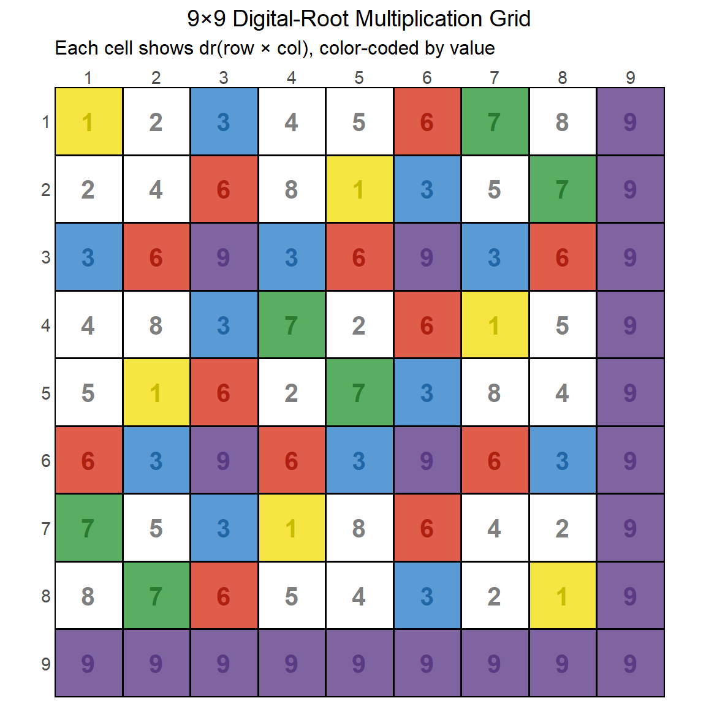
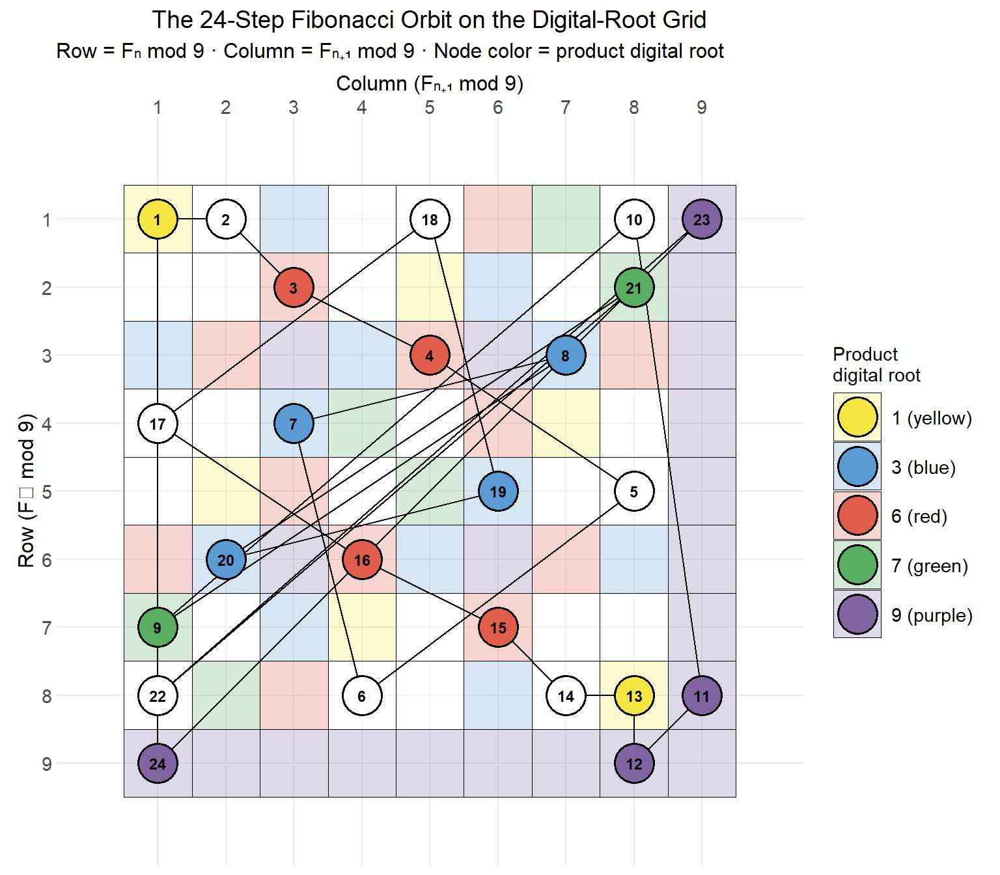

::: {.callout-note}
This report was generated using AI under general human direction. At the time of generation, the contents have not been comprehensively reviewed by a human analyst.

<!--
To indicate human review: Delete the line above about contents not being reviewed, and replace this comment with:
The contents have been reviewed and validated by [Your Name], [Your Role] on [Date].
-->
:::

## Introduction

The Fibonacci sequence is one of the most studied sequences in mathematics. What is less commonly appreciated is what happens when you reduce each term by its **digital root** — the repeated sum of its digits until a single digit remains, equivalent to the remainder mod 9 (with 9 substituted for 0).

When reduced this way, the Fibonacci sequence enters a **closed orbit of exactly 24 steps** before repeating. This 24-step period is called the **Pisano period** for mod 9, written π(9) = 24. The orbit traces a precise path through a 9×9 **digital-root multiplication grid**, where each cell holds the digital root of its row × column product.

This tutorial builds that picture from first principles:

| Section | Concept |
|---|---|
| Fibonacci sequence | Generating terms and their digital roots |
| Digital roots | The mod-9 arithmetic that makes this work |
| The 9×9 grid | Visualizing the digital-root multiplication table |
| The Pisano period | Why the sequence closes after 24 steps |
| The orbit | Plotting the 24-step path on the grid |
| 12-step symmetry | Why the color pattern repeats at the halfway mark |

---

## Setup


::: {.cell}

```{.r .cell-code}
# Digital root: dr(n) = n mod 9, with 0 replaced by 9
digital_root <- function(n) ifelse(n %% 9 == 0, 9L, as.integer(n %% 9))

# Fibonacci sequence computed entirely in digital-root arithmetic
fib_dr_seq <- function(n) {
  f <- integer(n)
  f[1] <- 1L; f[2] <- 1L
  for (i in 3:n) f[i] <- digital_root(f[i-1] + f[i-2])
  f
}

# Color palette: each digital root gets a fixed color
dr_colors <- c(
  "1" = "#F5E642",   # yellow
  "2" = "white",
  "3" = "#5B9BD5",   # blue
  "4" = "white",
  "5" = "white",
  "6" = "#E05C4B",   # red
  "7" = "#5AAE61",   # green
  "8" = "white",
  "9" = "#8064A2"    # purple
)

dr_text <- c(
  "1" = "#C8BC00", "2" = "gray50", "3" = "#2167A8",
  "4" = "gray50",  "5" = "gray50", "6" = "#B02010",
  "7" = "#2A7A30", "8" = "gray50", "9" = "#5A3A82"
)
```
:::


---

## The Fibonacci Sequence

The Fibonacci sequence starts with F₁ = 1, F₂ = 1, and each subsequent term is the sum of the two before it:

$$F_n = F_{n-1} + F_{n-2}$$


::: {.cell}

```{.r .cell-code}
# Actual Fibonacci values (using numeric to avoid integer overflow)
fib_actual <- function(n) {
  f <- numeric(n)
  f[1] <- 1; f[2] <- 1
  for (i in 3:n) f[i] <- f[i-1] + f[i-2]
  f
}

n     <- 25
fv    <- fib_actual(n)
fm9   <- fib_dr_seq(n)

tibble(
  `n`            = 1:n,
  `Fₙ`           = formatC(fv, format = "fg", big.mark = ","),
  `Fₙ mod 9`     = fm9,
  `Color`        = fm9
) |>
  gt(rowname_col = "n") |>
  tab_header(
    title    = "Fibonacci Sequence: First 25 Terms",
    subtitle = "Fₙ mod 9 maps each term to its digital root (1–9)"
  ) |>
  data_color(
    columns  = `Color`,
    target_columns = `Fₙ mod 9`,
    method   = "factor",
    palette  = unname(dr_colors[as.character(sort(unique(fm9)))])
  ) |>
  cols_hide(`Color`) |>
  tab_footnote("Digital root = repeated digit sum until a single digit remains.")
```

::: {.cell-output-display}

```{=html}
<div id="juaawohwdt" style="padding-left:0px;padding-right:0px;padding-top:10px;padding-bottom:10px;overflow-x:auto;overflow-y:auto;width:auto;height:auto;">
<style>#juaawohwdt table {
  font-family: system-ui, 'Segoe UI', Roboto, Helvetica, Arial, sans-serif, 'Apple Color Emoji', 'Segoe UI Emoji', 'Segoe UI Symbol', 'Noto Color Emoji';
  -webkit-font-smoothing: antialiased;
  -moz-osx-font-smoothing: grayscale;
}

#juaawohwdt thead, #juaawohwdt tbody, #juaawohwdt tfoot, #juaawohwdt tr, #juaawohwdt td, #juaawohwdt th {
  border-style: none;
}

#juaawohwdt p {
  margin: 0;
  padding: 0;
}

#juaawohwdt .gt_table {
  display: table;
  border-collapse: collapse;
  line-height: normal;
  margin-left: auto;
  margin-right: auto;
  color: #333333;
  font-size: 16px;
  font-weight: normal;
  font-style: normal;
  background-color: #FFFFFF;
  width: auto;
  border-top-style: solid;
  border-top-width: 2px;
  border-top-color: #A8A8A8;
  border-right-style: none;
  border-right-width: 2px;
  border-right-color: #D3D3D3;
  border-bottom-style: solid;
  border-bottom-width: 2px;
  border-bottom-color: #A8A8A8;
  border-left-style: none;
  border-left-width: 2px;
  border-left-color: #D3D3D3;
}

#juaawohwdt .gt_caption {
  padding-top: 4px;
  padding-bottom: 4px;
}

#juaawohwdt .gt_title {
  color: #333333;
  font-size: 125%;
  font-weight: initial;
  padding-top: 4px;
  padding-bottom: 4px;
  padding-left: 5px;
  padding-right: 5px;
  border-bottom-color: #FFFFFF;
  border-bottom-width: 0;
}

#juaawohwdt .gt_subtitle {
  color: #333333;
  font-size: 85%;
  font-weight: initial;
  padding-top: 3px;
  padding-bottom: 5px;
  padding-left: 5px;
  padding-right: 5px;
  border-top-color: #FFFFFF;
  border-top-width: 0;
}

#juaawohwdt .gt_heading {
  background-color: #FFFFFF;
  text-align: center;
  border-bottom-color: #FFFFFF;
  border-left-style: none;
  border-left-width: 1px;
  border-left-color: #D3D3D3;
  border-right-style: none;
  border-right-width: 1px;
  border-right-color: #D3D3D3;
}

#juaawohwdt .gt_bottom_border {
  border-bottom-style: solid;
  border-bottom-width: 2px;
  border-bottom-color: #D3D3D3;
}

#juaawohwdt .gt_col_headings {
  border-top-style: solid;
  border-top-width: 2px;
  border-top-color: #D3D3D3;
  border-bottom-style: solid;
  border-bottom-width: 2px;
  border-bottom-color: #D3D3D3;
  border-left-style: none;
  border-left-width: 1px;
  border-left-color: #D3D3D3;
  border-right-style: none;
  border-right-width: 1px;
  border-right-color: #D3D3D3;
}

#juaawohwdt .gt_col_heading {
  color: #333333;
  background-color: #FFFFFF;
  font-size: 100%;
  font-weight: normal;
  text-transform: inherit;
  border-left-style: none;
  border-left-width: 1px;
  border-left-color: #D3D3D3;
  border-right-style: none;
  border-right-width: 1px;
  border-right-color: #D3D3D3;
  vertical-align: bottom;
  padding-top: 5px;
  padding-bottom: 6px;
  padding-left: 5px;
  padding-right: 5px;
  overflow-x: hidden;
}

#juaawohwdt .gt_column_spanner_outer {
  color: #333333;
  background-color: #FFFFFF;
  font-size: 100%;
  font-weight: normal;
  text-transform: inherit;
  padding-top: 0;
  padding-bottom: 0;
  padding-left: 4px;
  padding-right: 4px;
}

#juaawohwdt .gt_column_spanner_outer:first-child {
  padding-left: 0;
}

#juaawohwdt .gt_column_spanner_outer:last-child {
  padding-right: 0;
}

#juaawohwdt .gt_column_spanner {
  border-bottom-style: solid;
  border-bottom-width: 2px;
  border-bottom-color: #D3D3D3;
  vertical-align: bottom;
  padding-top: 5px;
  padding-bottom: 5px;
  overflow-x: hidden;
  display: inline-block;
  width: 100%;
}

#juaawohwdt .gt_spanner_row {
  border-bottom-style: hidden;
}

#juaawohwdt .gt_group_heading {
  padding-top: 8px;
  padding-bottom: 8px;
  padding-left: 5px;
  padding-right: 5px;
  color: #333333;
  background-color: #FFFFFF;
  font-size: 100%;
  font-weight: initial;
  text-transform: inherit;
  border-top-style: solid;
  border-top-width: 2px;
  border-top-color: #D3D3D3;
  border-bottom-style: solid;
  border-bottom-width: 2px;
  border-bottom-color: #D3D3D3;
  border-left-style: none;
  border-left-width: 1px;
  border-left-color: #D3D3D3;
  border-right-style: none;
  border-right-width: 1px;
  border-right-color: #D3D3D3;
  vertical-align: middle;
  text-align: left;
}

#juaawohwdt .gt_empty_group_heading {
  padding: 0.5px;
  color: #333333;
  background-color: #FFFFFF;
  font-size: 100%;
  font-weight: initial;
  border-top-style: solid;
  border-top-width: 2px;
  border-top-color: #D3D3D3;
  border-bottom-style: solid;
  border-bottom-width: 2px;
  border-bottom-color: #D3D3D3;
  vertical-align: middle;
}

#juaawohwdt .gt_from_md > :first-child {
  margin-top: 0;
}

#juaawohwdt .gt_from_md > :last-child {
  margin-bottom: 0;
}

#juaawohwdt .gt_row {
  padding-top: 8px;
  padding-bottom: 8px;
  padding-left: 5px;
  padding-right: 5px;
  margin: 10px;
  border-top-style: solid;
  border-top-width: 1px;
  border-top-color: #D3D3D3;
  border-left-style: none;
  border-left-width: 1px;
  border-left-color: #D3D3D3;
  border-right-style: none;
  border-right-width: 1px;
  border-right-color: #D3D3D3;
  vertical-align: middle;
  overflow-x: hidden;
}

#juaawohwdt .gt_stub {
  color: #333333;
  background-color: #FFFFFF;
  font-size: 100%;
  font-weight: initial;
  text-transform: inherit;
  border-right-style: solid;
  border-right-width: 2px;
  border-right-color: #D3D3D3;
  padding-left: 5px;
  padding-right: 5px;
}

#juaawohwdt .gt_stub_row_group {
  color: #333333;
  background-color: #FFFFFF;
  font-size: 100%;
  font-weight: initial;
  text-transform: inherit;
  border-right-style: solid;
  border-right-width: 2px;
  border-right-color: #D3D3D3;
  padding-left: 5px;
  padding-right: 5px;
  vertical-align: top;
}

#juaawohwdt .gt_row_group_first td {
  border-top-width: 2px;
}

#juaawohwdt .gt_row_group_first th {
  border-top-width: 2px;
}

#juaawohwdt .gt_summary_row {
  color: #333333;
  background-color: #FFFFFF;
  text-transform: inherit;
  padding-top: 8px;
  padding-bottom: 8px;
  padding-left: 5px;
  padding-right: 5px;
}

#juaawohwdt .gt_first_summary_row {
  border-top-style: solid;
  border-top-color: #D3D3D3;
}

#juaawohwdt .gt_first_summary_row.thick {
  border-top-width: 2px;
}

#juaawohwdt .gt_last_summary_row {
  padding-top: 8px;
  padding-bottom: 8px;
  padding-left: 5px;
  padding-right: 5px;
  border-bottom-style: solid;
  border-bottom-width: 2px;
  border-bottom-color: #D3D3D3;
}

#juaawohwdt .gt_grand_summary_row {
  color: #333333;
  background-color: #FFFFFF;
  text-transform: inherit;
  padding-top: 8px;
  padding-bottom: 8px;
  padding-left: 5px;
  padding-right: 5px;
}

#juaawohwdt .gt_first_grand_summary_row {
  padding-top: 8px;
  padding-bottom: 8px;
  padding-left: 5px;
  padding-right: 5px;
  border-top-style: double;
  border-top-width: 6px;
  border-top-color: #D3D3D3;
}

#juaawohwdt .gt_last_grand_summary_row_top {
  padding-top: 8px;
  padding-bottom: 8px;
  padding-left: 5px;
  padding-right: 5px;
  border-bottom-style: double;
  border-bottom-width: 6px;
  border-bottom-color: #D3D3D3;
}

#juaawohwdt .gt_striped {
  background-color: rgba(128, 128, 128, 0.05);
}

#juaawohwdt .gt_table_body {
  border-top-style: solid;
  border-top-width: 2px;
  border-top-color: #D3D3D3;
  border-bottom-style: solid;
  border-bottom-width: 2px;
  border-bottom-color: #D3D3D3;
}

#juaawohwdt .gt_footnotes {
  color: #333333;
  background-color: #FFFFFF;
  border-bottom-style: none;
  border-bottom-width: 2px;
  border-bottom-color: #D3D3D3;
  border-left-style: none;
  border-left-width: 2px;
  border-left-color: #D3D3D3;
  border-right-style: none;
  border-right-width: 2px;
  border-right-color: #D3D3D3;
}

#juaawohwdt .gt_footnote {
  margin: 0px;
  font-size: 90%;
  padding-top: 4px;
  padding-bottom: 4px;
  padding-left: 5px;
  padding-right: 5px;
}

#juaawohwdt .gt_sourcenotes {
  color: #333333;
  background-color: #FFFFFF;
  border-bottom-style: none;
  border-bottom-width: 2px;
  border-bottom-color: #D3D3D3;
  border-left-style: none;
  border-left-width: 2px;
  border-left-color: #D3D3D3;
  border-right-style: none;
  border-right-width: 2px;
  border-right-color: #D3D3D3;
}

#juaawohwdt .gt_sourcenote {
  font-size: 90%;
  padding-top: 4px;
  padding-bottom: 4px;
  padding-left: 5px;
  padding-right: 5px;
}

#juaawohwdt .gt_left {
  text-align: left;
}

#juaawohwdt .gt_center {
  text-align: center;
}

#juaawohwdt .gt_right {
  text-align: right;
  font-variant-numeric: tabular-nums;
}

#juaawohwdt .gt_font_normal {
  font-weight: normal;
}

#juaawohwdt .gt_font_bold {
  font-weight: bold;
}

#juaawohwdt .gt_font_italic {
  font-style: italic;
}

#juaawohwdt .gt_super {
  font-size: 65%;
}

#juaawohwdt .gt_footnote_marks {
  font-size: 75%;
  vertical-align: 0.4em;
  position: initial;
}

#juaawohwdt .gt_asterisk {
  font-size: 100%;
  vertical-align: 0;
}

#juaawohwdt .gt_indent_1 {
  text-indent: 5px;
}

#juaawohwdt .gt_indent_2 {
  text-indent: 10px;
}

#juaawohwdt .gt_indent_3 {
  text-indent: 15px;
}

#juaawohwdt .gt_indent_4 {
  text-indent: 20px;
}

#juaawohwdt .gt_indent_5 {
  text-indent: 25px;
}

#juaawohwdt .katex-display {
  display: inline-flex !important;
  margin-bottom: 0.75em !important;
}

#juaawohwdt div.Reactable > div.rt-table > div.rt-thead > div.rt-tr.rt-tr-group-header > div.rt-th-group:after {
  height: 0px !important;
}
</style>
<table class="gt_table" data-quarto-disable-processing="false" data-quarto-bootstrap="false">
  <thead>
    <tr class="gt_heading">
      <td colspan="3" class="gt_heading gt_title gt_font_normal" style>Fibonacci Sequence: First 25 Terms</td>
    </tr>
    <tr class="gt_heading">
      <td colspan="3" class="gt_heading gt_subtitle gt_font_normal gt_bottom_border" style>Fₙ mod 9 maps each term to its digital root (1–9)</td>
    </tr>
    <tr class="gt_col_headings">
      <th class="gt_col_heading gt_columns_bottom_border gt_left" rowspan="1" colspan="1" scope="col" id="a::stub"></th>
      <th class="gt_col_heading gt_columns_bottom_border gt_right" rowspan="1" colspan="1" scope="col" id="Fₙ">Fₙ</th>
      <th class="gt_col_heading gt_columns_bottom_border gt_right" rowspan="1" colspan="1" scope="col" id="Fₙ-mod-9">Fₙ mod 9</th>
    </tr>
  </thead>
  <tbody class="gt_table_body">
    <tr><th id="stub_1_1" scope="row" class="gt_row gt_right gt_stub">1</th>
<td headers="stub_1_1 Fₙ" class="gt_row gt_right">1</td>
<td headers="stub_1_1 Fₙ mod 9" class="gt_row gt_right" style="background-color: #F5E642; color: #000000;">1</td></tr>
    <tr><th id="stub_1_2" scope="row" class="gt_row gt_right gt_stub">2</th>
<td headers="stub_1_2 Fₙ" class="gt_row gt_right">1</td>
<td headers="stub_1_2 Fₙ mod 9" class="gt_row gt_right" style="background-color: #F5E642; color: #000000;">1</td></tr>
    <tr><th id="stub_1_3" scope="row" class="gt_row gt_right gt_stub">3</th>
<td headers="stub_1_3 Fₙ" class="gt_row gt_right">2</td>
<td headers="stub_1_3 Fₙ mod 9" class="gt_row gt_right" style="background-color: #FFFFFF; color: #000000;">2</td></tr>
    <tr><th id="stub_1_4" scope="row" class="gt_row gt_right gt_stub">4</th>
<td headers="stub_1_4 Fₙ" class="gt_row gt_right">3</td>
<td headers="stub_1_4 Fₙ mod 9" class="gt_row gt_right" style="background-color: #5B9BD5; color: #FFFFFF;">3</td></tr>
    <tr><th id="stub_1_5" scope="row" class="gt_row gt_right gt_stub">5</th>
<td headers="stub_1_5 Fₙ" class="gt_row gt_right">5</td>
<td headers="stub_1_5 Fₙ mod 9" class="gt_row gt_right" style="background-color: #FFFFFF; color: #000000;">5</td></tr>
    <tr><th id="stub_1_6" scope="row" class="gt_row gt_right gt_stub">6</th>
<td headers="stub_1_6 Fₙ" class="gt_row gt_right">8</td>
<td headers="stub_1_6 Fₙ mod 9" class="gt_row gt_right" style="background-color: #FFFFFF; color: #000000;">8</td></tr>
    <tr><th id="stub_1_7" scope="row" class="gt_row gt_right gt_stub">7</th>
<td headers="stub_1_7 Fₙ" class="gt_row gt_right">13</td>
<td headers="stub_1_7 Fₙ mod 9" class="gt_row gt_right" style="background-color: #FFFFFF; color: #000000;">4</td></tr>
    <tr><th id="stub_1_8" scope="row" class="gt_row gt_right gt_stub">8</th>
<td headers="stub_1_8 Fₙ" class="gt_row gt_right">21</td>
<td headers="stub_1_8 Fₙ mod 9" class="gt_row gt_right" style="background-color: #5B9BD5; color: #FFFFFF;">3</td></tr>
    <tr><th id="stub_1_9" scope="row" class="gt_row gt_right gt_stub">9</th>
<td headers="stub_1_9 Fₙ" class="gt_row gt_right">34</td>
<td headers="stub_1_9 Fₙ mod 9" class="gt_row gt_right" style="background-color: #5AAE61; color: #FFFFFF;">7</td></tr>
    <tr><th id="stub_1_10" scope="row" class="gt_row gt_right gt_stub">10</th>
<td headers="stub_1_10 Fₙ" class="gt_row gt_right">55</td>
<td headers="stub_1_10 Fₙ mod 9" class="gt_row gt_right" style="background-color: #F5E642; color: #000000;">1</td></tr>
    <tr><th id="stub_1_11" scope="row" class="gt_row gt_right gt_stub">11</th>
<td headers="stub_1_11 Fₙ" class="gt_row gt_right">89</td>
<td headers="stub_1_11 Fₙ mod 9" class="gt_row gt_right" style="background-color: #FFFFFF; color: #000000;">8</td></tr>
    <tr><th id="stub_1_12" scope="row" class="gt_row gt_right gt_stub">12</th>
<td headers="stub_1_12 Fₙ" class="gt_row gt_right">144</td>
<td headers="stub_1_12 Fₙ mod 9" class="gt_row gt_right" style="background-color: #8064A2; color: #FFFFFF;">9</td></tr>
    <tr><th id="stub_1_13" scope="row" class="gt_row gt_right gt_stub">13</th>
<td headers="stub_1_13 Fₙ" class="gt_row gt_right">233</td>
<td headers="stub_1_13 Fₙ mod 9" class="gt_row gt_right" style="background-color: #FFFFFF; color: #000000;">8</td></tr>
    <tr><th id="stub_1_14" scope="row" class="gt_row gt_right gt_stub">14</th>
<td headers="stub_1_14 Fₙ" class="gt_row gt_right">377</td>
<td headers="stub_1_14 Fₙ mod 9" class="gt_row gt_right" style="background-color: #FFFFFF; color: #000000;">8</td></tr>
    <tr><th id="stub_1_15" scope="row" class="gt_row gt_right gt_stub">15</th>
<td headers="stub_1_15 Fₙ" class="gt_row gt_right">610</td>
<td headers="stub_1_15 Fₙ mod 9" class="gt_row gt_right" style="background-color: #5AAE61; color: #FFFFFF;">7</td></tr>
    <tr><th id="stub_1_16" scope="row" class="gt_row gt_right gt_stub">16</th>
<td headers="stub_1_16 Fₙ" class="gt_row gt_right">987</td>
<td headers="stub_1_16 Fₙ mod 9" class="gt_row gt_right" style="background-color: #E05C4B; color: #FFFFFF;">6</td></tr>
    <tr><th id="stub_1_17" scope="row" class="gt_row gt_right gt_stub">17</th>
<td headers="stub_1_17 Fₙ" class="gt_row gt_right">1,597</td>
<td headers="stub_1_17 Fₙ mod 9" class="gt_row gt_right" style="background-color: #FFFFFF; color: #000000;">4</td></tr>
    <tr><th id="stub_1_18" scope="row" class="gt_row gt_right gt_stub">18</th>
<td headers="stub_1_18 Fₙ" class="gt_row gt_right">2,584</td>
<td headers="stub_1_18 Fₙ mod 9" class="gt_row gt_right" style="background-color: #F5E642; color: #000000;">1</td></tr>
    <tr><th id="stub_1_19" scope="row" class="gt_row gt_right gt_stub">19</th>
<td headers="stub_1_19 Fₙ" class="gt_row gt_right">4,181</td>
<td headers="stub_1_19 Fₙ mod 9" class="gt_row gt_right" style="background-color: #FFFFFF; color: #000000;">5</td></tr>
    <tr><th id="stub_1_20" scope="row" class="gt_row gt_right gt_stub">20</th>
<td headers="stub_1_20 Fₙ" class="gt_row gt_right">6,765</td>
<td headers="stub_1_20 Fₙ mod 9" class="gt_row gt_right" style="background-color: #E05C4B; color: #FFFFFF;">6</td></tr>
    <tr><th id="stub_1_21" scope="row" class="gt_row gt_right gt_stub">21</th>
<td headers="stub_1_21 Fₙ" class="gt_row gt_right">10,946</td>
<td headers="stub_1_21 Fₙ mod 9" class="gt_row gt_right" style="background-color: #FFFFFF; color: #000000;">2</td></tr>
    <tr><th id="stub_1_22" scope="row" class="gt_row gt_right gt_stub">22</th>
<td headers="stub_1_22 Fₙ" class="gt_row gt_right">17,711</td>
<td headers="stub_1_22 Fₙ mod 9" class="gt_row gt_right" style="background-color: #FFFFFF; color: #000000;">8</td></tr>
    <tr><th id="stub_1_23" scope="row" class="gt_row gt_right gt_stub">23</th>
<td headers="stub_1_23 Fₙ" class="gt_row gt_right">28,657</td>
<td headers="stub_1_23 Fₙ mod 9" class="gt_row gt_right" style="background-color: #F5E642; color: #000000;">1</td></tr>
    <tr><th id="stub_1_24" scope="row" class="gt_row gt_right gt_stub">24</th>
<td headers="stub_1_24 Fₙ" class="gt_row gt_right">46,368</td>
<td headers="stub_1_24 Fₙ mod 9" class="gt_row gt_right" style="background-color: #8064A2; color: #FFFFFF;">9</td></tr>
    <tr><th id="stub_1_25" scope="row" class="gt_row gt_right gt_stub">25</th>
<td headers="stub_1_25 Fₙ" class="gt_row gt_right">75,025</td>
<td headers="stub_1_25 Fₙ mod 9" class="gt_row gt_right" style="background-color: #F5E642; color: #000000;">1</td></tr>
  </tbody>
  <tfoot>
    <tr class="gt_footnotes">
      <td class="gt_footnote" colspan="3"> Digital root = repeated digit sum until a single digit remains.</td>
    </tr>
  </tfoot>
</table>
</div>
```

:::
:::


Notice that term 25 is 1, the same as term 1 — and term 26 would be 1, the same as term 2. The sequence has **returned to its starting state** after exactly 24 steps.

---

## Digital Roots and the 9×9 Grid

The **digital root** of a positive integer is obtained by repeatedly summing its digits until a single digit remains. For example:

$$\text{dr}(144) = \text{dr}(1+4+4) = \text{dr}(9) = 9$$
$$\text{dr}(377) = \text{dr}(3+7+7) = \text{dr}(17) = \text{dr}(1+7) = 8$$

Equivalently: $\text{dr}(n) = 1 + (n - 1) \bmod 9$ for $n > 0$, which is just $n \bmod 9$ with the value 0 replaced by 9.

The **9×9 digital-root multiplication grid** shows the digital root of every row × column product. Because digital roots respect multiplication (dr(a×b) = dr(dr(a) × dr(b))), this 9×9 table is closed and self-consistent.


::: {.cell}

```{.r .cell-code}
grid_df <- expand.grid(col = 1:9, row = 1:9) |>
  mutate(dr = digital_root(row * col))

ggplot(grid_df, aes(x = col, y = row)) +
  geom_tile(aes(fill = factor(dr)), color = "black", linewidth = 0.6) +
  geom_text(aes(label = dr, color = factor(dr)),
            size = 5.5, fontface = "bold") +
  scale_fill_manual(values  = dr_colors, guide = "none") +
  scale_color_manual(values = dr_text,   guide = "none") +
  scale_x_continuous(breaks = 1:9, expand = c(0, 0), position = "top") +
  scale_y_reverse(breaks = 1:9, expand = c(0, 0)) +
  coord_fixed() +
  labs(
    title    = "9×9 Digital-Root Multiplication Grid",
    subtitle = "Each cell shows dr(row × col), color-coded by value",
    x = NULL, y = NULL
  )
```

::: {.cell-output-display}
{width=576}
:::
:::


A few structural features worth noting:

- **Row and column 9 are entirely purple (9)** — any number times 9 has digital root 9.
- **The grid is symmetric** — dr(a × b) = dr(b × a), so the grid mirrors along the diagonal.
- **Only five values appear as colored cells**: 1 (yellow), 3 (blue), 6 (red), 7 (green), 9 (purple). All others (2, 4, 5, 8) appear on white cells. These five are the *fixed points* and *small orbits* of digital-root multiplication.

---

## The Pisano Period

The **Pisano period** π(m) is the length of the repeating cycle of Fibonacci numbers modulo m. For m = 9, π(9) = **24**.

To see why, consider pairs of consecutive terms: the state of the Fibonacci sequence at any point is fully determined by (Fₙ, Fₙ₊₁). Since both values lie in {1, …, 9}, there are at most 81 possible states — so the sequence *must* eventually cycle. It turns out to return to the starting state (1, 1) after exactly 24 steps.


::: {.cell}

```{.r .cell-code}
seq48 <- fib_dr_seq(49)   # two full periods

tibble(
  Step    = 1:48,
  `Fₙ mod 9` = seq48[1:48],
  Period  = ifelse(1:48 <= 24, "Period 1 (steps 1–24)", "Period 2 (steps 25–48)")
) |>
  gt(groupname_col = "Period") |>
  tab_header(
    title    = "Fibonacci mod 9: Two Full Periods",
    subtitle = "The 24-step sequence repeats exactly"
  ) |>
  data_color(
    columns = `Fₙ mod 9`,
    method  = "factor",
    palette = unname(dr_colors[as.character(1:9)])
  ) |>
  cols_label(Step = "n", `Fₙ mod 9` = "Fₙ mod 9")
```

::: {.cell-output-display}

```{=html}
<div id="dngmnmvpoq" style="padding-left:0px;padding-right:0px;padding-top:10px;padding-bottom:10px;overflow-x:auto;overflow-y:auto;width:auto;height:auto;">
<style>#dngmnmvpoq table {
  font-family: system-ui, 'Segoe UI', Roboto, Helvetica, Arial, sans-serif, 'Apple Color Emoji', 'Segoe UI Emoji', 'Segoe UI Symbol', 'Noto Color Emoji';
  -webkit-font-smoothing: antialiased;
  -moz-osx-font-smoothing: grayscale;
}

#dngmnmvpoq thead, #dngmnmvpoq tbody, #dngmnmvpoq tfoot, #dngmnmvpoq tr, #dngmnmvpoq td, #dngmnmvpoq th {
  border-style: none;
}

#dngmnmvpoq p {
  margin: 0;
  padding: 0;
}

#dngmnmvpoq .gt_table {
  display: table;
  border-collapse: collapse;
  line-height: normal;
  margin-left: auto;
  margin-right: auto;
  color: #333333;
  font-size: 16px;
  font-weight: normal;
  font-style: normal;
  background-color: #FFFFFF;
  width: auto;
  border-top-style: solid;
  border-top-width: 2px;
  border-top-color: #A8A8A8;
  border-right-style: none;
  border-right-width: 2px;
  border-right-color: #D3D3D3;
  border-bottom-style: solid;
  border-bottom-width: 2px;
  border-bottom-color: #A8A8A8;
  border-left-style: none;
  border-left-width: 2px;
  border-left-color: #D3D3D3;
}

#dngmnmvpoq .gt_caption {
  padding-top: 4px;
  padding-bottom: 4px;
}

#dngmnmvpoq .gt_title {
  color: #333333;
  font-size: 125%;
  font-weight: initial;
  padding-top: 4px;
  padding-bottom: 4px;
  padding-left: 5px;
  padding-right: 5px;
  border-bottom-color: #FFFFFF;
  border-bottom-width: 0;
}

#dngmnmvpoq .gt_subtitle {
  color: #333333;
  font-size: 85%;
  font-weight: initial;
  padding-top: 3px;
  padding-bottom: 5px;
  padding-left: 5px;
  padding-right: 5px;
  border-top-color: #FFFFFF;
  border-top-width: 0;
}

#dngmnmvpoq .gt_heading {
  background-color: #FFFFFF;
  text-align: center;
  border-bottom-color: #FFFFFF;
  border-left-style: none;
  border-left-width: 1px;
  border-left-color: #D3D3D3;
  border-right-style: none;
  border-right-width: 1px;
  border-right-color: #D3D3D3;
}

#dngmnmvpoq .gt_bottom_border {
  border-bottom-style: solid;
  border-bottom-width: 2px;
  border-bottom-color: #D3D3D3;
}

#dngmnmvpoq .gt_col_headings {
  border-top-style: solid;
  border-top-width: 2px;
  border-top-color: #D3D3D3;
  border-bottom-style: solid;
  border-bottom-width: 2px;
  border-bottom-color: #D3D3D3;
  border-left-style: none;
  border-left-width: 1px;
  border-left-color: #D3D3D3;
  border-right-style: none;
  border-right-width: 1px;
  border-right-color: #D3D3D3;
}

#dngmnmvpoq .gt_col_heading {
  color: #333333;
  background-color: #FFFFFF;
  font-size: 100%;
  font-weight: normal;
  text-transform: inherit;
  border-left-style: none;
  border-left-width: 1px;
  border-left-color: #D3D3D3;
  border-right-style: none;
  border-right-width: 1px;
  border-right-color: #D3D3D3;
  vertical-align: bottom;
  padding-top: 5px;
  padding-bottom: 6px;
  padding-left: 5px;
  padding-right: 5px;
  overflow-x: hidden;
}

#dngmnmvpoq .gt_column_spanner_outer {
  color: #333333;
  background-color: #FFFFFF;
  font-size: 100%;
  font-weight: normal;
  text-transform: inherit;
  padding-top: 0;
  padding-bottom: 0;
  padding-left: 4px;
  padding-right: 4px;
}

#dngmnmvpoq .gt_column_spanner_outer:first-child {
  padding-left: 0;
}

#dngmnmvpoq .gt_column_spanner_outer:last-child {
  padding-right: 0;
}

#dngmnmvpoq .gt_column_spanner {
  border-bottom-style: solid;
  border-bottom-width: 2px;
  border-bottom-color: #D3D3D3;
  vertical-align: bottom;
  padding-top: 5px;
  padding-bottom: 5px;
  overflow-x: hidden;
  display: inline-block;
  width: 100%;
}

#dngmnmvpoq .gt_spanner_row {
  border-bottom-style: hidden;
}

#dngmnmvpoq .gt_group_heading {
  padding-top: 8px;
  padding-bottom: 8px;
  padding-left: 5px;
  padding-right: 5px;
  color: #333333;
  background-color: #FFFFFF;
  font-size: 100%;
  font-weight: initial;
  text-transform: inherit;
  border-top-style: solid;
  border-top-width: 2px;
  border-top-color: #D3D3D3;
  border-bottom-style: solid;
  border-bottom-width: 2px;
  border-bottom-color: #D3D3D3;
  border-left-style: none;
  border-left-width: 1px;
  border-left-color: #D3D3D3;
  border-right-style: none;
  border-right-width: 1px;
  border-right-color: #D3D3D3;
  vertical-align: middle;
  text-align: left;
}

#dngmnmvpoq .gt_empty_group_heading {
  padding: 0.5px;
  color: #333333;
  background-color: #FFFFFF;
  font-size: 100%;
  font-weight: initial;
  border-top-style: solid;
  border-top-width: 2px;
  border-top-color: #D3D3D3;
  border-bottom-style: solid;
  border-bottom-width: 2px;
  border-bottom-color: #D3D3D3;
  vertical-align: middle;
}

#dngmnmvpoq .gt_from_md > :first-child {
  margin-top: 0;
}

#dngmnmvpoq .gt_from_md > :last-child {
  margin-bottom: 0;
}

#dngmnmvpoq .gt_row {
  padding-top: 8px;
  padding-bottom: 8px;
  padding-left: 5px;
  padding-right: 5px;
  margin: 10px;
  border-top-style: solid;
  border-top-width: 1px;
  border-top-color: #D3D3D3;
  border-left-style: none;
  border-left-width: 1px;
  border-left-color: #D3D3D3;
  border-right-style: none;
  border-right-width: 1px;
  border-right-color: #D3D3D3;
  vertical-align: middle;
  overflow-x: hidden;
}

#dngmnmvpoq .gt_stub {
  color: #333333;
  background-color: #FFFFFF;
  font-size: 100%;
  font-weight: initial;
  text-transform: inherit;
  border-right-style: solid;
  border-right-width: 2px;
  border-right-color: #D3D3D3;
  padding-left: 5px;
  padding-right: 5px;
}

#dngmnmvpoq .gt_stub_row_group {
  color: #333333;
  background-color: #FFFFFF;
  font-size: 100%;
  font-weight: initial;
  text-transform: inherit;
  border-right-style: solid;
  border-right-width: 2px;
  border-right-color: #D3D3D3;
  padding-left: 5px;
  padding-right: 5px;
  vertical-align: top;
}

#dngmnmvpoq .gt_row_group_first td {
  border-top-width: 2px;
}

#dngmnmvpoq .gt_row_group_first th {
  border-top-width: 2px;
}

#dngmnmvpoq .gt_summary_row {
  color: #333333;
  background-color: #FFFFFF;
  text-transform: inherit;
  padding-top: 8px;
  padding-bottom: 8px;
  padding-left: 5px;
  padding-right: 5px;
}

#dngmnmvpoq .gt_first_summary_row {
  border-top-style: solid;
  border-top-color: #D3D3D3;
}

#dngmnmvpoq .gt_first_summary_row.thick {
  border-top-width: 2px;
}

#dngmnmvpoq .gt_last_summary_row {
  padding-top: 8px;
  padding-bottom: 8px;
  padding-left: 5px;
  padding-right: 5px;
  border-bottom-style: solid;
  border-bottom-width: 2px;
  border-bottom-color: #D3D3D3;
}

#dngmnmvpoq .gt_grand_summary_row {
  color: #333333;
  background-color: #FFFFFF;
  text-transform: inherit;
  padding-top: 8px;
  padding-bottom: 8px;
  padding-left: 5px;
  padding-right: 5px;
}

#dngmnmvpoq .gt_first_grand_summary_row {
  padding-top: 8px;
  padding-bottom: 8px;
  padding-left: 5px;
  padding-right: 5px;
  border-top-style: double;
  border-top-width: 6px;
  border-top-color: #D3D3D3;
}

#dngmnmvpoq .gt_last_grand_summary_row_top {
  padding-top: 8px;
  padding-bottom: 8px;
  padding-left: 5px;
  padding-right: 5px;
  border-bottom-style: double;
  border-bottom-width: 6px;
  border-bottom-color: #D3D3D3;
}

#dngmnmvpoq .gt_striped {
  background-color: rgba(128, 128, 128, 0.05);
}

#dngmnmvpoq .gt_table_body {
  border-top-style: solid;
  border-top-width: 2px;
  border-top-color: #D3D3D3;
  border-bottom-style: solid;
  border-bottom-width: 2px;
  border-bottom-color: #D3D3D3;
}

#dngmnmvpoq .gt_footnotes {
  color: #333333;
  background-color: #FFFFFF;
  border-bottom-style: none;
  border-bottom-width: 2px;
  border-bottom-color: #D3D3D3;
  border-left-style: none;
  border-left-width: 2px;
  border-left-color: #D3D3D3;
  border-right-style: none;
  border-right-width: 2px;
  border-right-color: #D3D3D3;
}

#dngmnmvpoq .gt_footnote {
  margin: 0px;
  font-size: 90%;
  padding-top: 4px;
  padding-bottom: 4px;
  padding-left: 5px;
  padding-right: 5px;
}

#dngmnmvpoq .gt_sourcenotes {
  color: #333333;
  background-color: #FFFFFF;
  border-bottom-style: none;
  border-bottom-width: 2px;
  border-bottom-color: #D3D3D3;
  border-left-style: none;
  border-left-width: 2px;
  border-left-color: #D3D3D3;
  border-right-style: none;
  border-right-width: 2px;
  border-right-color: #D3D3D3;
}

#dngmnmvpoq .gt_sourcenote {
  font-size: 90%;
  padding-top: 4px;
  padding-bottom: 4px;
  padding-left: 5px;
  padding-right: 5px;
}

#dngmnmvpoq .gt_left {
  text-align: left;
}

#dngmnmvpoq .gt_center {
  text-align: center;
}

#dngmnmvpoq .gt_right {
  text-align: right;
  font-variant-numeric: tabular-nums;
}

#dngmnmvpoq .gt_font_normal {
  font-weight: normal;
}

#dngmnmvpoq .gt_font_bold {
  font-weight: bold;
}

#dngmnmvpoq .gt_font_italic {
  font-style: italic;
}

#dngmnmvpoq .gt_super {
  font-size: 65%;
}

#dngmnmvpoq .gt_footnote_marks {
  font-size: 75%;
  vertical-align: 0.4em;
  position: initial;
}

#dngmnmvpoq .gt_asterisk {
  font-size: 100%;
  vertical-align: 0;
}

#dngmnmvpoq .gt_indent_1 {
  text-indent: 5px;
}

#dngmnmvpoq .gt_indent_2 {
  text-indent: 10px;
}

#dngmnmvpoq .gt_indent_3 {
  text-indent: 15px;
}

#dngmnmvpoq .gt_indent_4 {
  text-indent: 20px;
}

#dngmnmvpoq .gt_indent_5 {
  text-indent: 25px;
}

#dngmnmvpoq .katex-display {
  display: inline-flex !important;
  margin-bottom: 0.75em !important;
}

#dngmnmvpoq div.Reactable > div.rt-table > div.rt-thead > div.rt-tr.rt-tr-group-header > div.rt-th-group:after {
  height: 0px !important;
}
</style>
<table class="gt_table" data-quarto-disable-processing="false" data-quarto-bootstrap="false">
  <thead>
    <tr class="gt_heading">
      <td colspan="2" class="gt_heading gt_title gt_font_normal" style>Fibonacci mod 9: Two Full Periods</td>
    </tr>
    <tr class="gt_heading">
      <td colspan="2" class="gt_heading gt_subtitle gt_font_normal gt_bottom_border" style>The 24-step sequence repeats exactly</td>
    </tr>
    <tr class="gt_col_headings">
      <th class="gt_col_heading gt_columns_bottom_border gt_right" rowspan="1" colspan="1" scope="col" id="Step">n</th>
      <th class="gt_col_heading gt_columns_bottom_border gt_right" rowspan="1" colspan="1" scope="col" id="Fₙ-mod-9">Fₙ mod 9</th>
    </tr>
  </thead>
  <tbody class="gt_table_body">
    <tr class="gt_group_heading_row">
      <th colspan="2" class="gt_group_heading" scope="colgroup" id="Period 1 (steps 1–24)">Period 1 (steps 1–24)</th>
    </tr>
    <tr class="gt_row_group_first"><td headers="Period 1 (steps 1–24)  Step" class="gt_row gt_right">1</td>
<td headers="Period 1 (steps 1–24)  Fₙ mod 9" class="gt_row gt_right" style="background-color: #F5E642; color: #000000;">1</td></tr>
    <tr><td headers="Period 1 (steps 1–24)  Step" class="gt_row gt_right">2</td>
<td headers="Period 1 (steps 1–24)  Fₙ mod 9" class="gt_row gt_right" style="background-color: #F5E642; color: #000000;">1</td></tr>
    <tr><td headers="Period 1 (steps 1–24)  Step" class="gt_row gt_right">3</td>
<td headers="Period 1 (steps 1–24)  Fₙ mod 9" class="gt_row gt_right" style="background-color: #FFFFFF; color: #000000;">2</td></tr>
    <tr><td headers="Period 1 (steps 1–24)  Step" class="gt_row gt_right">4</td>
<td headers="Period 1 (steps 1–24)  Fₙ mod 9" class="gt_row gt_right" style="background-color: #5B9BD5; color: #FFFFFF;">3</td></tr>
    <tr><td headers="Period 1 (steps 1–24)  Step" class="gt_row gt_right">5</td>
<td headers="Period 1 (steps 1–24)  Fₙ mod 9" class="gt_row gt_right" style="background-color: #FFFFFF; color: #000000;">5</td></tr>
    <tr><td headers="Period 1 (steps 1–24)  Step" class="gt_row gt_right">6</td>
<td headers="Period 1 (steps 1–24)  Fₙ mod 9" class="gt_row gt_right" style="background-color: #FFFFFF; color: #000000;">8</td></tr>
    <tr><td headers="Period 1 (steps 1–24)  Step" class="gt_row gt_right">7</td>
<td headers="Period 1 (steps 1–24)  Fₙ mod 9" class="gt_row gt_right" style="background-color: #FFFFFF; color: #000000;">4</td></tr>
    <tr><td headers="Period 1 (steps 1–24)  Step" class="gt_row gt_right">8</td>
<td headers="Period 1 (steps 1–24)  Fₙ mod 9" class="gt_row gt_right" style="background-color: #5B9BD5; color: #FFFFFF;">3</td></tr>
    <tr><td headers="Period 1 (steps 1–24)  Step" class="gt_row gt_right">9</td>
<td headers="Period 1 (steps 1–24)  Fₙ mod 9" class="gt_row gt_right" style="background-color: #5AAE61; color: #FFFFFF;">7</td></tr>
    <tr><td headers="Period 1 (steps 1–24)  Step" class="gt_row gt_right">10</td>
<td headers="Period 1 (steps 1–24)  Fₙ mod 9" class="gt_row gt_right" style="background-color: #F5E642; color: #000000;">1</td></tr>
    <tr><td headers="Period 1 (steps 1–24)  Step" class="gt_row gt_right">11</td>
<td headers="Period 1 (steps 1–24)  Fₙ mod 9" class="gt_row gt_right" style="background-color: #FFFFFF; color: #000000;">8</td></tr>
    <tr><td headers="Period 1 (steps 1–24)  Step" class="gt_row gt_right">12</td>
<td headers="Period 1 (steps 1–24)  Fₙ mod 9" class="gt_row gt_right" style="background-color: #8064A2; color: #FFFFFF;">9</td></tr>
    <tr><td headers="Period 1 (steps 1–24)  Step" class="gt_row gt_right">13</td>
<td headers="Period 1 (steps 1–24)  Fₙ mod 9" class="gt_row gt_right" style="background-color: #FFFFFF; color: #000000;">8</td></tr>
    <tr><td headers="Period 1 (steps 1–24)  Step" class="gt_row gt_right">14</td>
<td headers="Period 1 (steps 1–24)  Fₙ mod 9" class="gt_row gt_right" style="background-color: #FFFFFF; color: #000000;">8</td></tr>
    <tr><td headers="Period 1 (steps 1–24)  Step" class="gt_row gt_right">15</td>
<td headers="Period 1 (steps 1–24)  Fₙ mod 9" class="gt_row gt_right" style="background-color: #5AAE61; color: #FFFFFF;">7</td></tr>
    <tr><td headers="Period 1 (steps 1–24)  Step" class="gt_row gt_right">16</td>
<td headers="Period 1 (steps 1–24)  Fₙ mod 9" class="gt_row gt_right" style="background-color: #E05C4B; color: #FFFFFF;">6</td></tr>
    <tr><td headers="Period 1 (steps 1–24)  Step" class="gt_row gt_right">17</td>
<td headers="Period 1 (steps 1–24)  Fₙ mod 9" class="gt_row gt_right" style="background-color: #FFFFFF; color: #000000;">4</td></tr>
    <tr><td headers="Period 1 (steps 1–24)  Step" class="gt_row gt_right">18</td>
<td headers="Period 1 (steps 1–24)  Fₙ mod 9" class="gt_row gt_right" style="background-color: #F5E642; color: #000000;">1</td></tr>
    <tr><td headers="Period 1 (steps 1–24)  Step" class="gt_row gt_right">19</td>
<td headers="Period 1 (steps 1–24)  Fₙ mod 9" class="gt_row gt_right" style="background-color: #FFFFFF; color: #000000;">5</td></tr>
    <tr><td headers="Period 1 (steps 1–24)  Step" class="gt_row gt_right">20</td>
<td headers="Period 1 (steps 1–24)  Fₙ mod 9" class="gt_row gt_right" style="background-color: #E05C4B; color: #FFFFFF;">6</td></tr>
    <tr><td headers="Period 1 (steps 1–24)  Step" class="gt_row gt_right">21</td>
<td headers="Period 1 (steps 1–24)  Fₙ mod 9" class="gt_row gt_right" style="background-color: #FFFFFF; color: #000000;">2</td></tr>
    <tr><td headers="Period 1 (steps 1–24)  Step" class="gt_row gt_right">22</td>
<td headers="Period 1 (steps 1–24)  Fₙ mod 9" class="gt_row gt_right" style="background-color: #FFFFFF; color: #000000;">8</td></tr>
    <tr><td headers="Period 1 (steps 1–24)  Step" class="gt_row gt_right">23</td>
<td headers="Period 1 (steps 1–24)  Fₙ mod 9" class="gt_row gt_right" style="background-color: #F5E642; color: #000000;">1</td></tr>
    <tr><td headers="Period 1 (steps 1–24)  Step" class="gt_row gt_right">24</td>
<td headers="Period 1 (steps 1–24)  Fₙ mod 9" class="gt_row gt_right" style="background-color: #8064A2; color: #FFFFFF;">9</td></tr>
    <tr class="gt_group_heading_row">
      <th colspan="2" class="gt_group_heading" scope="colgroup" id="Period 2 (steps 25–48)">Period 2 (steps 25–48)</th>
    </tr>
    <tr class="gt_row_group_first"><td headers="Period 2 (steps 25–48)  Step" class="gt_row gt_right">25</td>
<td headers="Period 2 (steps 25–48)  Fₙ mod 9" class="gt_row gt_right" style="background-color: #F5E642; color: #000000;">1</td></tr>
    <tr><td headers="Period 2 (steps 25–48)  Step" class="gt_row gt_right">26</td>
<td headers="Period 2 (steps 25–48)  Fₙ mod 9" class="gt_row gt_right" style="background-color: #F5E642; color: #000000;">1</td></tr>
    <tr><td headers="Period 2 (steps 25–48)  Step" class="gt_row gt_right">27</td>
<td headers="Period 2 (steps 25–48)  Fₙ mod 9" class="gt_row gt_right" style="background-color: #FFFFFF; color: #000000;">2</td></tr>
    <tr><td headers="Period 2 (steps 25–48)  Step" class="gt_row gt_right">28</td>
<td headers="Period 2 (steps 25–48)  Fₙ mod 9" class="gt_row gt_right" style="background-color: #5B9BD5; color: #FFFFFF;">3</td></tr>
    <tr><td headers="Period 2 (steps 25–48)  Step" class="gt_row gt_right">29</td>
<td headers="Period 2 (steps 25–48)  Fₙ mod 9" class="gt_row gt_right" style="background-color: #FFFFFF; color: #000000;">5</td></tr>
    <tr><td headers="Period 2 (steps 25–48)  Step" class="gt_row gt_right">30</td>
<td headers="Period 2 (steps 25–48)  Fₙ mod 9" class="gt_row gt_right" style="background-color: #FFFFFF; color: #000000;">8</td></tr>
    <tr><td headers="Period 2 (steps 25–48)  Step" class="gt_row gt_right">31</td>
<td headers="Period 2 (steps 25–48)  Fₙ mod 9" class="gt_row gt_right" style="background-color: #FFFFFF; color: #000000;">4</td></tr>
    <tr><td headers="Period 2 (steps 25–48)  Step" class="gt_row gt_right">32</td>
<td headers="Period 2 (steps 25–48)  Fₙ mod 9" class="gt_row gt_right" style="background-color: #5B9BD5; color: #FFFFFF;">3</td></tr>
    <tr><td headers="Period 2 (steps 25–48)  Step" class="gt_row gt_right">33</td>
<td headers="Period 2 (steps 25–48)  Fₙ mod 9" class="gt_row gt_right" style="background-color: #5AAE61; color: #FFFFFF;">7</td></tr>
    <tr><td headers="Period 2 (steps 25–48)  Step" class="gt_row gt_right">34</td>
<td headers="Period 2 (steps 25–48)  Fₙ mod 9" class="gt_row gt_right" style="background-color: #F5E642; color: #000000;">1</td></tr>
    <tr><td headers="Period 2 (steps 25–48)  Step" class="gt_row gt_right">35</td>
<td headers="Period 2 (steps 25–48)  Fₙ mod 9" class="gt_row gt_right" style="background-color: #FFFFFF; color: #000000;">8</td></tr>
    <tr><td headers="Period 2 (steps 25–48)  Step" class="gt_row gt_right">36</td>
<td headers="Period 2 (steps 25–48)  Fₙ mod 9" class="gt_row gt_right" style="background-color: #8064A2; color: #FFFFFF;">9</td></tr>
    <tr><td headers="Period 2 (steps 25–48)  Step" class="gt_row gt_right">37</td>
<td headers="Period 2 (steps 25–48)  Fₙ mod 9" class="gt_row gt_right" style="background-color: #FFFFFF; color: #000000;">8</td></tr>
    <tr><td headers="Period 2 (steps 25–48)  Step" class="gt_row gt_right">38</td>
<td headers="Period 2 (steps 25–48)  Fₙ mod 9" class="gt_row gt_right" style="background-color: #FFFFFF; color: #000000;">8</td></tr>
    <tr><td headers="Period 2 (steps 25–48)  Step" class="gt_row gt_right">39</td>
<td headers="Period 2 (steps 25–48)  Fₙ mod 9" class="gt_row gt_right" style="background-color: #5AAE61; color: #FFFFFF;">7</td></tr>
    <tr><td headers="Period 2 (steps 25–48)  Step" class="gt_row gt_right">40</td>
<td headers="Period 2 (steps 25–48)  Fₙ mod 9" class="gt_row gt_right" style="background-color: #E05C4B; color: #FFFFFF;">6</td></tr>
    <tr><td headers="Period 2 (steps 25–48)  Step" class="gt_row gt_right">41</td>
<td headers="Period 2 (steps 25–48)  Fₙ mod 9" class="gt_row gt_right" style="background-color: #FFFFFF; color: #000000;">4</td></tr>
    <tr><td headers="Period 2 (steps 25–48)  Step" class="gt_row gt_right">42</td>
<td headers="Period 2 (steps 25–48)  Fₙ mod 9" class="gt_row gt_right" style="background-color: #F5E642; color: #000000;">1</td></tr>
    <tr><td headers="Period 2 (steps 25–48)  Step" class="gt_row gt_right">43</td>
<td headers="Period 2 (steps 25–48)  Fₙ mod 9" class="gt_row gt_right" style="background-color: #FFFFFF; color: #000000;">5</td></tr>
    <tr><td headers="Period 2 (steps 25–48)  Step" class="gt_row gt_right">44</td>
<td headers="Period 2 (steps 25–48)  Fₙ mod 9" class="gt_row gt_right" style="background-color: #E05C4B; color: #FFFFFF;">6</td></tr>
    <tr><td headers="Period 2 (steps 25–48)  Step" class="gt_row gt_right">45</td>
<td headers="Period 2 (steps 25–48)  Fₙ mod 9" class="gt_row gt_right" style="background-color: #FFFFFF; color: #000000;">2</td></tr>
    <tr><td headers="Period 2 (steps 25–48)  Step" class="gt_row gt_right">46</td>
<td headers="Period 2 (steps 25–48)  Fₙ mod 9" class="gt_row gt_right" style="background-color: #FFFFFF; color: #000000;">8</td></tr>
    <tr><td headers="Period 2 (steps 25–48)  Step" class="gt_row gt_right">47</td>
<td headers="Period 2 (steps 25–48)  Fₙ mod 9" class="gt_row gt_right" style="background-color: #F5E642; color: #000000;">1</td></tr>
    <tr><td headers="Period 2 (steps 25–48)  Step" class="gt_row gt_right">48</td>
<td headers="Period 2 (steps 25–48)  Fₙ mod 9" class="gt_row gt_right" style="background-color: #8064A2; color: #FFFFFF;">9</td></tr>
  </tbody>
  
</table>
</div>
```

:::
:::


The pair sequence confirms the cycle:


::: {.cell}

```{.r .cell-code}
orbit_df <- tibble(
  step    = 1:24,
  Fₙ      = seq48[1:24],
  `Fₙ₊₁` = seq48[2:25]
) |>
  mutate(
    `Product dr` = digital_root(Fₙ * `Fₙ₊₁`),
    `Grid cell`  = paste0("(", Fₙ, ", ", `Fₙ₊₁`, ")")
  )

orbit_df |>
  gt() |>
  tab_header(
    title    = "The 24 Consecutive Pairs (Fₙ, Fₙ₊₁) mod 9",
    subtitle = "Each pair is a unique cell on the grid — none repeats until step 25"
  ) |>
  data_color(
    columns = `Product dr`,
    method  = "factor",
    palette = unname(dr_colors[as.character(1:9)])
  ) |>
  cols_label(step = "Step")
```

::: {.cell-output-display}

```{=html}
<div id="akrqmaxrph" style="padding-left:0px;padding-right:0px;padding-top:10px;padding-bottom:10px;overflow-x:auto;overflow-y:auto;width:auto;height:auto;">
<style>#akrqmaxrph table {
  font-family: system-ui, 'Segoe UI', Roboto, Helvetica, Arial, sans-serif, 'Apple Color Emoji', 'Segoe UI Emoji', 'Segoe UI Symbol', 'Noto Color Emoji';
  -webkit-font-smoothing: antialiased;
  -moz-osx-font-smoothing: grayscale;
}

#akrqmaxrph thead, #akrqmaxrph tbody, #akrqmaxrph tfoot, #akrqmaxrph tr, #akrqmaxrph td, #akrqmaxrph th {
  border-style: none;
}

#akrqmaxrph p {
  margin: 0;
  padding: 0;
}

#akrqmaxrph .gt_table {
  display: table;
  border-collapse: collapse;
  line-height: normal;
  margin-left: auto;
  margin-right: auto;
  color: #333333;
  font-size: 16px;
  font-weight: normal;
  font-style: normal;
  background-color: #FFFFFF;
  width: auto;
  border-top-style: solid;
  border-top-width: 2px;
  border-top-color: #A8A8A8;
  border-right-style: none;
  border-right-width: 2px;
  border-right-color: #D3D3D3;
  border-bottom-style: solid;
  border-bottom-width: 2px;
  border-bottom-color: #A8A8A8;
  border-left-style: none;
  border-left-width: 2px;
  border-left-color: #D3D3D3;
}

#akrqmaxrph .gt_caption {
  padding-top: 4px;
  padding-bottom: 4px;
}

#akrqmaxrph .gt_title {
  color: #333333;
  font-size: 125%;
  font-weight: initial;
  padding-top: 4px;
  padding-bottom: 4px;
  padding-left: 5px;
  padding-right: 5px;
  border-bottom-color: #FFFFFF;
  border-bottom-width: 0;
}

#akrqmaxrph .gt_subtitle {
  color: #333333;
  font-size: 85%;
  font-weight: initial;
  padding-top: 3px;
  padding-bottom: 5px;
  padding-left: 5px;
  padding-right: 5px;
  border-top-color: #FFFFFF;
  border-top-width: 0;
}

#akrqmaxrph .gt_heading {
  background-color: #FFFFFF;
  text-align: center;
  border-bottom-color: #FFFFFF;
  border-left-style: none;
  border-left-width: 1px;
  border-left-color: #D3D3D3;
  border-right-style: none;
  border-right-width: 1px;
  border-right-color: #D3D3D3;
}

#akrqmaxrph .gt_bottom_border {
  border-bottom-style: solid;
  border-bottom-width: 2px;
  border-bottom-color: #D3D3D3;
}

#akrqmaxrph .gt_col_headings {
  border-top-style: solid;
  border-top-width: 2px;
  border-top-color: #D3D3D3;
  border-bottom-style: solid;
  border-bottom-width: 2px;
  border-bottom-color: #D3D3D3;
  border-left-style: none;
  border-left-width: 1px;
  border-left-color: #D3D3D3;
  border-right-style: none;
  border-right-width: 1px;
  border-right-color: #D3D3D3;
}

#akrqmaxrph .gt_col_heading {
  color: #333333;
  background-color: #FFFFFF;
  font-size: 100%;
  font-weight: normal;
  text-transform: inherit;
  border-left-style: none;
  border-left-width: 1px;
  border-left-color: #D3D3D3;
  border-right-style: none;
  border-right-width: 1px;
  border-right-color: #D3D3D3;
  vertical-align: bottom;
  padding-top: 5px;
  padding-bottom: 6px;
  padding-left: 5px;
  padding-right: 5px;
  overflow-x: hidden;
}

#akrqmaxrph .gt_column_spanner_outer {
  color: #333333;
  background-color: #FFFFFF;
  font-size: 100%;
  font-weight: normal;
  text-transform: inherit;
  padding-top: 0;
  padding-bottom: 0;
  padding-left: 4px;
  padding-right: 4px;
}

#akrqmaxrph .gt_column_spanner_outer:first-child {
  padding-left: 0;
}

#akrqmaxrph .gt_column_spanner_outer:last-child {
  padding-right: 0;
}

#akrqmaxrph .gt_column_spanner {
  border-bottom-style: solid;
  border-bottom-width: 2px;
  border-bottom-color: #D3D3D3;
  vertical-align: bottom;
  padding-top: 5px;
  padding-bottom: 5px;
  overflow-x: hidden;
  display: inline-block;
  width: 100%;
}

#akrqmaxrph .gt_spanner_row {
  border-bottom-style: hidden;
}

#akrqmaxrph .gt_group_heading {
  padding-top: 8px;
  padding-bottom: 8px;
  padding-left: 5px;
  padding-right: 5px;
  color: #333333;
  background-color: #FFFFFF;
  font-size: 100%;
  font-weight: initial;
  text-transform: inherit;
  border-top-style: solid;
  border-top-width: 2px;
  border-top-color: #D3D3D3;
  border-bottom-style: solid;
  border-bottom-width: 2px;
  border-bottom-color: #D3D3D3;
  border-left-style: none;
  border-left-width: 1px;
  border-left-color: #D3D3D3;
  border-right-style: none;
  border-right-width: 1px;
  border-right-color: #D3D3D3;
  vertical-align: middle;
  text-align: left;
}

#akrqmaxrph .gt_empty_group_heading {
  padding: 0.5px;
  color: #333333;
  background-color: #FFFFFF;
  font-size: 100%;
  font-weight: initial;
  border-top-style: solid;
  border-top-width: 2px;
  border-top-color: #D3D3D3;
  border-bottom-style: solid;
  border-bottom-width: 2px;
  border-bottom-color: #D3D3D3;
  vertical-align: middle;
}

#akrqmaxrph .gt_from_md > :first-child {
  margin-top: 0;
}

#akrqmaxrph .gt_from_md > :last-child {
  margin-bottom: 0;
}

#akrqmaxrph .gt_row {
  padding-top: 8px;
  padding-bottom: 8px;
  padding-left: 5px;
  padding-right: 5px;
  margin: 10px;
  border-top-style: solid;
  border-top-width: 1px;
  border-top-color: #D3D3D3;
  border-left-style: none;
  border-left-width: 1px;
  border-left-color: #D3D3D3;
  border-right-style: none;
  border-right-width: 1px;
  border-right-color: #D3D3D3;
  vertical-align: middle;
  overflow-x: hidden;
}

#akrqmaxrph .gt_stub {
  color: #333333;
  background-color: #FFFFFF;
  font-size: 100%;
  font-weight: initial;
  text-transform: inherit;
  border-right-style: solid;
  border-right-width: 2px;
  border-right-color: #D3D3D3;
  padding-left: 5px;
  padding-right: 5px;
}

#akrqmaxrph .gt_stub_row_group {
  color: #333333;
  background-color: #FFFFFF;
  font-size: 100%;
  font-weight: initial;
  text-transform: inherit;
  border-right-style: solid;
  border-right-width: 2px;
  border-right-color: #D3D3D3;
  padding-left: 5px;
  padding-right: 5px;
  vertical-align: top;
}

#akrqmaxrph .gt_row_group_first td {
  border-top-width: 2px;
}

#akrqmaxrph .gt_row_group_first th {
  border-top-width: 2px;
}

#akrqmaxrph .gt_summary_row {
  color: #333333;
  background-color: #FFFFFF;
  text-transform: inherit;
  padding-top: 8px;
  padding-bottom: 8px;
  padding-left: 5px;
  padding-right: 5px;
}

#akrqmaxrph .gt_first_summary_row {
  border-top-style: solid;
  border-top-color: #D3D3D3;
}

#akrqmaxrph .gt_first_summary_row.thick {
  border-top-width: 2px;
}

#akrqmaxrph .gt_last_summary_row {
  padding-top: 8px;
  padding-bottom: 8px;
  padding-left: 5px;
  padding-right: 5px;
  border-bottom-style: solid;
  border-bottom-width: 2px;
  border-bottom-color: #D3D3D3;
}

#akrqmaxrph .gt_grand_summary_row {
  color: #333333;
  background-color: #FFFFFF;
  text-transform: inherit;
  padding-top: 8px;
  padding-bottom: 8px;
  padding-left: 5px;
  padding-right: 5px;
}

#akrqmaxrph .gt_first_grand_summary_row {
  padding-top: 8px;
  padding-bottom: 8px;
  padding-left: 5px;
  padding-right: 5px;
  border-top-style: double;
  border-top-width: 6px;
  border-top-color: #D3D3D3;
}

#akrqmaxrph .gt_last_grand_summary_row_top {
  padding-top: 8px;
  padding-bottom: 8px;
  padding-left: 5px;
  padding-right: 5px;
  border-bottom-style: double;
  border-bottom-width: 6px;
  border-bottom-color: #D3D3D3;
}

#akrqmaxrph .gt_striped {
  background-color: rgba(128, 128, 128, 0.05);
}

#akrqmaxrph .gt_table_body {
  border-top-style: solid;
  border-top-width: 2px;
  border-top-color: #D3D3D3;
  border-bottom-style: solid;
  border-bottom-width: 2px;
  border-bottom-color: #D3D3D3;
}

#akrqmaxrph .gt_footnotes {
  color: #333333;
  background-color: #FFFFFF;
  border-bottom-style: none;
  border-bottom-width: 2px;
  border-bottom-color: #D3D3D3;
  border-left-style: none;
  border-left-width: 2px;
  border-left-color: #D3D3D3;
  border-right-style: none;
  border-right-width: 2px;
  border-right-color: #D3D3D3;
}

#akrqmaxrph .gt_footnote {
  margin: 0px;
  font-size: 90%;
  padding-top: 4px;
  padding-bottom: 4px;
  padding-left: 5px;
  padding-right: 5px;
}

#akrqmaxrph .gt_sourcenotes {
  color: #333333;
  background-color: #FFFFFF;
  border-bottom-style: none;
  border-bottom-width: 2px;
  border-bottom-color: #D3D3D3;
  border-left-style: none;
  border-left-width: 2px;
  border-left-color: #D3D3D3;
  border-right-style: none;
  border-right-width: 2px;
  border-right-color: #D3D3D3;
}

#akrqmaxrph .gt_sourcenote {
  font-size: 90%;
  padding-top: 4px;
  padding-bottom: 4px;
  padding-left: 5px;
  padding-right: 5px;
}

#akrqmaxrph .gt_left {
  text-align: left;
}

#akrqmaxrph .gt_center {
  text-align: center;
}

#akrqmaxrph .gt_right {
  text-align: right;
  font-variant-numeric: tabular-nums;
}

#akrqmaxrph .gt_font_normal {
  font-weight: normal;
}

#akrqmaxrph .gt_font_bold {
  font-weight: bold;
}

#akrqmaxrph .gt_font_italic {
  font-style: italic;
}

#akrqmaxrph .gt_super {
  font-size: 65%;
}

#akrqmaxrph .gt_footnote_marks {
  font-size: 75%;
  vertical-align: 0.4em;
  position: initial;
}

#akrqmaxrph .gt_asterisk {
  font-size: 100%;
  vertical-align: 0;
}

#akrqmaxrph .gt_indent_1 {
  text-indent: 5px;
}

#akrqmaxrph .gt_indent_2 {
  text-indent: 10px;
}

#akrqmaxrph .gt_indent_3 {
  text-indent: 15px;
}

#akrqmaxrph .gt_indent_4 {
  text-indent: 20px;
}

#akrqmaxrph .gt_indent_5 {
  text-indent: 25px;
}

#akrqmaxrph .katex-display {
  display: inline-flex !important;
  margin-bottom: 0.75em !important;
}

#akrqmaxrph div.Reactable > div.rt-table > div.rt-thead > div.rt-tr.rt-tr-group-header > div.rt-th-group:after {
  height: 0px !important;
}
</style>
<table class="gt_table" data-quarto-disable-processing="false" data-quarto-bootstrap="false">
  <thead>
    <tr class="gt_heading">
      <td colspan="5" class="gt_heading gt_title gt_font_normal" style>The 24 Consecutive Pairs (Fₙ, Fₙ₊₁) mod 9</td>
    </tr>
    <tr class="gt_heading">
      <td colspan="5" class="gt_heading gt_subtitle gt_font_normal gt_bottom_border" style>Each pair is a unique cell on the grid — none repeats until step 25</td>
    </tr>
    <tr class="gt_col_headings">
      <th class="gt_col_heading gt_columns_bottom_border gt_right" rowspan="1" colspan="1" scope="col" id="step">Step</th>
      <th class="gt_col_heading gt_columns_bottom_border gt_right" rowspan="1" colspan="1" scope="col" id="Fₙ">Fₙ</th>
      <th class="gt_col_heading gt_columns_bottom_border gt_right" rowspan="1" colspan="1" scope="col" id="Fₙ₊₁">Fₙ₊₁</th>
      <th class="gt_col_heading gt_columns_bottom_border gt_right" rowspan="1" colspan="1" scope="col" id="Product-dr">Product dr</th>
      <th class="gt_col_heading gt_columns_bottom_border gt_right" rowspan="1" colspan="1" scope="col" id="Grid-cell">Grid cell</th>
    </tr>
  </thead>
  <tbody class="gt_table_body">
    <tr><td headers="step" class="gt_row gt_right">1</td>
<td headers="Fₙ" class="gt_row gt_right">1</td>
<td headers="Fₙ₊₁" class="gt_row gt_right">1</td>
<td headers="Product dr" class="gt_row gt_right" style="background-color: #F5E642; color: #000000;">1</td>
<td headers="Grid cell" class="gt_row gt_right">(1, 1)</td></tr>
    <tr><td headers="step" class="gt_row gt_right">2</td>
<td headers="Fₙ" class="gt_row gt_right">1</td>
<td headers="Fₙ₊₁" class="gt_row gt_right">2</td>
<td headers="Product dr" class="gt_row gt_right" style="background-color: #FFFFFF; color: #000000;">2</td>
<td headers="Grid cell" class="gt_row gt_right">(1, 2)</td></tr>
    <tr><td headers="step" class="gt_row gt_right">3</td>
<td headers="Fₙ" class="gt_row gt_right">2</td>
<td headers="Fₙ₊₁" class="gt_row gt_right">3</td>
<td headers="Product dr" class="gt_row gt_right" style="background-color: #E05C4B; color: #FFFFFF;">6</td>
<td headers="Grid cell" class="gt_row gt_right">(2, 3)</td></tr>
    <tr><td headers="step" class="gt_row gt_right">4</td>
<td headers="Fₙ" class="gt_row gt_right">3</td>
<td headers="Fₙ₊₁" class="gt_row gt_right">5</td>
<td headers="Product dr" class="gt_row gt_right" style="background-color: #E05C4B; color: #FFFFFF;">6</td>
<td headers="Grid cell" class="gt_row gt_right">(3, 5)</td></tr>
    <tr><td headers="step" class="gt_row gt_right">5</td>
<td headers="Fₙ" class="gt_row gt_right">5</td>
<td headers="Fₙ₊₁" class="gt_row gt_right">8</td>
<td headers="Product dr" class="gt_row gt_right" style="background-color: #FFFFFF; color: #000000;">4</td>
<td headers="Grid cell" class="gt_row gt_right">(5, 8)</td></tr>
    <tr><td headers="step" class="gt_row gt_right">6</td>
<td headers="Fₙ" class="gt_row gt_right">8</td>
<td headers="Fₙ₊₁" class="gt_row gt_right">4</td>
<td headers="Product dr" class="gt_row gt_right" style="background-color: #FFFFFF; color: #000000;">5</td>
<td headers="Grid cell" class="gt_row gt_right">(8, 4)</td></tr>
    <tr><td headers="step" class="gt_row gt_right">7</td>
<td headers="Fₙ" class="gt_row gt_right">4</td>
<td headers="Fₙ₊₁" class="gt_row gt_right">3</td>
<td headers="Product dr" class="gt_row gt_right" style="background-color: #5B9BD5; color: #FFFFFF;">3</td>
<td headers="Grid cell" class="gt_row gt_right">(4, 3)</td></tr>
    <tr><td headers="step" class="gt_row gt_right">8</td>
<td headers="Fₙ" class="gt_row gt_right">3</td>
<td headers="Fₙ₊₁" class="gt_row gt_right">7</td>
<td headers="Product dr" class="gt_row gt_right" style="background-color: #5B9BD5; color: #FFFFFF;">3</td>
<td headers="Grid cell" class="gt_row gt_right">(3, 7)</td></tr>
    <tr><td headers="step" class="gt_row gt_right">9</td>
<td headers="Fₙ" class="gt_row gt_right">7</td>
<td headers="Fₙ₊₁" class="gt_row gt_right">1</td>
<td headers="Product dr" class="gt_row gt_right" style="background-color: #5AAE61; color: #FFFFFF;">7</td>
<td headers="Grid cell" class="gt_row gt_right">(7, 1)</td></tr>
    <tr><td headers="step" class="gt_row gt_right">10</td>
<td headers="Fₙ" class="gt_row gt_right">1</td>
<td headers="Fₙ₊₁" class="gt_row gt_right">8</td>
<td headers="Product dr" class="gt_row gt_right" style="background-color: #FFFFFF; color: #000000;">8</td>
<td headers="Grid cell" class="gt_row gt_right">(1, 8)</td></tr>
    <tr><td headers="step" class="gt_row gt_right">11</td>
<td headers="Fₙ" class="gt_row gt_right">8</td>
<td headers="Fₙ₊₁" class="gt_row gt_right">9</td>
<td headers="Product dr" class="gt_row gt_right" style="background-color: #8064A2; color: #FFFFFF;">9</td>
<td headers="Grid cell" class="gt_row gt_right">(8, 9)</td></tr>
    <tr><td headers="step" class="gt_row gt_right">12</td>
<td headers="Fₙ" class="gt_row gt_right">9</td>
<td headers="Fₙ₊₁" class="gt_row gt_right">8</td>
<td headers="Product dr" class="gt_row gt_right" style="background-color: #8064A2; color: #FFFFFF;">9</td>
<td headers="Grid cell" class="gt_row gt_right">(9, 8)</td></tr>
    <tr><td headers="step" class="gt_row gt_right">13</td>
<td headers="Fₙ" class="gt_row gt_right">8</td>
<td headers="Fₙ₊₁" class="gt_row gt_right">8</td>
<td headers="Product dr" class="gt_row gt_right" style="background-color: #F5E642; color: #000000;">1</td>
<td headers="Grid cell" class="gt_row gt_right">(8, 8)</td></tr>
    <tr><td headers="step" class="gt_row gt_right">14</td>
<td headers="Fₙ" class="gt_row gt_right">8</td>
<td headers="Fₙ₊₁" class="gt_row gt_right">7</td>
<td headers="Product dr" class="gt_row gt_right" style="background-color: #FFFFFF; color: #000000;">2</td>
<td headers="Grid cell" class="gt_row gt_right">(8, 7)</td></tr>
    <tr><td headers="step" class="gt_row gt_right">15</td>
<td headers="Fₙ" class="gt_row gt_right">7</td>
<td headers="Fₙ₊₁" class="gt_row gt_right">6</td>
<td headers="Product dr" class="gt_row gt_right" style="background-color: #E05C4B; color: #FFFFFF;">6</td>
<td headers="Grid cell" class="gt_row gt_right">(7, 6)</td></tr>
    <tr><td headers="step" class="gt_row gt_right">16</td>
<td headers="Fₙ" class="gt_row gt_right">6</td>
<td headers="Fₙ₊₁" class="gt_row gt_right">4</td>
<td headers="Product dr" class="gt_row gt_right" style="background-color: #E05C4B; color: #FFFFFF;">6</td>
<td headers="Grid cell" class="gt_row gt_right">(6, 4)</td></tr>
    <tr><td headers="step" class="gt_row gt_right">17</td>
<td headers="Fₙ" class="gt_row gt_right">4</td>
<td headers="Fₙ₊₁" class="gt_row gt_right">1</td>
<td headers="Product dr" class="gt_row gt_right" style="background-color: #FFFFFF; color: #000000;">4</td>
<td headers="Grid cell" class="gt_row gt_right">(4, 1)</td></tr>
    <tr><td headers="step" class="gt_row gt_right">18</td>
<td headers="Fₙ" class="gt_row gt_right">1</td>
<td headers="Fₙ₊₁" class="gt_row gt_right">5</td>
<td headers="Product dr" class="gt_row gt_right" style="background-color: #FFFFFF; color: #000000;">5</td>
<td headers="Grid cell" class="gt_row gt_right">(1, 5)</td></tr>
    <tr><td headers="step" class="gt_row gt_right">19</td>
<td headers="Fₙ" class="gt_row gt_right">5</td>
<td headers="Fₙ₊₁" class="gt_row gt_right">6</td>
<td headers="Product dr" class="gt_row gt_right" style="background-color: #5B9BD5; color: #FFFFFF;">3</td>
<td headers="Grid cell" class="gt_row gt_right">(5, 6)</td></tr>
    <tr><td headers="step" class="gt_row gt_right">20</td>
<td headers="Fₙ" class="gt_row gt_right">6</td>
<td headers="Fₙ₊₁" class="gt_row gt_right">2</td>
<td headers="Product dr" class="gt_row gt_right" style="background-color: #5B9BD5; color: #FFFFFF;">3</td>
<td headers="Grid cell" class="gt_row gt_right">(6, 2)</td></tr>
    <tr><td headers="step" class="gt_row gt_right">21</td>
<td headers="Fₙ" class="gt_row gt_right">2</td>
<td headers="Fₙ₊₁" class="gt_row gt_right">8</td>
<td headers="Product dr" class="gt_row gt_right" style="background-color: #5AAE61; color: #FFFFFF;">7</td>
<td headers="Grid cell" class="gt_row gt_right">(2, 8)</td></tr>
    <tr><td headers="step" class="gt_row gt_right">22</td>
<td headers="Fₙ" class="gt_row gt_right">8</td>
<td headers="Fₙ₊₁" class="gt_row gt_right">1</td>
<td headers="Product dr" class="gt_row gt_right" style="background-color: #FFFFFF; color: #000000;">8</td>
<td headers="Grid cell" class="gt_row gt_right">(8, 1)</td></tr>
    <tr><td headers="step" class="gt_row gt_right">23</td>
<td headers="Fₙ" class="gt_row gt_right">1</td>
<td headers="Fₙ₊₁" class="gt_row gt_right">9</td>
<td headers="Product dr" class="gt_row gt_right" style="background-color: #8064A2; color: #FFFFFF;">9</td>
<td headers="Grid cell" class="gt_row gt_right">(1, 9)</td></tr>
    <tr><td headers="step" class="gt_row gt_right">24</td>
<td headers="Fₙ" class="gt_row gt_right">9</td>
<td headers="Fₙ₊₁" class="gt_row gt_right">1</td>
<td headers="Product dr" class="gt_row gt_right" style="background-color: #8064A2; color: #FFFFFF;">9</td>
<td headers="Grid cell" class="gt_row gt_right">(9, 1)</td></tr>
  </tbody>
  
</table>
</div>
```

:::
:::


---

## The Orbit on the Grid

Each pair (Fₙ mod 9, Fₙ₊₁ mod 9) locates a cell on the grid: **row = Fₙ mod 9**, **column = Fₙ₊₁ mod 9**. Plotting all 24 consecutive pairs and connecting them in order traces the orbit.

The **node color** reflects the digital root of the cell's product (row × col) — i.e., the color of the cell in the grid behind it.


::: {.cell}

```{.r .cell-code}
orbit_arrows <- orbit_df |>
  mutate(
    next_row = c(Fₙ[-1],      Fₙ[1]),
    next_col = c(`Fₙ₊₁`[-1], `Fₙ₊₁`[1])
  )

ggplot() +
  # faint grid background
  geom_tile(data = grid_df,
            aes(x = col, y = row, fill = factor(dr)),
            color = "black", linewidth = 0.3, alpha = 0.25) +
  # arrows connecting consecutive orbit steps
  geom_segment(data = orbit_arrows,
               aes(x = `Fₙ₊₁`, y = Fₙ, xend = next_col, yend = next_row),
               arrow     = arrow(length = unit(0.18, "cm"), type = "closed"),
               linewidth = 0.45, color = "black") +
  # orbit nodes (colored by product digital root)
  geom_point(data = orbit_df,
             aes(x = `Fₙ₊₁`, y = Fₙ, fill = factor(`Product dr`)),
             shape = 21, size = 10, color = "black", stroke = 1) +
  geom_text(data = orbit_df,
            aes(x = `Fₙ₊₁`, y = Fₙ, label = step),
            size = 3, fontface = "bold") +
  scale_fill_manual(
    values = dr_colors,
    name   = "Product\ndigital root",
    breaks = c("1", "3", "6", "7", "9"),
    labels = c("1 (yellow)", "3 (blue)", "6 (red)", "7 (green)", "9 (purple)")
  ) +
  scale_x_continuous(breaks = 1:9, expand = c(.1, .1), position = "top") +
  scale_y_reverse(breaks = 1:9, expand = c(.1, .1)) +
  coord_fixed() +
  labs(
    title    = "The 24-Step Fibonacci Orbit on the Digital-Root Grid",
    subtitle = "Row = Fₙ mod 9 · Column = Fₙ₊₁ mod 9 · Node color = product digital root",
    x = "Column (Fₙ₊₁ mod 9)", y = "Row (Fₙ mod 9)"
  ) +
  theme(legend.position = "right")
```

::: {.cell-output-display}
{width=768}
:::
:::


The orbit visits every colored region of the grid. The **product digital root sequence** along the orbit is:

$$1,\ 2,\ 6,\ 6,\ 4,\ 5,\ 3,\ 3,\ 7,\ 8,\ 9,\ 9,\ 1,\ 2,\ 6,\ 6,\ 4,\ 5,\ 3,\ 3,\ 7,\ 8,\ 9,\ 9$$

The first 12 values are identical to the last 12 — the color pattern repeats exactly at the halfway point.

---

## The 12-Step Symmetry

Why does the color pattern repeat after 12 steps instead of 24? The answer lies in a key algebraic property:

$$F_{n+12} \equiv -F_n \pmod{9}$$

In the 1–9 representation this means $F_{n+12} = 9 - F_n$ (for $F_n \neq 9$; a value of 9 stays 9). So each pair at step $n+12$ is the **element-wise negation** of the pair at step $n$:

$$(F_{n+12},\ F_{n+13}) \equiv (-F_n,\ -F_{n+1}) \pmod{9}$$


::: {.cell}

```{.r .cell-code}
tibble(
  Step     = 1:12,
  `Pair (step n)`    = paste0("(", orbit_df$Fₙ[1:12], ", ", orbit_df$`Fₙ₊₁`[1:12], ")"),
  `Pair (step n+12)` = paste0("(", orbit_df$Fₙ[13:24], ", ", orbit_df$`Fₙ₊₁`[13:24], ")"),
  `Sum`              = orbit_df$Fₙ[1:12] + orbit_df$Fₙ[13:24],
  `Product dr (n)`   = orbit_df$`Product dr`[1:12],
  `Product dr (n+12)`= orbit_df$`Product dr`[13:24]
) |>
  gt() |>
  tab_header(
    title    = "12-Step Symmetry",
    subtitle = "Each pair at step n+12 is the negative of step n mod 9 — sums equal 9 (or 18 when both are 9)"
  ) |>
  data_color(
    columns  = `Product dr (n)`,
    method   = "factor",
    palette  = unname(dr_colors[as.character(1:9)])
  ) |>
  data_color(
    columns  = `Product dr (n+12)`,
    method   = "factor",
    palette  = unname(dr_colors[as.character(1:9)])
  )
```

::: {.cell-output-display}

```{=html}
<div id="viqlvjqtlg" style="padding-left:0px;padding-right:0px;padding-top:10px;padding-bottom:10px;overflow-x:auto;overflow-y:auto;width:auto;height:auto;">
<style>#viqlvjqtlg table {
  font-family: system-ui, 'Segoe UI', Roboto, Helvetica, Arial, sans-serif, 'Apple Color Emoji', 'Segoe UI Emoji', 'Segoe UI Symbol', 'Noto Color Emoji';
  -webkit-font-smoothing: antialiased;
  -moz-osx-font-smoothing: grayscale;
}

#viqlvjqtlg thead, #viqlvjqtlg tbody, #viqlvjqtlg tfoot, #viqlvjqtlg tr, #viqlvjqtlg td, #viqlvjqtlg th {
  border-style: none;
}

#viqlvjqtlg p {
  margin: 0;
  padding: 0;
}

#viqlvjqtlg .gt_table {
  display: table;
  border-collapse: collapse;
  line-height: normal;
  margin-left: auto;
  margin-right: auto;
  color: #333333;
  font-size: 16px;
  font-weight: normal;
  font-style: normal;
  background-color: #FFFFFF;
  width: auto;
  border-top-style: solid;
  border-top-width: 2px;
  border-top-color: #A8A8A8;
  border-right-style: none;
  border-right-width: 2px;
  border-right-color: #D3D3D3;
  border-bottom-style: solid;
  border-bottom-width: 2px;
  border-bottom-color: #A8A8A8;
  border-left-style: none;
  border-left-width: 2px;
  border-left-color: #D3D3D3;
}

#viqlvjqtlg .gt_caption {
  padding-top: 4px;
  padding-bottom: 4px;
}

#viqlvjqtlg .gt_title {
  color: #333333;
  font-size: 125%;
  font-weight: initial;
  padding-top: 4px;
  padding-bottom: 4px;
  padding-left: 5px;
  padding-right: 5px;
  border-bottom-color: #FFFFFF;
  border-bottom-width: 0;
}

#viqlvjqtlg .gt_subtitle {
  color: #333333;
  font-size: 85%;
  font-weight: initial;
  padding-top: 3px;
  padding-bottom: 5px;
  padding-left: 5px;
  padding-right: 5px;
  border-top-color: #FFFFFF;
  border-top-width: 0;
}

#viqlvjqtlg .gt_heading {
  background-color: #FFFFFF;
  text-align: center;
  border-bottom-color: #FFFFFF;
  border-left-style: none;
  border-left-width: 1px;
  border-left-color: #D3D3D3;
  border-right-style: none;
  border-right-width: 1px;
  border-right-color: #D3D3D3;
}

#viqlvjqtlg .gt_bottom_border {
  border-bottom-style: solid;
  border-bottom-width: 2px;
  border-bottom-color: #D3D3D3;
}

#viqlvjqtlg .gt_col_headings {
  border-top-style: solid;
  border-top-width: 2px;
  border-top-color: #D3D3D3;
  border-bottom-style: solid;
  border-bottom-width: 2px;
  border-bottom-color: #D3D3D3;
  border-left-style: none;
  border-left-width: 1px;
  border-left-color: #D3D3D3;
  border-right-style: none;
  border-right-width: 1px;
  border-right-color: #D3D3D3;
}

#viqlvjqtlg .gt_col_heading {
  color: #333333;
  background-color: #FFFFFF;
  font-size: 100%;
  font-weight: normal;
  text-transform: inherit;
  border-left-style: none;
  border-left-width: 1px;
  border-left-color: #D3D3D3;
  border-right-style: none;
  border-right-width: 1px;
  border-right-color: #D3D3D3;
  vertical-align: bottom;
  padding-top: 5px;
  padding-bottom: 6px;
  padding-left: 5px;
  padding-right: 5px;
  overflow-x: hidden;
}

#viqlvjqtlg .gt_column_spanner_outer {
  color: #333333;
  background-color: #FFFFFF;
  font-size: 100%;
  font-weight: normal;
  text-transform: inherit;
  padding-top: 0;
  padding-bottom: 0;
  padding-left: 4px;
  padding-right: 4px;
}

#viqlvjqtlg .gt_column_spanner_outer:first-child {
  padding-left: 0;
}

#viqlvjqtlg .gt_column_spanner_outer:last-child {
  padding-right: 0;
}

#viqlvjqtlg .gt_column_spanner {
  border-bottom-style: solid;
  border-bottom-width: 2px;
  border-bottom-color: #D3D3D3;
  vertical-align: bottom;
  padding-top: 5px;
  padding-bottom: 5px;
  overflow-x: hidden;
  display: inline-block;
  width: 100%;
}

#viqlvjqtlg .gt_spanner_row {
  border-bottom-style: hidden;
}

#viqlvjqtlg .gt_group_heading {
  padding-top: 8px;
  padding-bottom: 8px;
  padding-left: 5px;
  padding-right: 5px;
  color: #333333;
  background-color: #FFFFFF;
  font-size: 100%;
  font-weight: initial;
  text-transform: inherit;
  border-top-style: solid;
  border-top-width: 2px;
  border-top-color: #D3D3D3;
  border-bottom-style: solid;
  border-bottom-width: 2px;
  border-bottom-color: #D3D3D3;
  border-left-style: none;
  border-left-width: 1px;
  border-left-color: #D3D3D3;
  border-right-style: none;
  border-right-width: 1px;
  border-right-color: #D3D3D3;
  vertical-align: middle;
  text-align: left;
}

#viqlvjqtlg .gt_empty_group_heading {
  padding: 0.5px;
  color: #333333;
  background-color: #FFFFFF;
  font-size: 100%;
  font-weight: initial;
  border-top-style: solid;
  border-top-width: 2px;
  border-top-color: #D3D3D3;
  border-bottom-style: solid;
  border-bottom-width: 2px;
  border-bottom-color: #D3D3D3;
  vertical-align: middle;
}

#viqlvjqtlg .gt_from_md > :first-child {
  margin-top: 0;
}

#viqlvjqtlg .gt_from_md > :last-child {
  margin-bottom: 0;
}

#viqlvjqtlg .gt_row {
  padding-top: 8px;
  padding-bottom: 8px;
  padding-left: 5px;
  padding-right: 5px;
  margin: 10px;
  border-top-style: solid;
  border-top-width: 1px;
  border-top-color: #D3D3D3;
  border-left-style: none;
  border-left-width: 1px;
  border-left-color: #D3D3D3;
  border-right-style: none;
  border-right-width: 1px;
  border-right-color: #D3D3D3;
  vertical-align: middle;
  overflow-x: hidden;
}

#viqlvjqtlg .gt_stub {
  color: #333333;
  background-color: #FFFFFF;
  font-size: 100%;
  font-weight: initial;
  text-transform: inherit;
  border-right-style: solid;
  border-right-width: 2px;
  border-right-color: #D3D3D3;
  padding-left: 5px;
  padding-right: 5px;
}

#viqlvjqtlg .gt_stub_row_group {
  color: #333333;
  background-color: #FFFFFF;
  font-size: 100%;
  font-weight: initial;
  text-transform: inherit;
  border-right-style: solid;
  border-right-width: 2px;
  border-right-color: #D3D3D3;
  padding-left: 5px;
  padding-right: 5px;
  vertical-align: top;
}

#viqlvjqtlg .gt_row_group_first td {
  border-top-width: 2px;
}

#viqlvjqtlg .gt_row_group_first th {
  border-top-width: 2px;
}

#viqlvjqtlg .gt_summary_row {
  color: #333333;
  background-color: #FFFFFF;
  text-transform: inherit;
  padding-top: 8px;
  padding-bottom: 8px;
  padding-left: 5px;
  padding-right: 5px;
}

#viqlvjqtlg .gt_first_summary_row {
  border-top-style: solid;
  border-top-color: #D3D3D3;
}

#viqlvjqtlg .gt_first_summary_row.thick {
  border-top-width: 2px;
}

#viqlvjqtlg .gt_last_summary_row {
  padding-top: 8px;
  padding-bottom: 8px;
  padding-left: 5px;
  padding-right: 5px;
  border-bottom-style: solid;
  border-bottom-width: 2px;
  border-bottom-color: #D3D3D3;
}

#viqlvjqtlg .gt_grand_summary_row {
  color: #333333;
  background-color: #FFFFFF;
  text-transform: inherit;
  padding-top: 8px;
  padding-bottom: 8px;
  padding-left: 5px;
  padding-right: 5px;
}

#viqlvjqtlg .gt_first_grand_summary_row {
  padding-top: 8px;
  padding-bottom: 8px;
  padding-left: 5px;
  padding-right: 5px;
  border-top-style: double;
  border-top-width: 6px;
  border-top-color: #D3D3D3;
}

#viqlvjqtlg .gt_last_grand_summary_row_top {
  padding-top: 8px;
  padding-bottom: 8px;
  padding-left: 5px;
  padding-right: 5px;
  border-bottom-style: double;
  border-bottom-width: 6px;
  border-bottom-color: #D3D3D3;
}

#viqlvjqtlg .gt_striped {
  background-color: rgba(128, 128, 128, 0.05);
}

#viqlvjqtlg .gt_table_body {
  border-top-style: solid;
  border-top-width: 2px;
  border-top-color: #D3D3D3;
  border-bottom-style: solid;
  border-bottom-width: 2px;
  border-bottom-color: #D3D3D3;
}

#viqlvjqtlg .gt_footnotes {
  color: #333333;
  background-color: #FFFFFF;
  border-bottom-style: none;
  border-bottom-width: 2px;
  border-bottom-color: #D3D3D3;
  border-left-style: none;
  border-left-width: 2px;
  border-left-color: #D3D3D3;
  border-right-style: none;
  border-right-width: 2px;
  border-right-color: #D3D3D3;
}

#viqlvjqtlg .gt_footnote {
  margin: 0px;
  font-size: 90%;
  padding-top: 4px;
  padding-bottom: 4px;
  padding-left: 5px;
  padding-right: 5px;
}

#viqlvjqtlg .gt_sourcenotes {
  color: #333333;
  background-color: #FFFFFF;
  border-bottom-style: none;
  border-bottom-width: 2px;
  border-bottom-color: #D3D3D3;
  border-left-style: none;
  border-left-width: 2px;
  border-left-color: #D3D3D3;
  border-right-style: none;
  border-right-width: 2px;
  border-right-color: #D3D3D3;
}

#viqlvjqtlg .gt_sourcenote {
  font-size: 90%;
  padding-top: 4px;
  padding-bottom: 4px;
  padding-left: 5px;
  padding-right: 5px;
}

#viqlvjqtlg .gt_left {
  text-align: left;
}

#viqlvjqtlg .gt_center {
  text-align: center;
}

#viqlvjqtlg .gt_right {
  text-align: right;
  font-variant-numeric: tabular-nums;
}

#viqlvjqtlg .gt_font_normal {
  font-weight: normal;
}

#viqlvjqtlg .gt_font_bold {
  font-weight: bold;
}

#viqlvjqtlg .gt_font_italic {
  font-style: italic;
}

#viqlvjqtlg .gt_super {
  font-size: 65%;
}

#viqlvjqtlg .gt_footnote_marks {
  font-size: 75%;
  vertical-align: 0.4em;
  position: initial;
}

#viqlvjqtlg .gt_asterisk {
  font-size: 100%;
  vertical-align: 0;
}

#viqlvjqtlg .gt_indent_1 {
  text-indent: 5px;
}

#viqlvjqtlg .gt_indent_2 {
  text-indent: 10px;
}

#viqlvjqtlg .gt_indent_3 {
  text-indent: 15px;
}

#viqlvjqtlg .gt_indent_4 {
  text-indent: 20px;
}

#viqlvjqtlg .gt_indent_5 {
  text-indent: 25px;
}

#viqlvjqtlg .katex-display {
  display: inline-flex !important;
  margin-bottom: 0.75em !important;
}

#viqlvjqtlg div.Reactable > div.rt-table > div.rt-thead > div.rt-tr.rt-tr-group-header > div.rt-th-group:after {
  height: 0px !important;
}
</style>
<table class="gt_table" data-quarto-disable-processing="false" data-quarto-bootstrap="false">
  <thead>
    <tr class="gt_heading">
      <td colspan="6" class="gt_heading gt_title gt_font_normal" style>12-Step Symmetry</td>
    </tr>
    <tr class="gt_heading">
      <td colspan="6" class="gt_heading gt_subtitle gt_font_normal gt_bottom_border" style>Each pair at step n+12 is the negative of step n mod 9 — sums equal 9 (or 18 when both are 9)</td>
    </tr>
    <tr class="gt_col_headings">
      <th class="gt_col_heading gt_columns_bottom_border gt_right" rowspan="1" colspan="1" scope="col" id="Step">Step</th>
      <th class="gt_col_heading gt_columns_bottom_border gt_right" rowspan="1" colspan="1" scope="col" id="Pair-(step-n)">Pair (step n)</th>
      <th class="gt_col_heading gt_columns_bottom_border gt_right" rowspan="1" colspan="1" scope="col" id="Pair-(step-n+12)">Pair (step n+12)</th>
      <th class="gt_col_heading gt_columns_bottom_border gt_right" rowspan="1" colspan="1" scope="col" id="Sum">Sum</th>
      <th class="gt_col_heading gt_columns_bottom_border gt_right" rowspan="1" colspan="1" scope="col" id="Product-dr-(n)">Product dr (n)</th>
      <th class="gt_col_heading gt_columns_bottom_border gt_right" rowspan="1" colspan="1" scope="col" id="Product-dr-(n+12)">Product dr (n+12)</th>
    </tr>
  </thead>
  <tbody class="gt_table_body">
    <tr><td headers="Step" class="gt_row gt_right">1</td>
<td headers="Pair (step n)" class="gt_row gt_right">(1, 1)</td>
<td headers="Pair (step n+12)" class="gt_row gt_right">(8, 8)</td>
<td headers="Sum" class="gt_row gt_right">9</td>
<td headers="Product dr (n)" class="gt_row gt_right" style="background-color: #F5E642; color: #000000;">1</td>
<td headers="Product dr (n+12)" class="gt_row gt_right" style="background-color: #F5E642; color: #000000;">1</td></tr>
    <tr><td headers="Step" class="gt_row gt_right">2</td>
<td headers="Pair (step n)" class="gt_row gt_right">(1, 2)</td>
<td headers="Pair (step n+12)" class="gt_row gt_right">(8, 7)</td>
<td headers="Sum" class="gt_row gt_right">9</td>
<td headers="Product dr (n)" class="gt_row gt_right" style="background-color: #FFFFFF; color: #000000;">2</td>
<td headers="Product dr (n+12)" class="gt_row gt_right" style="background-color: #FFFFFF; color: #000000;">2</td></tr>
    <tr><td headers="Step" class="gt_row gt_right">3</td>
<td headers="Pair (step n)" class="gt_row gt_right">(2, 3)</td>
<td headers="Pair (step n+12)" class="gt_row gt_right">(7, 6)</td>
<td headers="Sum" class="gt_row gt_right">9</td>
<td headers="Product dr (n)" class="gt_row gt_right" style="background-color: #E05C4B; color: #FFFFFF;">6</td>
<td headers="Product dr (n+12)" class="gt_row gt_right" style="background-color: #E05C4B; color: #FFFFFF;">6</td></tr>
    <tr><td headers="Step" class="gt_row gt_right">4</td>
<td headers="Pair (step n)" class="gt_row gt_right">(3, 5)</td>
<td headers="Pair (step n+12)" class="gt_row gt_right">(6, 4)</td>
<td headers="Sum" class="gt_row gt_right">9</td>
<td headers="Product dr (n)" class="gt_row gt_right" style="background-color: #E05C4B; color: #FFFFFF;">6</td>
<td headers="Product dr (n+12)" class="gt_row gt_right" style="background-color: #E05C4B; color: #FFFFFF;">6</td></tr>
    <tr><td headers="Step" class="gt_row gt_right">5</td>
<td headers="Pair (step n)" class="gt_row gt_right">(5, 8)</td>
<td headers="Pair (step n+12)" class="gt_row gt_right">(4, 1)</td>
<td headers="Sum" class="gt_row gt_right">9</td>
<td headers="Product dr (n)" class="gt_row gt_right" style="background-color: #FFFFFF; color: #000000;">4</td>
<td headers="Product dr (n+12)" class="gt_row gt_right" style="background-color: #FFFFFF; color: #000000;">4</td></tr>
    <tr><td headers="Step" class="gt_row gt_right">6</td>
<td headers="Pair (step n)" class="gt_row gt_right">(8, 4)</td>
<td headers="Pair (step n+12)" class="gt_row gt_right">(1, 5)</td>
<td headers="Sum" class="gt_row gt_right">9</td>
<td headers="Product dr (n)" class="gt_row gt_right" style="background-color: #FFFFFF; color: #000000;">5</td>
<td headers="Product dr (n+12)" class="gt_row gt_right" style="background-color: #FFFFFF; color: #000000;">5</td></tr>
    <tr><td headers="Step" class="gt_row gt_right">7</td>
<td headers="Pair (step n)" class="gt_row gt_right">(4, 3)</td>
<td headers="Pair (step n+12)" class="gt_row gt_right">(5, 6)</td>
<td headers="Sum" class="gt_row gt_right">9</td>
<td headers="Product dr (n)" class="gt_row gt_right" style="background-color: #5B9BD5; color: #FFFFFF;">3</td>
<td headers="Product dr (n+12)" class="gt_row gt_right" style="background-color: #5B9BD5; color: #FFFFFF;">3</td></tr>
    <tr><td headers="Step" class="gt_row gt_right">8</td>
<td headers="Pair (step n)" class="gt_row gt_right">(3, 7)</td>
<td headers="Pair (step n+12)" class="gt_row gt_right">(6, 2)</td>
<td headers="Sum" class="gt_row gt_right">9</td>
<td headers="Product dr (n)" class="gt_row gt_right" style="background-color: #5B9BD5; color: #FFFFFF;">3</td>
<td headers="Product dr (n+12)" class="gt_row gt_right" style="background-color: #5B9BD5; color: #FFFFFF;">3</td></tr>
    <tr><td headers="Step" class="gt_row gt_right">9</td>
<td headers="Pair (step n)" class="gt_row gt_right">(7, 1)</td>
<td headers="Pair (step n+12)" class="gt_row gt_right">(2, 8)</td>
<td headers="Sum" class="gt_row gt_right">9</td>
<td headers="Product dr (n)" class="gt_row gt_right" style="background-color: #5AAE61; color: #FFFFFF;">7</td>
<td headers="Product dr (n+12)" class="gt_row gt_right" style="background-color: #5AAE61; color: #FFFFFF;">7</td></tr>
    <tr><td headers="Step" class="gt_row gt_right">10</td>
<td headers="Pair (step n)" class="gt_row gt_right">(1, 8)</td>
<td headers="Pair (step n+12)" class="gt_row gt_right">(8, 1)</td>
<td headers="Sum" class="gt_row gt_right">9</td>
<td headers="Product dr (n)" class="gt_row gt_right" style="background-color: #FFFFFF; color: #000000;">8</td>
<td headers="Product dr (n+12)" class="gt_row gt_right" style="background-color: #FFFFFF; color: #000000;">8</td></tr>
    <tr><td headers="Step" class="gt_row gt_right">11</td>
<td headers="Pair (step n)" class="gt_row gt_right">(8, 9)</td>
<td headers="Pair (step n+12)" class="gt_row gt_right">(1, 9)</td>
<td headers="Sum" class="gt_row gt_right">9</td>
<td headers="Product dr (n)" class="gt_row gt_right" style="background-color: #8064A2; color: #FFFFFF;">9</td>
<td headers="Product dr (n+12)" class="gt_row gt_right" style="background-color: #8064A2; color: #FFFFFF;">9</td></tr>
    <tr><td headers="Step" class="gt_row gt_right">12</td>
<td headers="Pair (step n)" class="gt_row gt_right">(9, 8)</td>
<td headers="Pair (step n+12)" class="gt_row gt_right">(9, 1)</td>
<td headers="Sum" class="gt_row gt_right">18</td>
<td headers="Product dr (n)" class="gt_row gt_right" style="background-color: #8064A2; color: #FFFFFF;">9</td>
<td headers="Product dr (n+12)" class="gt_row gt_right" style="background-color: #8064A2; color: #FFFFFF;">9</td></tr>
  </tbody>
  
</table>
</div>
```

:::
:::


Since $(-a)(-b) = ab$, the product of a negated pair equals the product of the original pair. Therefore $\text{dr}((-F_n)(-F_{n+1})) = \text{dr}(F_n \cdot F_{n+1})$, and **the product digital roots — and hence node colors — are identical at steps $n$ and $n + 12$**.

This means the full 24-step orbit consists of two identical color sequences back to back, even though the actual cell locations differ.

---

## Summary

| Property | Value |
|---|---|
| Pisano period π(9) | **24** |
| Starting state | (F₁, F₂) = (1, 1) |
| Number of distinct grid cells visited | 24 |
| Product digital-root sequence period | **12** |
| Cause of 12-step symmetry | $F_{n+12} \equiv -F_n \pmod 9$ |

The Fibonacci sequence, reduced mod 9, is not random noise — it traces a perfectly closed, color-symmetric orbit that reflects deep multiplicative structure in modular arithmetic. The 9×9 digital-root grid makes that structure visible.
