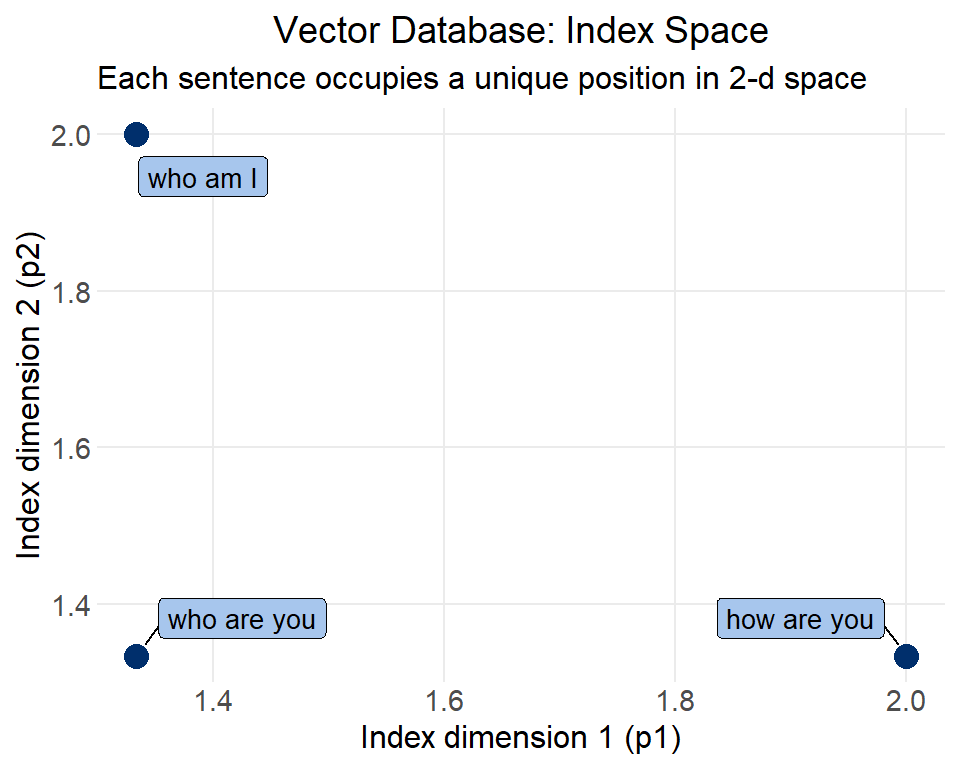
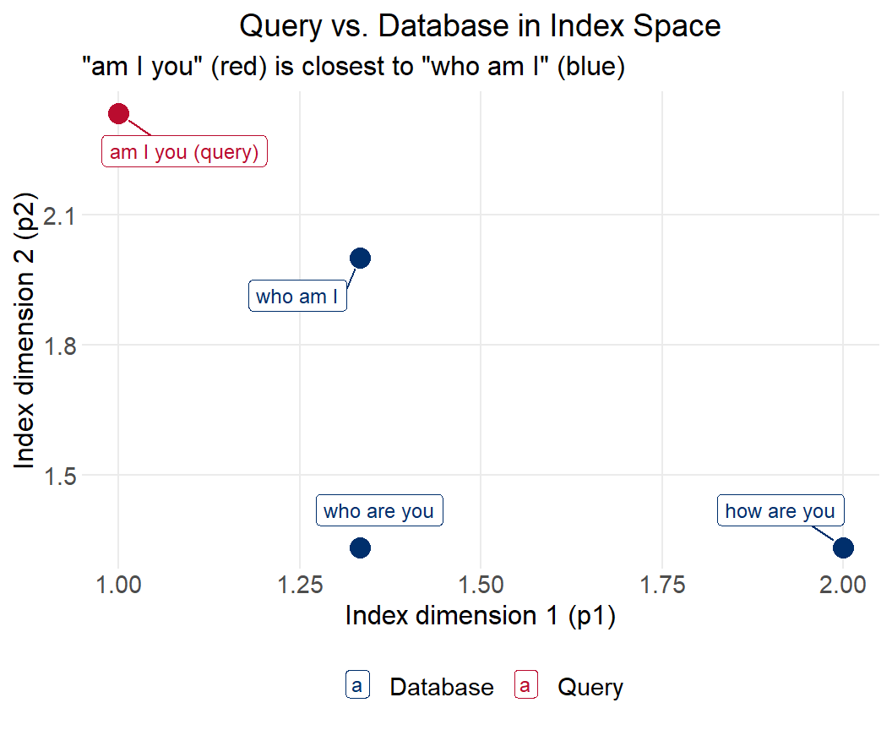

::: {.callout-note}
This report was generated using AI under general human direction. At the time of generation, the contents have not been comprehensively reviewed by a human analyst.

<!--
To indicate human review: Delete the line above about contents not being reviewed, and replace this comment with:
The contents have been reviewed and validated by [Your Name], [Your Role] on [Date].
-->
:::

## Introduction

This tutorial walks through how a **vector database** works from first principles, following the structure of Dr. Tom Yeh's [Vector Database by Hand](https://www.byhand.ai/p/14-can-you-calculate-a-vector-database). Every computation is performed explicitly in R so the mechanics are fully visible.

Vector databases are the backbone of **Retrieval Augmented Generation (RAG)** — the technique that allows large language models to search and retrieve relevant information from a corpus before generating a response. Instead of storing data as rows and columns, a vector database stores data as numeric vectors called *embeddings*, and retrieves information by geometric similarity rather than exact match.

The pipeline has four stages:

| Stage | Input | Output |
|---|---|---|
| Word Embeddings | Words (text) | Numeric vectors per word |
| Encoding + Pooling | Word vectors | Single vector per sentence |
| Indexing | Full-dim vectors | Reduced-dim vectors stored in DB |
| Retrieval | Query vector | Most similar item from DB |

We will work through each stage with a tiny corpus of three sentences:

- **"how are you"**
- **"who are you"**
- **"who am I"**

And we will query the database with: **"am I you"**

---

## Data

Our corpus has 3 sentences, each 3 words long. We define a vocabulary of the 6 unique words that appear across all sentences and the query.


::: {.cell}

```{.r .cell-code}
sentences <- list(
  s1 = c("how", "are", "you"),
  s2 = c("who", "are", "you"),
  s3 = c("who", "am",  "I")
)

query_words <- c("am", "I", "you")

vocab <- c("how", "are", "you", "who", "am", "I")

tibble(
  Sentence = c("how are you", "who are you", "who am I"),
  Label    = c("s1", "s2", "s3")
) |>
  gt() |>
  tab_header(title = "Corpus") |>
  cols_label(Sentence = "Text", Label = "ID")
```

::: {.cell-output-display}

```{=html}
<div id="sqkesfxczb" style="padding-left:0px;padding-right:0px;padding-top:10px;padding-bottom:10px;overflow-x:auto;overflow-y:auto;width:auto;height:auto;">
<style>#sqkesfxczb table {
  font-family: system-ui, 'Segoe UI', Roboto, Helvetica, Arial, sans-serif, 'Apple Color Emoji', 'Segoe UI Emoji', 'Segoe UI Symbol', 'Noto Color Emoji';
  -webkit-font-smoothing: antialiased;
  -moz-osx-font-smoothing: grayscale;
}

#sqkesfxczb thead, #sqkesfxczb tbody, #sqkesfxczb tfoot, #sqkesfxczb tr, #sqkesfxczb td, #sqkesfxczb th {
  border-style: none;
}

#sqkesfxczb p {
  margin: 0;
  padding: 0;
}

#sqkesfxczb .gt_table {
  display: table;
  border-collapse: collapse;
  line-height: normal;
  margin-left: auto;
  margin-right: auto;
  color: #333333;
  font-size: 16px;
  font-weight: normal;
  font-style: normal;
  background-color: #FFFFFF;
  width: auto;
  border-top-style: solid;
  border-top-width: 2px;
  border-top-color: #A8A8A8;
  border-right-style: none;
  border-right-width: 2px;
  border-right-color: #D3D3D3;
  border-bottom-style: solid;
  border-bottom-width: 2px;
  border-bottom-color: #A8A8A8;
  border-left-style: none;
  border-left-width: 2px;
  border-left-color: #D3D3D3;
}

#sqkesfxczb .gt_caption {
  padding-top: 4px;
  padding-bottom: 4px;
}

#sqkesfxczb .gt_title {
  color: #333333;
  font-size: 125%;
  font-weight: initial;
  padding-top: 4px;
  padding-bottom: 4px;
  padding-left: 5px;
  padding-right: 5px;
  border-bottom-color: #FFFFFF;
  border-bottom-width: 0;
}

#sqkesfxczb .gt_subtitle {
  color: #333333;
  font-size: 85%;
  font-weight: initial;
  padding-top: 3px;
  padding-bottom: 5px;
  padding-left: 5px;
  padding-right: 5px;
  border-top-color: #FFFFFF;
  border-top-width: 0;
}

#sqkesfxczb .gt_heading {
  background-color: #FFFFFF;
  text-align: center;
  border-bottom-color: #FFFFFF;
  border-left-style: none;
  border-left-width: 1px;
  border-left-color: #D3D3D3;
  border-right-style: none;
  border-right-width: 1px;
  border-right-color: #D3D3D3;
}

#sqkesfxczb .gt_bottom_border {
  border-bottom-style: solid;
  border-bottom-width: 2px;
  border-bottom-color: #D3D3D3;
}

#sqkesfxczb .gt_col_headings {
  border-top-style: solid;
  border-top-width: 2px;
  border-top-color: #D3D3D3;
  border-bottom-style: solid;
  border-bottom-width: 2px;
  border-bottom-color: #D3D3D3;
  border-left-style: none;
  border-left-width: 1px;
  border-left-color: #D3D3D3;
  border-right-style: none;
  border-right-width: 1px;
  border-right-color: #D3D3D3;
}

#sqkesfxczb .gt_col_heading {
  color: #333333;
  background-color: #FFFFFF;
  font-size: 100%;
  font-weight: normal;
  text-transform: inherit;
  border-left-style: none;
  border-left-width: 1px;
  border-left-color: #D3D3D3;
  border-right-style: none;
  border-right-width: 1px;
  border-right-color: #D3D3D3;
  vertical-align: bottom;
  padding-top: 5px;
  padding-bottom: 6px;
  padding-left: 5px;
  padding-right: 5px;
  overflow-x: hidden;
}

#sqkesfxczb .gt_column_spanner_outer {
  color: #333333;
  background-color: #FFFFFF;
  font-size: 100%;
  font-weight: normal;
  text-transform: inherit;
  padding-top: 0;
  padding-bottom: 0;
  padding-left: 4px;
  padding-right: 4px;
}

#sqkesfxczb .gt_column_spanner_outer:first-child {
  padding-left: 0;
}

#sqkesfxczb .gt_column_spanner_outer:last-child {
  padding-right: 0;
}

#sqkesfxczb .gt_column_spanner {
  border-bottom-style: solid;
  border-bottom-width: 2px;
  border-bottom-color: #D3D3D3;
  vertical-align: bottom;
  padding-top: 5px;
  padding-bottom: 5px;
  overflow-x: hidden;
  display: inline-block;
  width: 100%;
}

#sqkesfxczb .gt_spanner_row {
  border-bottom-style: hidden;
}

#sqkesfxczb .gt_group_heading {
  padding-top: 8px;
  padding-bottom: 8px;
  padding-left: 5px;
  padding-right: 5px;
  color: #333333;
  background-color: #FFFFFF;
  font-size: 100%;
  font-weight: initial;
  text-transform: inherit;
  border-top-style: solid;
  border-top-width: 2px;
  border-top-color: #D3D3D3;
  border-bottom-style: solid;
  border-bottom-width: 2px;
  border-bottom-color: #D3D3D3;
  border-left-style: none;
  border-left-width: 1px;
  border-left-color: #D3D3D3;
  border-right-style: none;
  border-right-width: 1px;
  border-right-color: #D3D3D3;
  vertical-align: middle;
  text-align: left;
}

#sqkesfxczb .gt_empty_group_heading {
  padding: 0.5px;
  color: #333333;
  background-color: #FFFFFF;
  font-size: 100%;
  font-weight: initial;
  border-top-style: solid;
  border-top-width: 2px;
  border-top-color: #D3D3D3;
  border-bottom-style: solid;
  border-bottom-width: 2px;
  border-bottom-color: #D3D3D3;
  vertical-align: middle;
}

#sqkesfxczb .gt_from_md > :first-child {
  margin-top: 0;
}

#sqkesfxczb .gt_from_md > :last-child {
  margin-bottom: 0;
}

#sqkesfxczb .gt_row {
  padding-top: 8px;
  padding-bottom: 8px;
  padding-left: 5px;
  padding-right: 5px;
  margin: 10px;
  border-top-style: solid;
  border-top-width: 1px;
  border-top-color: #D3D3D3;
  border-left-style: none;
  border-left-width: 1px;
  border-left-color: #D3D3D3;
  border-right-style: none;
  border-right-width: 1px;
  border-right-color: #D3D3D3;
  vertical-align: middle;
  overflow-x: hidden;
}

#sqkesfxczb .gt_stub {
  color: #333333;
  background-color: #FFFFFF;
  font-size: 100%;
  font-weight: initial;
  text-transform: inherit;
  border-right-style: solid;
  border-right-width: 2px;
  border-right-color: #D3D3D3;
  padding-left: 5px;
  padding-right: 5px;
}

#sqkesfxczb .gt_stub_row_group {
  color: #333333;
  background-color: #FFFFFF;
  font-size: 100%;
  font-weight: initial;
  text-transform: inherit;
  border-right-style: solid;
  border-right-width: 2px;
  border-right-color: #D3D3D3;
  padding-left: 5px;
  padding-right: 5px;
  vertical-align: top;
}

#sqkesfxczb .gt_row_group_first td {
  border-top-width: 2px;
}

#sqkesfxczb .gt_row_group_first th {
  border-top-width: 2px;
}

#sqkesfxczb .gt_summary_row {
  color: #333333;
  background-color: #FFFFFF;
  text-transform: inherit;
  padding-top: 8px;
  padding-bottom: 8px;
  padding-left: 5px;
  padding-right: 5px;
}

#sqkesfxczb .gt_first_summary_row {
  border-top-style: solid;
  border-top-color: #D3D3D3;
}

#sqkesfxczb .gt_first_summary_row.thick {
  border-top-width: 2px;
}

#sqkesfxczb .gt_last_summary_row {
  padding-top: 8px;
  padding-bottom: 8px;
  padding-left: 5px;
  padding-right: 5px;
  border-bottom-style: solid;
  border-bottom-width: 2px;
  border-bottom-color: #D3D3D3;
}

#sqkesfxczb .gt_grand_summary_row {
  color: #333333;
  background-color: #FFFFFF;
  text-transform: inherit;
  padding-top: 8px;
  padding-bottom: 8px;
  padding-left: 5px;
  padding-right: 5px;
}

#sqkesfxczb .gt_first_grand_summary_row {
  padding-top: 8px;
  padding-bottom: 8px;
  padding-left: 5px;
  padding-right: 5px;
  border-top-style: double;
  border-top-width: 6px;
  border-top-color: #D3D3D3;
}

#sqkesfxczb .gt_last_grand_summary_row_top {
  padding-top: 8px;
  padding-bottom: 8px;
  padding-left: 5px;
  padding-right: 5px;
  border-bottom-style: double;
  border-bottom-width: 6px;
  border-bottom-color: #D3D3D3;
}

#sqkesfxczb .gt_striped {
  background-color: rgba(128, 128, 128, 0.05);
}

#sqkesfxczb .gt_table_body {
  border-top-style: solid;
  border-top-width: 2px;
  border-top-color: #D3D3D3;
  border-bottom-style: solid;
  border-bottom-width: 2px;
  border-bottom-color: #D3D3D3;
}

#sqkesfxczb .gt_footnotes {
  color: #333333;
  background-color: #FFFFFF;
  border-bottom-style: none;
  border-bottom-width: 2px;
  border-bottom-color: #D3D3D3;
  border-left-style: none;
  border-left-width: 2px;
  border-left-color: #D3D3D3;
  border-right-style: none;
  border-right-width: 2px;
  border-right-color: #D3D3D3;
}

#sqkesfxczb .gt_footnote {
  margin: 0px;
  font-size: 90%;
  padding-top: 4px;
  padding-bottom: 4px;
  padding-left: 5px;
  padding-right: 5px;
}

#sqkesfxczb .gt_sourcenotes {
  color: #333333;
  background-color: #FFFFFF;
  border-bottom-style: none;
  border-bottom-width: 2px;
  border-bottom-color: #D3D3D3;
  border-left-style: none;
  border-left-width: 2px;
  border-left-color: #D3D3D3;
  border-right-style: none;
  border-right-width: 2px;
  border-right-color: #D3D3D3;
}

#sqkesfxczb .gt_sourcenote {
  font-size: 90%;
  padding-top: 4px;
  padding-bottom: 4px;
  padding-left: 5px;
  padding-right: 5px;
}

#sqkesfxczb .gt_left {
  text-align: left;
}

#sqkesfxczb .gt_center {
  text-align: center;
}

#sqkesfxczb .gt_right {
  text-align: right;
  font-variant-numeric: tabular-nums;
}

#sqkesfxczb .gt_font_normal {
  font-weight: normal;
}

#sqkesfxczb .gt_font_bold {
  font-weight: bold;
}

#sqkesfxczb .gt_font_italic {
  font-style: italic;
}

#sqkesfxczb .gt_super {
  font-size: 65%;
}

#sqkesfxczb .gt_footnote_marks {
  font-size: 75%;
  vertical-align: 0.4em;
  position: initial;
}

#sqkesfxczb .gt_asterisk {
  font-size: 100%;
  vertical-align: 0;
}

#sqkesfxczb .gt_indent_1 {
  text-indent: 5px;
}

#sqkesfxczb .gt_indent_2 {
  text-indent: 10px;
}

#sqkesfxczb .gt_indent_3 {
  text-indent: 15px;
}

#sqkesfxczb .gt_indent_4 {
  text-indent: 20px;
}

#sqkesfxczb .gt_indent_5 {
  text-indent: 25px;
}

#sqkesfxczb .katex-display {
  display: inline-flex !important;
  margin-bottom: 0.75em !important;
}

#sqkesfxczb div.Reactable > div.rt-table > div.rt-thead > div.rt-tr.rt-tr-group-header > div.rt-th-group:after {
  height: 0px !important;
}
</style>
<table class="gt_table" data-quarto-disable-processing="false" data-quarto-bootstrap="false">
  <thead>
    <tr class="gt_heading">
      <td colspan="2" class="gt_heading gt_title gt_font_normal gt_bottom_border" style>Corpus</td>
    </tr>
    
    <tr class="gt_col_headings">
      <th class="gt_col_heading gt_columns_bottom_border gt_left" rowspan="1" colspan="1" scope="col" id="Sentence">Text</th>
      <th class="gt_col_heading gt_columns_bottom_border gt_left" rowspan="1" colspan="1" scope="col" id="Label">ID</th>
    </tr>
  </thead>
  <tbody class="gt_table_body">
    <tr><td headers="Sentence" class="gt_row gt_left">how are you</td>
<td headers="Label" class="gt_row gt_left">s1</td></tr>
    <tr><td headers="Sentence" class="gt_row gt_left">who are you</td>
<td headers="Label" class="gt_row gt_left">s2</td></tr>
    <tr><td headers="Sentence" class="gt_row gt_left">who am I</td>
<td headers="Label" class="gt_row gt_left">s3</td></tr>
  </tbody>
  
</table>
</div>
```

:::
:::


In practice, a corpus may contain millions of documents with a vocabulary of tens of thousands of tokens. The math is the same — just bigger.

---

## Word Embeddings

The first step converts each word into a numeric vector. These vectors are stored in a **word embedding table**: a matrix where each column is a word and each row is one dimension of the embedding space.

The values in this table are learned during model training to capture semantic relationships. Here we use a hand-crafted 4-dimensional table (values drawn from Dr. Yeh's spreadsheet where available) for illustration:


::: {.cell}

```{.r .cell-code}
E <- matrix(
  c(# how  are  you  who   am    I
     1,   0,   0,   1,   0,   0,   # dim 1  (wh-question words)
     0,   1,   0,   0,   1,   0,   # dim 2  (verb-like words)
     1,   1,   0,   0,   0,   1,   # dim 3  (sentence-structure words)
     0,   0,   1,   0,   1,   1    # dim 4  (person/object words)
  ),
  nrow = 4, byrow = TRUE,
  dimnames = list(paste0("dim", 1:4), vocab)
)

E |>
  as.data.frame() |>
  rownames_to_column("Dimension") |>
  gt() |>
  tab_header(
    title    = "Word Embedding Table E",
    subtitle = "4 dimensions × 6 vocabulary words"
  ) |>
  tab_spanner(label = "Vocabulary", columns = all_of(vocab)) |>
  data_color(
    columns = all_of(vocab),
    method  = "numeric",
    palette = c("white", "#A7C6ED", "#002F6C")
  )
```

::: {.cell-output-display}

```{=html}
<div id="dezjghntin" style="padding-left:0px;padding-right:0px;padding-top:10px;padding-bottom:10px;overflow-x:auto;overflow-y:auto;width:auto;height:auto;">
<style>#dezjghntin table {
  font-family: system-ui, 'Segoe UI', Roboto, Helvetica, Arial, sans-serif, 'Apple Color Emoji', 'Segoe UI Emoji', 'Segoe UI Symbol', 'Noto Color Emoji';
  -webkit-font-smoothing: antialiased;
  -moz-osx-font-smoothing: grayscale;
}

#dezjghntin thead, #dezjghntin tbody, #dezjghntin tfoot, #dezjghntin tr, #dezjghntin td, #dezjghntin th {
  border-style: none;
}

#dezjghntin p {
  margin: 0;
  padding: 0;
}

#dezjghntin .gt_table {
  display: table;
  border-collapse: collapse;
  line-height: normal;
  margin-left: auto;
  margin-right: auto;
  color: #333333;
  font-size: 16px;
  font-weight: normal;
  font-style: normal;
  background-color: #FFFFFF;
  width: auto;
  border-top-style: solid;
  border-top-width: 2px;
  border-top-color: #A8A8A8;
  border-right-style: none;
  border-right-width: 2px;
  border-right-color: #D3D3D3;
  border-bottom-style: solid;
  border-bottom-width: 2px;
  border-bottom-color: #A8A8A8;
  border-left-style: none;
  border-left-width: 2px;
  border-left-color: #D3D3D3;
}

#dezjghntin .gt_caption {
  padding-top: 4px;
  padding-bottom: 4px;
}

#dezjghntin .gt_title {
  color: #333333;
  font-size: 125%;
  font-weight: initial;
  padding-top: 4px;
  padding-bottom: 4px;
  padding-left: 5px;
  padding-right: 5px;
  border-bottom-color: #FFFFFF;
  border-bottom-width: 0;
}

#dezjghntin .gt_subtitle {
  color: #333333;
  font-size: 85%;
  font-weight: initial;
  padding-top: 3px;
  padding-bottom: 5px;
  padding-left: 5px;
  padding-right: 5px;
  border-top-color: #FFFFFF;
  border-top-width: 0;
}

#dezjghntin .gt_heading {
  background-color: #FFFFFF;
  text-align: center;
  border-bottom-color: #FFFFFF;
  border-left-style: none;
  border-left-width: 1px;
  border-left-color: #D3D3D3;
  border-right-style: none;
  border-right-width: 1px;
  border-right-color: #D3D3D3;
}

#dezjghntin .gt_bottom_border {
  border-bottom-style: solid;
  border-bottom-width: 2px;
  border-bottom-color: #D3D3D3;
}

#dezjghntin .gt_col_headings {
  border-top-style: solid;
  border-top-width: 2px;
  border-top-color: #D3D3D3;
  border-bottom-style: solid;
  border-bottom-width: 2px;
  border-bottom-color: #D3D3D3;
  border-left-style: none;
  border-left-width: 1px;
  border-left-color: #D3D3D3;
  border-right-style: none;
  border-right-width: 1px;
  border-right-color: #D3D3D3;
}

#dezjghntin .gt_col_heading {
  color: #333333;
  background-color: #FFFFFF;
  font-size: 100%;
  font-weight: normal;
  text-transform: inherit;
  border-left-style: none;
  border-left-width: 1px;
  border-left-color: #D3D3D3;
  border-right-style: none;
  border-right-width: 1px;
  border-right-color: #D3D3D3;
  vertical-align: bottom;
  padding-top: 5px;
  padding-bottom: 6px;
  padding-left: 5px;
  padding-right: 5px;
  overflow-x: hidden;
}

#dezjghntin .gt_column_spanner_outer {
  color: #333333;
  background-color: #FFFFFF;
  font-size: 100%;
  font-weight: normal;
  text-transform: inherit;
  padding-top: 0;
  padding-bottom: 0;
  padding-left: 4px;
  padding-right: 4px;
}

#dezjghntin .gt_column_spanner_outer:first-child {
  padding-left: 0;
}

#dezjghntin .gt_column_spanner_outer:last-child {
  padding-right: 0;
}

#dezjghntin .gt_column_spanner {
  border-bottom-style: solid;
  border-bottom-width: 2px;
  border-bottom-color: #D3D3D3;
  vertical-align: bottom;
  padding-top: 5px;
  padding-bottom: 5px;
  overflow-x: hidden;
  display: inline-block;
  width: 100%;
}

#dezjghntin .gt_spanner_row {
  border-bottom-style: hidden;
}

#dezjghntin .gt_group_heading {
  padding-top: 8px;
  padding-bottom: 8px;
  padding-left: 5px;
  padding-right: 5px;
  color: #333333;
  background-color: #FFFFFF;
  font-size: 100%;
  font-weight: initial;
  text-transform: inherit;
  border-top-style: solid;
  border-top-width: 2px;
  border-top-color: #D3D3D3;
  border-bottom-style: solid;
  border-bottom-width: 2px;
  border-bottom-color: #D3D3D3;
  border-left-style: none;
  border-left-width: 1px;
  border-left-color: #D3D3D3;
  border-right-style: none;
  border-right-width: 1px;
  border-right-color: #D3D3D3;
  vertical-align: middle;
  text-align: left;
}

#dezjghntin .gt_empty_group_heading {
  padding: 0.5px;
  color: #333333;
  background-color: #FFFFFF;
  font-size: 100%;
  font-weight: initial;
  border-top-style: solid;
  border-top-width: 2px;
  border-top-color: #D3D3D3;
  border-bottom-style: solid;
  border-bottom-width: 2px;
  border-bottom-color: #D3D3D3;
  vertical-align: middle;
}

#dezjghntin .gt_from_md > :first-child {
  margin-top: 0;
}

#dezjghntin .gt_from_md > :last-child {
  margin-bottom: 0;
}

#dezjghntin .gt_row {
  padding-top: 8px;
  padding-bottom: 8px;
  padding-left: 5px;
  padding-right: 5px;
  margin: 10px;
  border-top-style: solid;
  border-top-width: 1px;
  border-top-color: #D3D3D3;
  border-left-style: none;
  border-left-width: 1px;
  border-left-color: #D3D3D3;
  border-right-style: none;
  border-right-width: 1px;
  border-right-color: #D3D3D3;
  vertical-align: middle;
  overflow-x: hidden;
}

#dezjghntin .gt_stub {
  color: #333333;
  background-color: #FFFFFF;
  font-size: 100%;
  font-weight: initial;
  text-transform: inherit;
  border-right-style: solid;
  border-right-width: 2px;
  border-right-color: #D3D3D3;
  padding-left: 5px;
  padding-right: 5px;
}

#dezjghntin .gt_stub_row_group {
  color: #333333;
  background-color: #FFFFFF;
  font-size: 100%;
  font-weight: initial;
  text-transform: inherit;
  border-right-style: solid;
  border-right-width: 2px;
  border-right-color: #D3D3D3;
  padding-left: 5px;
  padding-right: 5px;
  vertical-align: top;
}

#dezjghntin .gt_row_group_first td {
  border-top-width: 2px;
}

#dezjghntin .gt_row_group_first th {
  border-top-width: 2px;
}

#dezjghntin .gt_summary_row {
  color: #333333;
  background-color: #FFFFFF;
  text-transform: inherit;
  padding-top: 8px;
  padding-bottom: 8px;
  padding-left: 5px;
  padding-right: 5px;
}

#dezjghntin .gt_first_summary_row {
  border-top-style: solid;
  border-top-color: #D3D3D3;
}

#dezjghntin .gt_first_summary_row.thick {
  border-top-width: 2px;
}

#dezjghntin .gt_last_summary_row {
  padding-top: 8px;
  padding-bottom: 8px;
  padding-left: 5px;
  padding-right: 5px;
  border-bottom-style: solid;
  border-bottom-width: 2px;
  border-bottom-color: #D3D3D3;
}

#dezjghntin .gt_grand_summary_row {
  color: #333333;
  background-color: #FFFFFF;
  text-transform: inherit;
  padding-top: 8px;
  padding-bottom: 8px;
  padding-left: 5px;
  padding-right: 5px;
}

#dezjghntin .gt_first_grand_summary_row {
  padding-top: 8px;
  padding-bottom: 8px;
  padding-left: 5px;
  padding-right: 5px;
  border-top-style: double;
  border-top-width: 6px;
  border-top-color: #D3D3D3;
}

#dezjghntin .gt_last_grand_summary_row_top {
  padding-top: 8px;
  padding-bottom: 8px;
  padding-left: 5px;
  padding-right: 5px;
  border-bottom-style: double;
  border-bottom-width: 6px;
  border-bottom-color: #D3D3D3;
}

#dezjghntin .gt_striped {
  background-color: rgba(128, 128, 128, 0.05);
}

#dezjghntin .gt_table_body {
  border-top-style: solid;
  border-top-width: 2px;
  border-top-color: #D3D3D3;
  border-bottom-style: solid;
  border-bottom-width: 2px;
  border-bottom-color: #D3D3D3;
}

#dezjghntin .gt_footnotes {
  color: #333333;
  background-color: #FFFFFF;
  border-bottom-style: none;
  border-bottom-width: 2px;
  border-bottom-color: #D3D3D3;
  border-left-style: none;
  border-left-width: 2px;
  border-left-color: #D3D3D3;
  border-right-style: none;
  border-right-width: 2px;
  border-right-color: #D3D3D3;
}

#dezjghntin .gt_footnote {
  margin: 0px;
  font-size: 90%;
  padding-top: 4px;
  padding-bottom: 4px;
  padding-left: 5px;
  padding-right: 5px;
}

#dezjghntin .gt_sourcenotes {
  color: #333333;
  background-color: #FFFFFF;
  border-bottom-style: none;
  border-bottom-width: 2px;
  border-bottom-color: #D3D3D3;
  border-left-style: none;
  border-left-width: 2px;
  border-left-color: #D3D3D3;
  border-right-style: none;
  border-right-width: 2px;
  border-right-color: #D3D3D3;
}

#dezjghntin .gt_sourcenote {
  font-size: 90%;
  padding-top: 4px;
  padding-bottom: 4px;
  padding-left: 5px;
  padding-right: 5px;
}

#dezjghntin .gt_left {
  text-align: left;
}

#dezjghntin .gt_center {
  text-align: center;
}

#dezjghntin .gt_right {
  text-align: right;
  font-variant-numeric: tabular-nums;
}

#dezjghntin .gt_font_normal {
  font-weight: normal;
}

#dezjghntin .gt_font_bold {
  font-weight: bold;
}

#dezjghntin .gt_font_italic {
  font-style: italic;
}

#dezjghntin .gt_super {
  font-size: 65%;
}

#dezjghntin .gt_footnote_marks {
  font-size: 75%;
  vertical-align: 0.4em;
  position: initial;
}

#dezjghntin .gt_asterisk {
  font-size: 100%;
  vertical-align: 0;
}

#dezjghntin .gt_indent_1 {
  text-indent: 5px;
}

#dezjghntin .gt_indent_2 {
  text-indent: 10px;
}

#dezjghntin .gt_indent_3 {
  text-indent: 15px;
}

#dezjghntin .gt_indent_4 {
  text-indent: 20px;
}

#dezjghntin .gt_indent_5 {
  text-indent: 25px;
}

#dezjghntin .katex-display {
  display: inline-flex !important;
  margin-bottom: 0.75em !important;
}

#dezjghntin div.Reactable > div.rt-table > div.rt-thead > div.rt-tr.rt-tr-group-header > div.rt-th-group:after {
  height: 0px !important;
}
</style>
<table class="gt_table" data-quarto-disable-processing="false" data-quarto-bootstrap="false">
  <thead>
    <tr class="gt_heading">
      <td colspan="7" class="gt_heading gt_title gt_font_normal" style>Word Embedding Table E</td>
    </tr>
    <tr class="gt_heading">
      <td colspan="7" class="gt_heading gt_subtitle gt_font_normal gt_bottom_border" style>4 dimensions × 6 vocabulary words</td>
    </tr>
    <tr class="gt_col_headings gt_spanner_row">
      <th class="gt_col_heading gt_columns_bottom_border gt_left" rowspan="2" colspan="1" scope="col" id="Dimension">Dimension</th>
      <th class="gt_center gt_columns_top_border gt_column_spanner_outer" rowspan="1" colspan="6" scope="colgroup" id="Vocabulary">
        <div class="gt_column_spanner">Vocabulary</div>
      </th>
    </tr>
    <tr class="gt_col_headings">
      <th class="gt_col_heading gt_columns_bottom_border gt_right" rowspan="1" colspan="1" scope="col" id="how">how</th>
      <th class="gt_col_heading gt_columns_bottom_border gt_right" rowspan="1" colspan="1" scope="col" id="are">are</th>
      <th class="gt_col_heading gt_columns_bottom_border gt_right" rowspan="1" colspan="1" scope="col" id="you">you</th>
      <th class="gt_col_heading gt_columns_bottom_border gt_right" rowspan="1" colspan="1" scope="col" id="who">who</th>
      <th class="gt_col_heading gt_columns_bottom_border gt_right" rowspan="1" colspan="1" scope="col" id="am">am</th>
      <th class="gt_col_heading gt_columns_bottom_border gt_right" rowspan="1" colspan="1" scope="col" id="I">I</th>
    </tr>
  </thead>
  <tbody class="gt_table_body">
    <tr><td headers="Dimension" class="gt_row gt_left">dim1</td>
<td headers="how" class="gt_row gt_right" style="background-color: #002F6C; color: #FFFFFF;">1</td>
<td headers="are" class="gt_row gt_right" style="background-color: #FFFFFF; color: #000000;">0</td>
<td headers="you" class="gt_row gt_right" style="background-color: #FFFFFF; color: #000000;">0</td>
<td headers="who" class="gt_row gt_right" style="background-color: #002F6C; color: #FFFFFF;">1</td>
<td headers="am" class="gt_row gt_right" style="background-color: #FFFFFF; color: #000000;">0</td>
<td headers="I" class="gt_row gt_right" style="background-color: #FFFFFF; color: #000000;">0</td></tr>
    <tr><td headers="Dimension" class="gt_row gt_left">dim2</td>
<td headers="how" class="gt_row gt_right" style="background-color: #FFFFFF; color: #000000;">0</td>
<td headers="are" class="gt_row gt_right" style="background-color: #002F6C; color: #FFFFFF;">1</td>
<td headers="you" class="gt_row gt_right" style="background-color: #FFFFFF; color: #000000;">0</td>
<td headers="who" class="gt_row gt_right" style="background-color: #FFFFFF; color: #000000;">0</td>
<td headers="am" class="gt_row gt_right" style="background-color: #002F6C; color: #FFFFFF;">1</td>
<td headers="I" class="gt_row gt_right" style="background-color: #FFFFFF; color: #000000;">0</td></tr>
    <tr><td headers="Dimension" class="gt_row gt_left">dim3</td>
<td headers="how" class="gt_row gt_right" style="background-color: #002F6C; color: #FFFFFF;">1</td>
<td headers="are" class="gt_row gt_right" style="background-color: #002F6C; color: #FFFFFF;">1</td>
<td headers="you" class="gt_row gt_right" style="background-color: #FFFFFF; color: #000000;">0</td>
<td headers="who" class="gt_row gt_right" style="background-color: #FFFFFF; color: #000000;">0</td>
<td headers="am" class="gt_row gt_right" style="background-color: #FFFFFF; color: #000000;">0</td>
<td headers="I" class="gt_row gt_right" style="background-color: #002F6C; color: #FFFFFF;">1</td></tr>
    <tr><td headers="Dimension" class="gt_row gt_left">dim4</td>
<td headers="how" class="gt_row gt_right" style="background-color: #FFFFFF; color: #000000;">0</td>
<td headers="are" class="gt_row gt_right" style="background-color: #FFFFFF; color: #000000;">0</td>
<td headers="you" class="gt_row gt_right" style="background-color: #002F6C; color: #FFFFFF;">1</td>
<td headers="who" class="gt_row gt_right" style="background-color: #FFFFFF; color: #000000;">0</td>
<td headers="am" class="gt_row gt_right" style="background-color: #002F6C; color: #FFFFFF;">1</td>
<td headers="I" class="gt_row gt_right" style="background-color: #002F6C; color: #FFFFFF;">1</td></tr>
  </tbody>
  
</table>
</div>
```

:::
:::


To embed a sentence, we simply **look up** each word's column from this table. For "how are you":


::: {.cell}

```{.r .cell-code}
sentence1_embs <- E[, sentences$s1]

sentence1_embs |>
  as.data.frame() |>
  rownames_to_column("Dimension") |>
  gt() |>
  tab_header(
    title    = "Word Lookup: \"how are you\"",
    subtitle = "Each column is retrieved from the embedding table E"
  ) |>
  cols_label(how = "how", are = "are", you = "you")
```

::: {.cell-output-display}

```{=html}
<div id="fxdhqxalxj" style="padding-left:0px;padding-right:0px;padding-top:10px;padding-bottom:10px;overflow-x:auto;overflow-y:auto;width:auto;height:auto;">
<style>#fxdhqxalxj table {
  font-family: system-ui, 'Segoe UI', Roboto, Helvetica, Arial, sans-serif, 'Apple Color Emoji', 'Segoe UI Emoji', 'Segoe UI Symbol', 'Noto Color Emoji';
  -webkit-font-smoothing: antialiased;
  -moz-osx-font-smoothing: grayscale;
}

#fxdhqxalxj thead, #fxdhqxalxj tbody, #fxdhqxalxj tfoot, #fxdhqxalxj tr, #fxdhqxalxj td, #fxdhqxalxj th {
  border-style: none;
}

#fxdhqxalxj p {
  margin: 0;
  padding: 0;
}

#fxdhqxalxj .gt_table {
  display: table;
  border-collapse: collapse;
  line-height: normal;
  margin-left: auto;
  margin-right: auto;
  color: #333333;
  font-size: 16px;
  font-weight: normal;
  font-style: normal;
  background-color: #FFFFFF;
  width: auto;
  border-top-style: solid;
  border-top-width: 2px;
  border-top-color: #A8A8A8;
  border-right-style: none;
  border-right-width: 2px;
  border-right-color: #D3D3D3;
  border-bottom-style: solid;
  border-bottom-width: 2px;
  border-bottom-color: #A8A8A8;
  border-left-style: none;
  border-left-width: 2px;
  border-left-color: #D3D3D3;
}

#fxdhqxalxj .gt_caption {
  padding-top: 4px;
  padding-bottom: 4px;
}

#fxdhqxalxj .gt_title {
  color: #333333;
  font-size: 125%;
  font-weight: initial;
  padding-top: 4px;
  padding-bottom: 4px;
  padding-left: 5px;
  padding-right: 5px;
  border-bottom-color: #FFFFFF;
  border-bottom-width: 0;
}

#fxdhqxalxj .gt_subtitle {
  color: #333333;
  font-size: 85%;
  font-weight: initial;
  padding-top: 3px;
  padding-bottom: 5px;
  padding-left: 5px;
  padding-right: 5px;
  border-top-color: #FFFFFF;
  border-top-width: 0;
}

#fxdhqxalxj .gt_heading {
  background-color: #FFFFFF;
  text-align: center;
  border-bottom-color: #FFFFFF;
  border-left-style: none;
  border-left-width: 1px;
  border-left-color: #D3D3D3;
  border-right-style: none;
  border-right-width: 1px;
  border-right-color: #D3D3D3;
}

#fxdhqxalxj .gt_bottom_border {
  border-bottom-style: solid;
  border-bottom-width: 2px;
  border-bottom-color: #D3D3D3;
}

#fxdhqxalxj .gt_col_headings {
  border-top-style: solid;
  border-top-width: 2px;
  border-top-color: #D3D3D3;
  border-bottom-style: solid;
  border-bottom-width: 2px;
  border-bottom-color: #D3D3D3;
  border-left-style: none;
  border-left-width: 1px;
  border-left-color: #D3D3D3;
  border-right-style: none;
  border-right-width: 1px;
  border-right-color: #D3D3D3;
}

#fxdhqxalxj .gt_col_heading {
  color: #333333;
  background-color: #FFFFFF;
  font-size: 100%;
  font-weight: normal;
  text-transform: inherit;
  border-left-style: none;
  border-left-width: 1px;
  border-left-color: #D3D3D3;
  border-right-style: none;
  border-right-width: 1px;
  border-right-color: #D3D3D3;
  vertical-align: bottom;
  padding-top: 5px;
  padding-bottom: 6px;
  padding-left: 5px;
  padding-right: 5px;
  overflow-x: hidden;
}

#fxdhqxalxj .gt_column_spanner_outer {
  color: #333333;
  background-color: #FFFFFF;
  font-size: 100%;
  font-weight: normal;
  text-transform: inherit;
  padding-top: 0;
  padding-bottom: 0;
  padding-left: 4px;
  padding-right: 4px;
}

#fxdhqxalxj .gt_column_spanner_outer:first-child {
  padding-left: 0;
}

#fxdhqxalxj .gt_column_spanner_outer:last-child {
  padding-right: 0;
}

#fxdhqxalxj .gt_column_spanner {
  border-bottom-style: solid;
  border-bottom-width: 2px;
  border-bottom-color: #D3D3D3;
  vertical-align: bottom;
  padding-top: 5px;
  padding-bottom: 5px;
  overflow-x: hidden;
  display: inline-block;
  width: 100%;
}

#fxdhqxalxj .gt_spanner_row {
  border-bottom-style: hidden;
}

#fxdhqxalxj .gt_group_heading {
  padding-top: 8px;
  padding-bottom: 8px;
  padding-left: 5px;
  padding-right: 5px;
  color: #333333;
  background-color: #FFFFFF;
  font-size: 100%;
  font-weight: initial;
  text-transform: inherit;
  border-top-style: solid;
  border-top-width: 2px;
  border-top-color: #D3D3D3;
  border-bottom-style: solid;
  border-bottom-width: 2px;
  border-bottom-color: #D3D3D3;
  border-left-style: none;
  border-left-width: 1px;
  border-left-color: #D3D3D3;
  border-right-style: none;
  border-right-width: 1px;
  border-right-color: #D3D3D3;
  vertical-align: middle;
  text-align: left;
}

#fxdhqxalxj .gt_empty_group_heading {
  padding: 0.5px;
  color: #333333;
  background-color: #FFFFFF;
  font-size: 100%;
  font-weight: initial;
  border-top-style: solid;
  border-top-width: 2px;
  border-top-color: #D3D3D3;
  border-bottom-style: solid;
  border-bottom-width: 2px;
  border-bottom-color: #D3D3D3;
  vertical-align: middle;
}

#fxdhqxalxj .gt_from_md > :first-child {
  margin-top: 0;
}

#fxdhqxalxj .gt_from_md > :last-child {
  margin-bottom: 0;
}

#fxdhqxalxj .gt_row {
  padding-top: 8px;
  padding-bottom: 8px;
  padding-left: 5px;
  padding-right: 5px;
  margin: 10px;
  border-top-style: solid;
  border-top-width: 1px;
  border-top-color: #D3D3D3;
  border-left-style: none;
  border-left-width: 1px;
  border-left-color: #D3D3D3;
  border-right-style: none;
  border-right-width: 1px;
  border-right-color: #D3D3D3;
  vertical-align: middle;
  overflow-x: hidden;
}

#fxdhqxalxj .gt_stub {
  color: #333333;
  background-color: #FFFFFF;
  font-size: 100%;
  font-weight: initial;
  text-transform: inherit;
  border-right-style: solid;
  border-right-width: 2px;
  border-right-color: #D3D3D3;
  padding-left: 5px;
  padding-right: 5px;
}

#fxdhqxalxj .gt_stub_row_group {
  color: #333333;
  background-color: #FFFFFF;
  font-size: 100%;
  font-weight: initial;
  text-transform: inherit;
  border-right-style: solid;
  border-right-width: 2px;
  border-right-color: #D3D3D3;
  padding-left: 5px;
  padding-right: 5px;
  vertical-align: top;
}

#fxdhqxalxj .gt_row_group_first td {
  border-top-width: 2px;
}

#fxdhqxalxj .gt_row_group_first th {
  border-top-width: 2px;
}

#fxdhqxalxj .gt_summary_row {
  color: #333333;
  background-color: #FFFFFF;
  text-transform: inherit;
  padding-top: 8px;
  padding-bottom: 8px;
  padding-left: 5px;
  padding-right: 5px;
}

#fxdhqxalxj .gt_first_summary_row {
  border-top-style: solid;
  border-top-color: #D3D3D3;
}

#fxdhqxalxj .gt_first_summary_row.thick {
  border-top-width: 2px;
}

#fxdhqxalxj .gt_last_summary_row {
  padding-top: 8px;
  padding-bottom: 8px;
  padding-left: 5px;
  padding-right: 5px;
  border-bottom-style: solid;
  border-bottom-width: 2px;
  border-bottom-color: #D3D3D3;
}

#fxdhqxalxj .gt_grand_summary_row {
  color: #333333;
  background-color: #FFFFFF;
  text-transform: inherit;
  padding-top: 8px;
  padding-bottom: 8px;
  padding-left: 5px;
  padding-right: 5px;
}

#fxdhqxalxj .gt_first_grand_summary_row {
  padding-top: 8px;
  padding-bottom: 8px;
  padding-left: 5px;
  padding-right: 5px;
  border-top-style: double;
  border-top-width: 6px;
  border-top-color: #D3D3D3;
}

#fxdhqxalxj .gt_last_grand_summary_row_top {
  padding-top: 8px;
  padding-bottom: 8px;
  padding-left: 5px;
  padding-right: 5px;
  border-bottom-style: double;
  border-bottom-width: 6px;
  border-bottom-color: #D3D3D3;
}

#fxdhqxalxj .gt_striped {
  background-color: rgba(128, 128, 128, 0.05);
}

#fxdhqxalxj .gt_table_body {
  border-top-style: solid;
  border-top-width: 2px;
  border-top-color: #D3D3D3;
  border-bottom-style: solid;
  border-bottom-width: 2px;
  border-bottom-color: #D3D3D3;
}

#fxdhqxalxj .gt_footnotes {
  color: #333333;
  background-color: #FFFFFF;
  border-bottom-style: none;
  border-bottom-width: 2px;
  border-bottom-color: #D3D3D3;
  border-left-style: none;
  border-left-width: 2px;
  border-left-color: #D3D3D3;
  border-right-style: none;
  border-right-width: 2px;
  border-right-color: #D3D3D3;
}

#fxdhqxalxj .gt_footnote {
  margin: 0px;
  font-size: 90%;
  padding-top: 4px;
  padding-bottom: 4px;
  padding-left: 5px;
  padding-right: 5px;
}

#fxdhqxalxj .gt_sourcenotes {
  color: #333333;
  background-color: #FFFFFF;
  border-bottom-style: none;
  border-bottom-width: 2px;
  border-bottom-color: #D3D3D3;
  border-left-style: none;
  border-left-width: 2px;
  border-left-color: #D3D3D3;
  border-right-style: none;
  border-right-width: 2px;
  border-right-color: #D3D3D3;
}

#fxdhqxalxj .gt_sourcenote {
  font-size: 90%;
  padding-top: 4px;
  padding-bottom: 4px;
  padding-left: 5px;
  padding-right: 5px;
}

#fxdhqxalxj .gt_left {
  text-align: left;
}

#fxdhqxalxj .gt_center {
  text-align: center;
}

#fxdhqxalxj .gt_right {
  text-align: right;
  font-variant-numeric: tabular-nums;
}

#fxdhqxalxj .gt_font_normal {
  font-weight: normal;
}

#fxdhqxalxj .gt_font_bold {
  font-weight: bold;
}

#fxdhqxalxj .gt_font_italic {
  font-style: italic;
}

#fxdhqxalxj .gt_super {
  font-size: 65%;
}

#fxdhqxalxj .gt_footnote_marks {
  font-size: 75%;
  vertical-align: 0.4em;
  position: initial;
}

#fxdhqxalxj .gt_asterisk {
  font-size: 100%;
  vertical-align: 0;
}

#fxdhqxalxj .gt_indent_1 {
  text-indent: 5px;
}

#fxdhqxalxj .gt_indent_2 {
  text-indent: 10px;
}

#fxdhqxalxj .gt_indent_3 {
  text-indent: 15px;
}

#fxdhqxalxj .gt_indent_4 {
  text-indent: 20px;
}

#fxdhqxalxj .gt_indent_5 {
  text-indent: 25px;
}

#fxdhqxalxj .katex-display {
  display: inline-flex !important;
  margin-bottom: 0.75em !important;
}

#fxdhqxalxj div.Reactable > div.rt-table > div.rt-thead > div.rt-tr.rt-tr-group-header > div.rt-th-group:after {
  height: 0px !important;
}
</style>
<table class="gt_table" data-quarto-disable-processing="false" data-quarto-bootstrap="false">
  <thead>
    <tr class="gt_heading">
      <td colspan="4" class="gt_heading gt_title gt_font_normal" style>Word Lookup: "how are you"</td>
    </tr>
    <tr class="gt_heading">
      <td colspan="4" class="gt_heading gt_subtitle gt_font_normal gt_bottom_border" style>Each column is retrieved from the embedding table E</td>
    </tr>
    <tr class="gt_col_headings">
      <th class="gt_col_heading gt_columns_bottom_border gt_left" rowspan="1" colspan="1" scope="col" id="Dimension">Dimension</th>
      <th class="gt_col_heading gt_columns_bottom_border gt_right" rowspan="1" colspan="1" scope="col" id="how">how</th>
      <th class="gt_col_heading gt_columns_bottom_border gt_right" rowspan="1" colspan="1" scope="col" id="are">are</th>
      <th class="gt_col_heading gt_columns_bottom_border gt_right" rowspan="1" colspan="1" scope="col" id="you">you</th>
    </tr>
  </thead>
  <tbody class="gt_table_body">
    <tr><td headers="Dimension" class="gt_row gt_left">dim1</td>
<td headers="how" class="gt_row gt_right">1</td>
<td headers="are" class="gt_row gt_right">0</td>
<td headers="you" class="gt_row gt_right">0</td></tr>
    <tr><td headers="Dimension" class="gt_row gt_left">dim2</td>
<td headers="how" class="gt_row gt_right">0</td>
<td headers="are" class="gt_row gt_right">1</td>
<td headers="you" class="gt_row gt_right">0</td></tr>
    <tr><td headers="Dimension" class="gt_row gt_left">dim3</td>
<td headers="how" class="gt_row gt_right">1</td>
<td headers="are" class="gt_row gt_right">1</td>
<td headers="you" class="gt_row gt_right">0</td></tr>
    <tr><td headers="Dimension" class="gt_row gt_left">dim4</td>
<td headers="how" class="gt_row gt_right">0</td>
<td headers="are" class="gt_row gt_right">0</td>
<td headers="you" class="gt_row gt_right">1</td></tr>
  </tbody>
  
</table>
</div>
```

:::
:::


> **Key insight:** At this point we have a *matrix* of embeddings — one column per word. We need a single vector to represent the whole sentence. That is the job of the encoder.

---

## Text Embeddings: Encoding and Pooling

Turning a variable-length sequence of word vectors into a single fixed-size vector requires two sub-steps: **encoding** and **pooling**.

### Linear Encoder + ReLU {.unnumbered}

The encoder applies a weight matrix **W** to each word embedding, followed by a ReLU activation (which sets any negative values to zero). This is a single-layer perceptron — the simplest possible neural network encoder. In practice, a full transformer architecture is used.


::: {.cell}

```{.r .cell-code}
# Weight matrix W (4×4): learned during training, hand-crafted here
W <- matrix(
  c( 1,  0,  1,  0,
     0,  1,  0,  1,
     1,  0,  0,  1,
     0,  1,  1,  0),
  nrow = 4, byrow = TRUE,
  dimnames = list(paste0("f", 1:4), paste0("dim", 1:4))
)

W |>
  as.data.frame() |>
  rownames_to_column("Feature") |>
  gt() |>
  tab_header(
    title    = "Encoder Weight Matrix W",
    subtitle = "4×4: maps word embeddings to feature vectors"
  ) |>
  data_color(
    columns = starts_with("dim"),
    method  = "numeric",
    palette = c("white", "#A7C6ED", "#002F6C")
  )
```

::: {.cell-output-display}

```{=html}
<div id="beqcraboyq" style="padding-left:0px;padding-right:0px;padding-top:10px;padding-bottom:10px;overflow-x:auto;overflow-y:auto;width:auto;height:auto;">
<style>#beqcraboyq table {
  font-family: system-ui, 'Segoe UI', Roboto, Helvetica, Arial, sans-serif, 'Apple Color Emoji', 'Segoe UI Emoji', 'Segoe UI Symbol', 'Noto Color Emoji';
  -webkit-font-smoothing: antialiased;
  -moz-osx-font-smoothing: grayscale;
}

#beqcraboyq thead, #beqcraboyq tbody, #beqcraboyq tfoot, #beqcraboyq tr, #beqcraboyq td, #beqcraboyq th {
  border-style: none;
}

#beqcraboyq p {
  margin: 0;
  padding: 0;
}

#beqcraboyq .gt_table {
  display: table;
  border-collapse: collapse;
  line-height: normal;
  margin-left: auto;
  margin-right: auto;
  color: #333333;
  font-size: 16px;
  font-weight: normal;
  font-style: normal;
  background-color: #FFFFFF;
  width: auto;
  border-top-style: solid;
  border-top-width: 2px;
  border-top-color: #A8A8A8;
  border-right-style: none;
  border-right-width: 2px;
  border-right-color: #D3D3D3;
  border-bottom-style: solid;
  border-bottom-width: 2px;
  border-bottom-color: #A8A8A8;
  border-left-style: none;
  border-left-width: 2px;
  border-left-color: #D3D3D3;
}

#beqcraboyq .gt_caption {
  padding-top: 4px;
  padding-bottom: 4px;
}

#beqcraboyq .gt_title {
  color: #333333;
  font-size: 125%;
  font-weight: initial;
  padding-top: 4px;
  padding-bottom: 4px;
  padding-left: 5px;
  padding-right: 5px;
  border-bottom-color: #FFFFFF;
  border-bottom-width: 0;
}

#beqcraboyq .gt_subtitle {
  color: #333333;
  font-size: 85%;
  font-weight: initial;
  padding-top: 3px;
  padding-bottom: 5px;
  padding-left: 5px;
  padding-right: 5px;
  border-top-color: #FFFFFF;
  border-top-width: 0;
}

#beqcraboyq .gt_heading {
  background-color: #FFFFFF;
  text-align: center;
  border-bottom-color: #FFFFFF;
  border-left-style: none;
  border-left-width: 1px;
  border-left-color: #D3D3D3;
  border-right-style: none;
  border-right-width: 1px;
  border-right-color: #D3D3D3;
}

#beqcraboyq .gt_bottom_border {
  border-bottom-style: solid;
  border-bottom-width: 2px;
  border-bottom-color: #D3D3D3;
}

#beqcraboyq .gt_col_headings {
  border-top-style: solid;
  border-top-width: 2px;
  border-top-color: #D3D3D3;
  border-bottom-style: solid;
  border-bottom-width: 2px;
  border-bottom-color: #D3D3D3;
  border-left-style: none;
  border-left-width: 1px;
  border-left-color: #D3D3D3;
  border-right-style: none;
  border-right-width: 1px;
  border-right-color: #D3D3D3;
}

#beqcraboyq .gt_col_heading {
  color: #333333;
  background-color: #FFFFFF;
  font-size: 100%;
  font-weight: normal;
  text-transform: inherit;
  border-left-style: none;
  border-left-width: 1px;
  border-left-color: #D3D3D3;
  border-right-style: none;
  border-right-width: 1px;
  border-right-color: #D3D3D3;
  vertical-align: bottom;
  padding-top: 5px;
  padding-bottom: 6px;
  padding-left: 5px;
  padding-right: 5px;
  overflow-x: hidden;
}

#beqcraboyq .gt_column_spanner_outer {
  color: #333333;
  background-color: #FFFFFF;
  font-size: 100%;
  font-weight: normal;
  text-transform: inherit;
  padding-top: 0;
  padding-bottom: 0;
  padding-left: 4px;
  padding-right: 4px;
}

#beqcraboyq .gt_column_spanner_outer:first-child {
  padding-left: 0;
}

#beqcraboyq .gt_column_spanner_outer:last-child {
  padding-right: 0;
}

#beqcraboyq .gt_column_spanner {
  border-bottom-style: solid;
  border-bottom-width: 2px;
  border-bottom-color: #D3D3D3;
  vertical-align: bottom;
  padding-top: 5px;
  padding-bottom: 5px;
  overflow-x: hidden;
  display: inline-block;
  width: 100%;
}

#beqcraboyq .gt_spanner_row {
  border-bottom-style: hidden;
}

#beqcraboyq .gt_group_heading {
  padding-top: 8px;
  padding-bottom: 8px;
  padding-left: 5px;
  padding-right: 5px;
  color: #333333;
  background-color: #FFFFFF;
  font-size: 100%;
  font-weight: initial;
  text-transform: inherit;
  border-top-style: solid;
  border-top-width: 2px;
  border-top-color: #D3D3D3;
  border-bottom-style: solid;
  border-bottom-width: 2px;
  border-bottom-color: #D3D3D3;
  border-left-style: none;
  border-left-width: 1px;
  border-left-color: #D3D3D3;
  border-right-style: none;
  border-right-width: 1px;
  border-right-color: #D3D3D3;
  vertical-align: middle;
  text-align: left;
}

#beqcraboyq .gt_empty_group_heading {
  padding: 0.5px;
  color: #333333;
  background-color: #FFFFFF;
  font-size: 100%;
  font-weight: initial;
  border-top-style: solid;
  border-top-width: 2px;
  border-top-color: #D3D3D3;
  border-bottom-style: solid;
  border-bottom-width: 2px;
  border-bottom-color: #D3D3D3;
  vertical-align: middle;
}

#beqcraboyq .gt_from_md > :first-child {
  margin-top: 0;
}

#beqcraboyq .gt_from_md > :last-child {
  margin-bottom: 0;
}

#beqcraboyq .gt_row {
  padding-top: 8px;
  padding-bottom: 8px;
  padding-left: 5px;
  padding-right: 5px;
  margin: 10px;
  border-top-style: solid;
  border-top-width: 1px;
  border-top-color: #D3D3D3;
  border-left-style: none;
  border-left-width: 1px;
  border-left-color: #D3D3D3;
  border-right-style: none;
  border-right-width: 1px;
  border-right-color: #D3D3D3;
  vertical-align: middle;
  overflow-x: hidden;
}

#beqcraboyq .gt_stub {
  color: #333333;
  background-color: #FFFFFF;
  font-size: 100%;
  font-weight: initial;
  text-transform: inherit;
  border-right-style: solid;
  border-right-width: 2px;
  border-right-color: #D3D3D3;
  padding-left: 5px;
  padding-right: 5px;
}

#beqcraboyq .gt_stub_row_group {
  color: #333333;
  background-color: #FFFFFF;
  font-size: 100%;
  font-weight: initial;
  text-transform: inherit;
  border-right-style: solid;
  border-right-width: 2px;
  border-right-color: #D3D3D3;
  padding-left: 5px;
  padding-right: 5px;
  vertical-align: top;
}

#beqcraboyq .gt_row_group_first td {
  border-top-width: 2px;
}

#beqcraboyq .gt_row_group_first th {
  border-top-width: 2px;
}

#beqcraboyq .gt_summary_row {
  color: #333333;
  background-color: #FFFFFF;
  text-transform: inherit;
  padding-top: 8px;
  padding-bottom: 8px;
  padding-left: 5px;
  padding-right: 5px;
}

#beqcraboyq .gt_first_summary_row {
  border-top-style: solid;
  border-top-color: #D3D3D3;
}

#beqcraboyq .gt_first_summary_row.thick {
  border-top-width: 2px;
}

#beqcraboyq .gt_last_summary_row {
  padding-top: 8px;
  padding-bottom: 8px;
  padding-left: 5px;
  padding-right: 5px;
  border-bottom-style: solid;
  border-bottom-width: 2px;
  border-bottom-color: #D3D3D3;
}

#beqcraboyq .gt_grand_summary_row {
  color: #333333;
  background-color: #FFFFFF;
  text-transform: inherit;
  padding-top: 8px;
  padding-bottom: 8px;
  padding-left: 5px;
  padding-right: 5px;
}

#beqcraboyq .gt_first_grand_summary_row {
  padding-top: 8px;
  padding-bottom: 8px;
  padding-left: 5px;
  padding-right: 5px;
  border-top-style: double;
  border-top-width: 6px;
  border-top-color: #D3D3D3;
}

#beqcraboyq .gt_last_grand_summary_row_top {
  padding-top: 8px;
  padding-bottom: 8px;
  padding-left: 5px;
  padding-right: 5px;
  border-bottom-style: double;
  border-bottom-width: 6px;
  border-bottom-color: #D3D3D3;
}

#beqcraboyq .gt_striped {
  background-color: rgba(128, 128, 128, 0.05);
}

#beqcraboyq .gt_table_body {
  border-top-style: solid;
  border-top-width: 2px;
  border-top-color: #D3D3D3;
  border-bottom-style: solid;
  border-bottom-width: 2px;
  border-bottom-color: #D3D3D3;
}

#beqcraboyq .gt_footnotes {
  color: #333333;
  background-color: #FFFFFF;
  border-bottom-style: none;
  border-bottom-width: 2px;
  border-bottom-color: #D3D3D3;
  border-left-style: none;
  border-left-width: 2px;
  border-left-color: #D3D3D3;
  border-right-style: none;
  border-right-width: 2px;
  border-right-color: #D3D3D3;
}

#beqcraboyq .gt_footnote {
  margin: 0px;
  font-size: 90%;
  padding-top: 4px;
  padding-bottom: 4px;
  padding-left: 5px;
  padding-right: 5px;
}

#beqcraboyq .gt_sourcenotes {
  color: #333333;
  background-color: #FFFFFF;
  border-bottom-style: none;
  border-bottom-width: 2px;
  border-bottom-color: #D3D3D3;
  border-left-style: none;
  border-left-width: 2px;
  border-left-color: #D3D3D3;
  border-right-style: none;
  border-right-width: 2px;
  border-right-color: #D3D3D3;
}

#beqcraboyq .gt_sourcenote {
  font-size: 90%;
  padding-top: 4px;
  padding-bottom: 4px;
  padding-left: 5px;
  padding-right: 5px;
}

#beqcraboyq .gt_left {
  text-align: left;
}

#beqcraboyq .gt_center {
  text-align: center;
}

#beqcraboyq .gt_right {
  text-align: right;
  font-variant-numeric: tabular-nums;
}

#beqcraboyq .gt_font_normal {
  font-weight: normal;
}

#beqcraboyq .gt_font_bold {
  font-weight: bold;
}

#beqcraboyq .gt_font_italic {
  font-style: italic;
}

#beqcraboyq .gt_super {
  font-size: 65%;
}

#beqcraboyq .gt_footnote_marks {
  font-size: 75%;
  vertical-align: 0.4em;
  position: initial;
}

#beqcraboyq .gt_asterisk {
  font-size: 100%;
  vertical-align: 0;
}

#beqcraboyq .gt_indent_1 {
  text-indent: 5px;
}

#beqcraboyq .gt_indent_2 {
  text-indent: 10px;
}

#beqcraboyq .gt_indent_3 {
  text-indent: 15px;
}

#beqcraboyq .gt_indent_4 {
  text-indent: 20px;
}

#beqcraboyq .gt_indent_5 {
  text-indent: 25px;
}

#beqcraboyq .katex-display {
  display: inline-flex !important;
  margin-bottom: 0.75em !important;
}

#beqcraboyq div.Reactable > div.rt-table > div.rt-thead > div.rt-tr.rt-tr-group-header > div.rt-th-group:after {
  height: 0px !important;
}
</style>
<table class="gt_table" data-quarto-disable-processing="false" data-quarto-bootstrap="false">
  <thead>
    <tr class="gt_heading">
      <td colspan="5" class="gt_heading gt_title gt_font_normal" style>Encoder Weight Matrix W</td>
    </tr>
    <tr class="gt_heading">
      <td colspan="5" class="gt_heading gt_subtitle gt_font_normal gt_bottom_border" style>4×4: maps word embeddings to feature vectors</td>
    </tr>
    <tr class="gt_col_headings">
      <th class="gt_col_heading gt_columns_bottom_border gt_left" rowspan="1" colspan="1" scope="col" id="Feature">Feature</th>
      <th class="gt_col_heading gt_columns_bottom_border gt_right" rowspan="1" colspan="1" scope="col" id="dim1">dim1</th>
      <th class="gt_col_heading gt_columns_bottom_border gt_right" rowspan="1" colspan="1" scope="col" id="dim2">dim2</th>
      <th class="gt_col_heading gt_columns_bottom_border gt_right" rowspan="1" colspan="1" scope="col" id="dim3">dim3</th>
      <th class="gt_col_heading gt_columns_bottom_border gt_right" rowspan="1" colspan="1" scope="col" id="dim4">dim4</th>
    </tr>
  </thead>
  <tbody class="gt_table_body">
    <tr><td headers="Feature" class="gt_row gt_left">f1</td>
<td headers="dim1" class="gt_row gt_right" style="background-color: #002F6C; color: #FFFFFF;">1</td>
<td headers="dim2" class="gt_row gt_right" style="background-color: #FFFFFF; color: #000000;">0</td>
<td headers="dim3" class="gt_row gt_right" style="background-color: #002F6C; color: #FFFFFF;">1</td>
<td headers="dim4" class="gt_row gt_right" style="background-color: #FFFFFF; color: #000000;">0</td></tr>
    <tr><td headers="Feature" class="gt_row gt_left">f2</td>
<td headers="dim1" class="gt_row gt_right" style="background-color: #FFFFFF; color: #000000;">0</td>
<td headers="dim2" class="gt_row gt_right" style="background-color: #002F6C; color: #FFFFFF;">1</td>
<td headers="dim3" class="gt_row gt_right" style="background-color: #FFFFFF; color: #000000;">0</td>
<td headers="dim4" class="gt_row gt_right" style="background-color: #002F6C; color: #FFFFFF;">1</td></tr>
    <tr><td headers="Feature" class="gt_row gt_left">f3</td>
<td headers="dim1" class="gt_row gt_right" style="background-color: #002F6C; color: #FFFFFF;">1</td>
<td headers="dim2" class="gt_row gt_right" style="background-color: #FFFFFF; color: #000000;">0</td>
<td headers="dim3" class="gt_row gt_right" style="background-color: #FFFFFF; color: #000000;">0</td>
<td headers="dim4" class="gt_row gt_right" style="background-color: #002F6C; color: #FFFFFF;">1</td></tr>
    <tr><td headers="Feature" class="gt_row gt_left">f4</td>
<td headers="dim1" class="gt_row gt_right" style="background-color: #FFFFFF; color: #000000;">0</td>
<td headers="dim2" class="gt_row gt_right" style="background-color: #002F6C; color: #FFFFFF;">1</td>
<td headers="dim3" class="gt_row gt_right" style="background-color: #002F6C; color: #FFFFFF;">1</td>
<td headers="dim4" class="gt_row gt_right" style="background-color: #FFFFFF; color: #000000;">0</td></tr>
  </tbody>
  
</table>
</div>
```

:::
:::


The ReLU function is applied element-wise after the matrix multiplication:

$$\text{ReLU}(x) = \max(0, x)$$


::: {.cell}

```{.r .cell-code}
relu <- function(x) pmax(x, 0)

# Show encoding of "how are you" word by word
linear_out <- W %*% sentence1_embs
relu_out   <- relu(linear_out)

list(
  `Linear (W × embeddings)` = linear_out,
  `After ReLU`              = relu_out
) |>
  lapply(\(m) as.data.frame(m) |> rownames_to_column("Feature")) |>
  bind_rows(.id = "Step") |>
  gt(groupname_col = "Step") |>
  tab_header(
    title    = "Encoding \"how are you\"",
    subtitle = "Step 1: W × word_embedding | Step 2: ReLU(result)"
  ) |>
  fmt_number(decimals = 2) |>
  data_color(
    columns = where(is.numeric),
    method  = "numeric",
    palette = c("white", "#A7C6ED", "#002F6C")
  )
```

::: {.cell-output-display}

```{=html}
<div id="dslpyngmzm" style="padding-left:0px;padding-right:0px;padding-top:10px;padding-bottom:10px;overflow-x:auto;overflow-y:auto;width:auto;height:auto;">
<style>#dslpyngmzm table {
  font-family: system-ui, 'Segoe UI', Roboto, Helvetica, Arial, sans-serif, 'Apple Color Emoji', 'Segoe UI Emoji', 'Segoe UI Symbol', 'Noto Color Emoji';
  -webkit-font-smoothing: antialiased;
  -moz-osx-font-smoothing: grayscale;
}

#dslpyngmzm thead, #dslpyngmzm tbody, #dslpyngmzm tfoot, #dslpyngmzm tr, #dslpyngmzm td, #dslpyngmzm th {
  border-style: none;
}

#dslpyngmzm p {
  margin: 0;
  padding: 0;
}

#dslpyngmzm .gt_table {
  display: table;
  border-collapse: collapse;
  line-height: normal;
  margin-left: auto;
  margin-right: auto;
  color: #333333;
  font-size: 16px;
  font-weight: normal;
  font-style: normal;
  background-color: #FFFFFF;
  width: auto;
  border-top-style: solid;
  border-top-width: 2px;
  border-top-color: #A8A8A8;
  border-right-style: none;
  border-right-width: 2px;
  border-right-color: #D3D3D3;
  border-bottom-style: solid;
  border-bottom-width: 2px;
  border-bottom-color: #A8A8A8;
  border-left-style: none;
  border-left-width: 2px;
  border-left-color: #D3D3D3;
}

#dslpyngmzm .gt_caption {
  padding-top: 4px;
  padding-bottom: 4px;
}

#dslpyngmzm .gt_title {
  color: #333333;
  font-size: 125%;
  font-weight: initial;
  padding-top: 4px;
  padding-bottom: 4px;
  padding-left: 5px;
  padding-right: 5px;
  border-bottom-color: #FFFFFF;
  border-bottom-width: 0;
}

#dslpyngmzm .gt_subtitle {
  color: #333333;
  font-size: 85%;
  font-weight: initial;
  padding-top: 3px;
  padding-bottom: 5px;
  padding-left: 5px;
  padding-right: 5px;
  border-top-color: #FFFFFF;
  border-top-width: 0;
}

#dslpyngmzm .gt_heading {
  background-color: #FFFFFF;
  text-align: center;
  border-bottom-color: #FFFFFF;
  border-left-style: none;
  border-left-width: 1px;
  border-left-color: #D3D3D3;
  border-right-style: none;
  border-right-width: 1px;
  border-right-color: #D3D3D3;
}

#dslpyngmzm .gt_bottom_border {
  border-bottom-style: solid;
  border-bottom-width: 2px;
  border-bottom-color: #D3D3D3;
}

#dslpyngmzm .gt_col_headings {
  border-top-style: solid;
  border-top-width: 2px;
  border-top-color: #D3D3D3;
  border-bottom-style: solid;
  border-bottom-width: 2px;
  border-bottom-color: #D3D3D3;
  border-left-style: none;
  border-left-width: 1px;
  border-left-color: #D3D3D3;
  border-right-style: none;
  border-right-width: 1px;
  border-right-color: #D3D3D3;
}

#dslpyngmzm .gt_col_heading {
  color: #333333;
  background-color: #FFFFFF;
  font-size: 100%;
  font-weight: normal;
  text-transform: inherit;
  border-left-style: none;
  border-left-width: 1px;
  border-left-color: #D3D3D3;
  border-right-style: none;
  border-right-width: 1px;
  border-right-color: #D3D3D3;
  vertical-align: bottom;
  padding-top: 5px;
  padding-bottom: 6px;
  padding-left: 5px;
  padding-right: 5px;
  overflow-x: hidden;
}

#dslpyngmzm .gt_column_spanner_outer {
  color: #333333;
  background-color: #FFFFFF;
  font-size: 100%;
  font-weight: normal;
  text-transform: inherit;
  padding-top: 0;
  padding-bottom: 0;
  padding-left: 4px;
  padding-right: 4px;
}

#dslpyngmzm .gt_column_spanner_outer:first-child {
  padding-left: 0;
}

#dslpyngmzm .gt_column_spanner_outer:last-child {
  padding-right: 0;
}

#dslpyngmzm .gt_column_spanner {
  border-bottom-style: solid;
  border-bottom-width: 2px;
  border-bottom-color: #D3D3D3;
  vertical-align: bottom;
  padding-top: 5px;
  padding-bottom: 5px;
  overflow-x: hidden;
  display: inline-block;
  width: 100%;
}

#dslpyngmzm .gt_spanner_row {
  border-bottom-style: hidden;
}

#dslpyngmzm .gt_group_heading {
  padding-top: 8px;
  padding-bottom: 8px;
  padding-left: 5px;
  padding-right: 5px;
  color: #333333;
  background-color: #FFFFFF;
  font-size: 100%;
  font-weight: initial;
  text-transform: inherit;
  border-top-style: solid;
  border-top-width: 2px;
  border-top-color: #D3D3D3;
  border-bottom-style: solid;
  border-bottom-width: 2px;
  border-bottom-color: #D3D3D3;
  border-left-style: none;
  border-left-width: 1px;
  border-left-color: #D3D3D3;
  border-right-style: none;
  border-right-width: 1px;
  border-right-color: #D3D3D3;
  vertical-align: middle;
  text-align: left;
}

#dslpyngmzm .gt_empty_group_heading {
  padding: 0.5px;
  color: #333333;
  background-color: #FFFFFF;
  font-size: 100%;
  font-weight: initial;
  border-top-style: solid;
  border-top-width: 2px;
  border-top-color: #D3D3D3;
  border-bottom-style: solid;
  border-bottom-width: 2px;
  border-bottom-color: #D3D3D3;
  vertical-align: middle;
}

#dslpyngmzm .gt_from_md > :first-child {
  margin-top: 0;
}

#dslpyngmzm .gt_from_md > :last-child {
  margin-bottom: 0;
}

#dslpyngmzm .gt_row {
  padding-top: 8px;
  padding-bottom: 8px;
  padding-left: 5px;
  padding-right: 5px;
  margin: 10px;
  border-top-style: solid;
  border-top-width: 1px;
  border-top-color: #D3D3D3;
  border-left-style: none;
  border-left-width: 1px;
  border-left-color: #D3D3D3;
  border-right-style: none;
  border-right-width: 1px;
  border-right-color: #D3D3D3;
  vertical-align: middle;
  overflow-x: hidden;
}

#dslpyngmzm .gt_stub {
  color: #333333;
  background-color: #FFFFFF;
  font-size: 100%;
  font-weight: initial;
  text-transform: inherit;
  border-right-style: solid;
  border-right-width: 2px;
  border-right-color: #D3D3D3;
  padding-left: 5px;
  padding-right: 5px;
}

#dslpyngmzm .gt_stub_row_group {
  color: #333333;
  background-color: #FFFFFF;
  font-size: 100%;
  font-weight: initial;
  text-transform: inherit;
  border-right-style: solid;
  border-right-width: 2px;
  border-right-color: #D3D3D3;
  padding-left: 5px;
  padding-right: 5px;
  vertical-align: top;
}

#dslpyngmzm .gt_row_group_first td {
  border-top-width: 2px;
}

#dslpyngmzm .gt_row_group_first th {
  border-top-width: 2px;
}

#dslpyngmzm .gt_summary_row {
  color: #333333;
  background-color: #FFFFFF;
  text-transform: inherit;
  padding-top: 8px;
  padding-bottom: 8px;
  padding-left: 5px;
  padding-right: 5px;
}

#dslpyngmzm .gt_first_summary_row {
  border-top-style: solid;
  border-top-color: #D3D3D3;
}

#dslpyngmzm .gt_first_summary_row.thick {
  border-top-width: 2px;
}

#dslpyngmzm .gt_last_summary_row {
  padding-top: 8px;
  padding-bottom: 8px;
  padding-left: 5px;
  padding-right: 5px;
  border-bottom-style: solid;
  border-bottom-width: 2px;
  border-bottom-color: #D3D3D3;
}

#dslpyngmzm .gt_grand_summary_row {
  color: #333333;
  background-color: #FFFFFF;
  text-transform: inherit;
  padding-top: 8px;
  padding-bottom: 8px;
  padding-left: 5px;
  padding-right: 5px;
}

#dslpyngmzm .gt_first_grand_summary_row {
  padding-top: 8px;
  padding-bottom: 8px;
  padding-left: 5px;
  padding-right: 5px;
  border-top-style: double;
  border-top-width: 6px;
  border-top-color: #D3D3D3;
}

#dslpyngmzm .gt_last_grand_summary_row_top {
  padding-top: 8px;
  padding-bottom: 8px;
  padding-left: 5px;
  padding-right: 5px;
  border-bottom-style: double;
  border-bottom-width: 6px;
  border-bottom-color: #D3D3D3;
}

#dslpyngmzm .gt_striped {
  background-color: rgba(128, 128, 128, 0.05);
}

#dslpyngmzm .gt_table_body {
  border-top-style: solid;
  border-top-width: 2px;
  border-top-color: #D3D3D3;
  border-bottom-style: solid;
  border-bottom-width: 2px;
  border-bottom-color: #D3D3D3;
}

#dslpyngmzm .gt_footnotes {
  color: #333333;
  background-color: #FFFFFF;
  border-bottom-style: none;
  border-bottom-width: 2px;
  border-bottom-color: #D3D3D3;
  border-left-style: none;
  border-left-width: 2px;
  border-left-color: #D3D3D3;
  border-right-style: none;
  border-right-width: 2px;
  border-right-color: #D3D3D3;
}

#dslpyngmzm .gt_footnote {
  margin: 0px;
  font-size: 90%;
  padding-top: 4px;
  padding-bottom: 4px;
  padding-left: 5px;
  padding-right: 5px;
}

#dslpyngmzm .gt_sourcenotes {
  color: #333333;
  background-color: #FFFFFF;
  border-bottom-style: none;
  border-bottom-width: 2px;
  border-bottom-color: #D3D3D3;
  border-left-style: none;
  border-left-width: 2px;
  border-left-color: #D3D3D3;
  border-right-style: none;
  border-right-width: 2px;
  border-right-color: #D3D3D3;
}

#dslpyngmzm .gt_sourcenote {
  font-size: 90%;
  padding-top: 4px;
  padding-bottom: 4px;
  padding-left: 5px;
  padding-right: 5px;
}

#dslpyngmzm .gt_left {
  text-align: left;
}

#dslpyngmzm .gt_center {
  text-align: center;
}

#dslpyngmzm .gt_right {
  text-align: right;
  font-variant-numeric: tabular-nums;
}

#dslpyngmzm .gt_font_normal {
  font-weight: normal;
}

#dslpyngmzm .gt_font_bold {
  font-weight: bold;
}

#dslpyngmzm .gt_font_italic {
  font-style: italic;
}

#dslpyngmzm .gt_super {
  font-size: 65%;
}

#dslpyngmzm .gt_footnote_marks {
  font-size: 75%;
  vertical-align: 0.4em;
  position: initial;
}

#dslpyngmzm .gt_asterisk {
  font-size: 100%;
  vertical-align: 0;
}

#dslpyngmzm .gt_indent_1 {
  text-indent: 5px;
}

#dslpyngmzm .gt_indent_2 {
  text-indent: 10px;
}

#dslpyngmzm .gt_indent_3 {
  text-indent: 15px;
}

#dslpyngmzm .gt_indent_4 {
  text-indent: 20px;
}

#dslpyngmzm .gt_indent_5 {
  text-indent: 25px;
}

#dslpyngmzm .katex-display {
  display: inline-flex !important;
  margin-bottom: 0.75em !important;
}

#dslpyngmzm div.Reactable > div.rt-table > div.rt-thead > div.rt-tr.rt-tr-group-header > div.rt-th-group:after {
  height: 0px !important;
}
</style>
<table class="gt_table" data-quarto-disable-processing="false" data-quarto-bootstrap="false">
  <thead>
    <tr class="gt_heading">
      <td colspan="4" class="gt_heading gt_title gt_font_normal" style>Encoding "how are you"</td>
    </tr>
    <tr class="gt_heading">
      <td colspan="4" class="gt_heading gt_subtitle gt_font_normal gt_bottom_border" style>Step 1: W × word_embedding | Step 2: ReLU(result)</td>
    </tr>
    <tr class="gt_col_headings">
      <th class="gt_col_heading gt_columns_bottom_border gt_left" rowspan="1" colspan="1" scope="col" id="Feature">Feature</th>
      <th class="gt_col_heading gt_columns_bottom_border gt_right" rowspan="1" colspan="1" scope="col" id="how">how</th>
      <th class="gt_col_heading gt_columns_bottom_border gt_right" rowspan="1" colspan="1" scope="col" id="are">are</th>
      <th class="gt_col_heading gt_columns_bottom_border gt_right" rowspan="1" colspan="1" scope="col" id="you">you</th>
    </tr>
  </thead>
  <tbody class="gt_table_body">
    <tr class="gt_group_heading_row">
      <th colspan="4" class="gt_group_heading" scope="colgroup" id="Linear (W × embeddings)">Linear (W × embeddings)</th>
    </tr>
    <tr class="gt_row_group_first"><td headers="Linear (W × embeddings)  Feature" class="gt_row gt_left">f1</td>
<td headers="Linear (W × embeddings)  how" class="gt_row gt_right" style="background-color: #002F6C; color: #FFFFFF;">2.00</td>
<td headers="Linear (W × embeddings)  are" class="gt_row gt_right" style="background-color: #A7C6ED; color: #000000;">1.00</td>
<td headers="Linear (W × embeddings)  you" class="gt_row gt_right" style="background-color: #FFFFFF; color: #000000;">0.00</td></tr>
    <tr><td headers="Linear (W × embeddings)  Feature" class="gt_row gt_left">f2</td>
<td headers="Linear (W × embeddings)  how" class="gt_row gt_right" style="background-color: #FFFFFF; color: #000000;">0.00</td>
<td headers="Linear (W × embeddings)  are" class="gt_row gt_right" style="background-color: #A7C6ED; color: #000000;">1.00</td>
<td headers="Linear (W × embeddings)  you" class="gt_row gt_right" style="background-color: #002F6C; color: #FFFFFF;">1.00</td></tr>
    <tr><td headers="Linear (W × embeddings)  Feature" class="gt_row gt_left">f3</td>
<td headers="Linear (W × embeddings)  how" class="gt_row gt_right" style="background-color: #A7C6ED; color: #000000;">1.00</td>
<td headers="Linear (W × embeddings)  are" class="gt_row gt_right" style="background-color: #FFFFFF; color: #000000;">0.00</td>
<td headers="Linear (W × embeddings)  you" class="gt_row gt_right" style="background-color: #002F6C; color: #FFFFFF;">1.00</td></tr>
    <tr><td headers="Linear (W × embeddings)  Feature" class="gt_row gt_left">f4</td>
<td headers="Linear (W × embeddings)  how" class="gt_row gt_right" style="background-color: #A7C6ED; color: #000000;">1.00</td>
<td headers="Linear (W × embeddings)  are" class="gt_row gt_right" style="background-color: #002F6C; color: #FFFFFF;">2.00</td>
<td headers="Linear (W × embeddings)  you" class="gt_row gt_right" style="background-color: #FFFFFF; color: #000000;">0.00</td></tr>
    <tr class="gt_group_heading_row">
      <th colspan="4" class="gt_group_heading" scope="colgroup" id="After ReLU">After ReLU</th>
    </tr>
    <tr class="gt_row_group_first"><td headers="After ReLU  Feature" class="gt_row gt_left">f1</td>
<td headers="After ReLU  how" class="gt_row gt_right" style="background-color: #002F6C; color: #FFFFFF;">2.00</td>
<td headers="After ReLU  are" class="gt_row gt_right" style="background-color: #A7C6ED; color: #000000;">1.00</td>
<td headers="After ReLU  you" class="gt_row gt_right" style="background-color: #FFFFFF; color: #000000;">0.00</td></tr>
    <tr><td headers="After ReLU  Feature" class="gt_row gt_left">f2</td>
<td headers="After ReLU  how" class="gt_row gt_right" style="background-color: #FFFFFF; color: #000000;">0.00</td>
<td headers="After ReLU  are" class="gt_row gt_right" style="background-color: #A7C6ED; color: #000000;">1.00</td>
<td headers="After ReLU  you" class="gt_row gt_right" style="background-color: #002F6C; color: #FFFFFF;">1.00</td></tr>
    <tr><td headers="After ReLU  Feature" class="gt_row gt_left">f3</td>
<td headers="After ReLU  how" class="gt_row gt_right" style="background-color: #A7C6ED; color: #000000;">1.00</td>
<td headers="After ReLU  are" class="gt_row gt_right" style="background-color: #FFFFFF; color: #000000;">0.00</td>
<td headers="After ReLU  you" class="gt_row gt_right" style="background-color: #002F6C; color: #FFFFFF;">1.00</td></tr>
    <tr><td headers="After ReLU  Feature" class="gt_row gt_left">f4</td>
<td headers="After ReLU  how" class="gt_row gt_right" style="background-color: #A7C6ED; color: #000000;">1.00</td>
<td headers="After ReLU  are" class="gt_row gt_right" style="background-color: #002F6C; color: #FFFFFF;">2.00</td>
<td headers="After ReLU  you" class="gt_row gt_right" style="background-color: #FFFFFF; color: #000000;">0.00</td></tr>
  </tbody>
  
</table>
</div>
```

:::
:::


### Mean Pooling {.unnumbered}

We now have one feature vector per word. Mean pooling collapses them into a **single sentence vector** by averaging across the word dimension:

$$\text{pooled} = \frac{1}{n} \sum_{i=1}^{n} \text{feature}_i$$


::: {.cell}

```{.r .cell-code}
pooled_s1 <- rowMeans(relu_out)

tibble(
  Feature = paste0("f", 1:4),
  `ReLU(how)` = relu_out[, "how"],
  `ReLU(are)` = relu_out[, "are"],
  `ReLU(you)` = relu_out[, "you"],
  `Mean (pooled)` = pooled_s1
) |>
  gt() |>
  tab_header(
    title    = "Mean Pooling: \"how are you\"",
    subtitle = "Average across words to produce one sentence vector"
  ) |>
  fmt_number(decimals = 3) |>
  tab_style(
    style = cell_fill(color = "#A7C6ED"),
    locations = cells_body(columns = `Mean (pooled)`)
  )
```

::: {.cell-output-display}

```{=html}
<div id="scjqddwgdd" style="padding-left:0px;padding-right:0px;padding-top:10px;padding-bottom:10px;overflow-x:auto;overflow-y:auto;width:auto;height:auto;">
<style>#scjqddwgdd table {
  font-family: system-ui, 'Segoe UI', Roboto, Helvetica, Arial, sans-serif, 'Apple Color Emoji', 'Segoe UI Emoji', 'Segoe UI Symbol', 'Noto Color Emoji';
  -webkit-font-smoothing: antialiased;
  -moz-osx-font-smoothing: grayscale;
}

#scjqddwgdd thead, #scjqddwgdd tbody, #scjqddwgdd tfoot, #scjqddwgdd tr, #scjqddwgdd td, #scjqddwgdd th {
  border-style: none;
}

#scjqddwgdd p {
  margin: 0;
  padding: 0;
}

#scjqddwgdd .gt_table {
  display: table;
  border-collapse: collapse;
  line-height: normal;
  margin-left: auto;
  margin-right: auto;
  color: #333333;
  font-size: 16px;
  font-weight: normal;
  font-style: normal;
  background-color: #FFFFFF;
  width: auto;
  border-top-style: solid;
  border-top-width: 2px;
  border-top-color: #A8A8A8;
  border-right-style: none;
  border-right-width: 2px;
  border-right-color: #D3D3D3;
  border-bottom-style: solid;
  border-bottom-width: 2px;
  border-bottom-color: #A8A8A8;
  border-left-style: none;
  border-left-width: 2px;
  border-left-color: #D3D3D3;
}

#scjqddwgdd .gt_caption {
  padding-top: 4px;
  padding-bottom: 4px;
}

#scjqddwgdd .gt_title {
  color: #333333;
  font-size: 125%;
  font-weight: initial;
  padding-top: 4px;
  padding-bottom: 4px;
  padding-left: 5px;
  padding-right: 5px;
  border-bottom-color: #FFFFFF;
  border-bottom-width: 0;
}

#scjqddwgdd .gt_subtitle {
  color: #333333;
  font-size: 85%;
  font-weight: initial;
  padding-top: 3px;
  padding-bottom: 5px;
  padding-left: 5px;
  padding-right: 5px;
  border-top-color: #FFFFFF;
  border-top-width: 0;
}

#scjqddwgdd .gt_heading {
  background-color: #FFFFFF;
  text-align: center;
  border-bottom-color: #FFFFFF;
  border-left-style: none;
  border-left-width: 1px;
  border-left-color: #D3D3D3;
  border-right-style: none;
  border-right-width: 1px;
  border-right-color: #D3D3D3;
}

#scjqddwgdd .gt_bottom_border {
  border-bottom-style: solid;
  border-bottom-width: 2px;
  border-bottom-color: #D3D3D3;
}

#scjqddwgdd .gt_col_headings {
  border-top-style: solid;
  border-top-width: 2px;
  border-top-color: #D3D3D3;
  border-bottom-style: solid;
  border-bottom-width: 2px;
  border-bottom-color: #D3D3D3;
  border-left-style: none;
  border-left-width: 1px;
  border-left-color: #D3D3D3;
  border-right-style: none;
  border-right-width: 1px;
  border-right-color: #D3D3D3;
}

#scjqddwgdd .gt_col_heading {
  color: #333333;
  background-color: #FFFFFF;
  font-size: 100%;
  font-weight: normal;
  text-transform: inherit;
  border-left-style: none;
  border-left-width: 1px;
  border-left-color: #D3D3D3;
  border-right-style: none;
  border-right-width: 1px;
  border-right-color: #D3D3D3;
  vertical-align: bottom;
  padding-top: 5px;
  padding-bottom: 6px;
  padding-left: 5px;
  padding-right: 5px;
  overflow-x: hidden;
}

#scjqddwgdd .gt_column_spanner_outer {
  color: #333333;
  background-color: #FFFFFF;
  font-size: 100%;
  font-weight: normal;
  text-transform: inherit;
  padding-top: 0;
  padding-bottom: 0;
  padding-left: 4px;
  padding-right: 4px;
}

#scjqddwgdd .gt_column_spanner_outer:first-child {
  padding-left: 0;
}

#scjqddwgdd .gt_column_spanner_outer:last-child {
  padding-right: 0;
}

#scjqddwgdd .gt_column_spanner {
  border-bottom-style: solid;
  border-bottom-width: 2px;
  border-bottom-color: #D3D3D3;
  vertical-align: bottom;
  padding-top: 5px;
  padding-bottom: 5px;
  overflow-x: hidden;
  display: inline-block;
  width: 100%;
}

#scjqddwgdd .gt_spanner_row {
  border-bottom-style: hidden;
}

#scjqddwgdd .gt_group_heading {
  padding-top: 8px;
  padding-bottom: 8px;
  padding-left: 5px;
  padding-right: 5px;
  color: #333333;
  background-color: #FFFFFF;
  font-size: 100%;
  font-weight: initial;
  text-transform: inherit;
  border-top-style: solid;
  border-top-width: 2px;
  border-top-color: #D3D3D3;
  border-bottom-style: solid;
  border-bottom-width: 2px;
  border-bottom-color: #D3D3D3;
  border-left-style: none;
  border-left-width: 1px;
  border-left-color: #D3D3D3;
  border-right-style: none;
  border-right-width: 1px;
  border-right-color: #D3D3D3;
  vertical-align: middle;
  text-align: left;
}

#scjqddwgdd .gt_empty_group_heading {
  padding: 0.5px;
  color: #333333;
  background-color: #FFFFFF;
  font-size: 100%;
  font-weight: initial;
  border-top-style: solid;
  border-top-width: 2px;
  border-top-color: #D3D3D3;
  border-bottom-style: solid;
  border-bottom-width: 2px;
  border-bottom-color: #D3D3D3;
  vertical-align: middle;
}

#scjqddwgdd .gt_from_md > :first-child {
  margin-top: 0;
}

#scjqddwgdd .gt_from_md > :last-child {
  margin-bottom: 0;
}

#scjqddwgdd .gt_row {
  padding-top: 8px;
  padding-bottom: 8px;
  padding-left: 5px;
  padding-right: 5px;
  margin: 10px;
  border-top-style: solid;
  border-top-width: 1px;
  border-top-color: #D3D3D3;
  border-left-style: none;
  border-left-width: 1px;
  border-left-color: #D3D3D3;
  border-right-style: none;
  border-right-width: 1px;
  border-right-color: #D3D3D3;
  vertical-align: middle;
  overflow-x: hidden;
}

#scjqddwgdd .gt_stub {
  color: #333333;
  background-color: #FFFFFF;
  font-size: 100%;
  font-weight: initial;
  text-transform: inherit;
  border-right-style: solid;
  border-right-width: 2px;
  border-right-color: #D3D3D3;
  padding-left: 5px;
  padding-right: 5px;
}

#scjqddwgdd .gt_stub_row_group {
  color: #333333;
  background-color: #FFFFFF;
  font-size: 100%;
  font-weight: initial;
  text-transform: inherit;
  border-right-style: solid;
  border-right-width: 2px;
  border-right-color: #D3D3D3;
  padding-left: 5px;
  padding-right: 5px;
  vertical-align: top;
}

#scjqddwgdd .gt_row_group_first td {
  border-top-width: 2px;
}

#scjqddwgdd .gt_row_group_first th {
  border-top-width: 2px;
}

#scjqddwgdd .gt_summary_row {
  color: #333333;
  background-color: #FFFFFF;
  text-transform: inherit;
  padding-top: 8px;
  padding-bottom: 8px;
  padding-left: 5px;
  padding-right: 5px;
}

#scjqddwgdd .gt_first_summary_row {
  border-top-style: solid;
  border-top-color: #D3D3D3;
}

#scjqddwgdd .gt_first_summary_row.thick {
  border-top-width: 2px;
}

#scjqddwgdd .gt_last_summary_row {
  padding-top: 8px;
  padding-bottom: 8px;
  padding-left: 5px;
  padding-right: 5px;
  border-bottom-style: solid;
  border-bottom-width: 2px;
  border-bottom-color: #D3D3D3;
}

#scjqddwgdd .gt_grand_summary_row {
  color: #333333;
  background-color: #FFFFFF;
  text-transform: inherit;
  padding-top: 8px;
  padding-bottom: 8px;
  padding-left: 5px;
  padding-right: 5px;
}

#scjqddwgdd .gt_first_grand_summary_row {
  padding-top: 8px;
  padding-bottom: 8px;
  padding-left: 5px;
  padding-right: 5px;
  border-top-style: double;
  border-top-width: 6px;
  border-top-color: #D3D3D3;
}

#scjqddwgdd .gt_last_grand_summary_row_top {
  padding-top: 8px;
  padding-bottom: 8px;
  padding-left: 5px;
  padding-right: 5px;
  border-bottom-style: double;
  border-bottom-width: 6px;
  border-bottom-color: #D3D3D3;
}

#scjqddwgdd .gt_striped {
  background-color: rgba(128, 128, 128, 0.05);
}

#scjqddwgdd .gt_table_body {
  border-top-style: solid;
  border-top-width: 2px;
  border-top-color: #D3D3D3;
  border-bottom-style: solid;
  border-bottom-width: 2px;
  border-bottom-color: #D3D3D3;
}

#scjqddwgdd .gt_footnotes {
  color: #333333;
  background-color: #FFFFFF;
  border-bottom-style: none;
  border-bottom-width: 2px;
  border-bottom-color: #D3D3D3;
  border-left-style: none;
  border-left-width: 2px;
  border-left-color: #D3D3D3;
  border-right-style: none;
  border-right-width: 2px;
  border-right-color: #D3D3D3;
}

#scjqddwgdd .gt_footnote {
  margin: 0px;
  font-size: 90%;
  padding-top: 4px;
  padding-bottom: 4px;
  padding-left: 5px;
  padding-right: 5px;
}

#scjqddwgdd .gt_sourcenotes {
  color: #333333;
  background-color: #FFFFFF;
  border-bottom-style: none;
  border-bottom-width: 2px;
  border-bottom-color: #D3D3D3;
  border-left-style: none;
  border-left-width: 2px;
  border-left-color: #D3D3D3;
  border-right-style: none;
  border-right-width: 2px;
  border-right-color: #D3D3D3;
}

#scjqddwgdd .gt_sourcenote {
  font-size: 90%;
  padding-top: 4px;
  padding-bottom: 4px;
  padding-left: 5px;
  padding-right: 5px;
}

#scjqddwgdd .gt_left {
  text-align: left;
}

#scjqddwgdd .gt_center {
  text-align: center;
}

#scjqddwgdd .gt_right {
  text-align: right;
  font-variant-numeric: tabular-nums;
}

#scjqddwgdd .gt_font_normal {
  font-weight: normal;
}

#scjqddwgdd .gt_font_bold {
  font-weight: bold;
}

#scjqddwgdd .gt_font_italic {
  font-style: italic;
}

#scjqddwgdd .gt_super {
  font-size: 65%;
}

#scjqddwgdd .gt_footnote_marks {
  font-size: 75%;
  vertical-align: 0.4em;
  position: initial;
}

#scjqddwgdd .gt_asterisk {
  font-size: 100%;
  vertical-align: 0;
}

#scjqddwgdd .gt_indent_1 {
  text-indent: 5px;
}

#scjqddwgdd .gt_indent_2 {
  text-indent: 10px;
}

#scjqddwgdd .gt_indent_3 {
  text-indent: 15px;
}

#scjqddwgdd .gt_indent_4 {
  text-indent: 20px;
}

#scjqddwgdd .gt_indent_5 {
  text-indent: 25px;
}

#scjqddwgdd .katex-display {
  display: inline-flex !important;
  margin-bottom: 0.75em !important;
}

#scjqddwgdd div.Reactable > div.rt-table > div.rt-thead > div.rt-tr.rt-tr-group-header > div.rt-th-group:after {
  height: 0px !important;
}
</style>
<table class="gt_table" data-quarto-disable-processing="false" data-quarto-bootstrap="false">
  <thead>
    <tr class="gt_heading">
      <td colspan="5" class="gt_heading gt_title gt_font_normal" style>Mean Pooling: "how are you"</td>
    </tr>
    <tr class="gt_heading">
      <td colspan="5" class="gt_heading gt_subtitle gt_font_normal gt_bottom_border" style>Average across words to produce one sentence vector</td>
    </tr>
    <tr class="gt_col_headings">
      <th class="gt_col_heading gt_columns_bottom_border gt_left" rowspan="1" colspan="1" scope="col" id="Feature">Feature</th>
      <th class="gt_col_heading gt_columns_bottom_border gt_right" rowspan="1" colspan="1" scope="col" id="ReLU(how)">ReLU(how)</th>
      <th class="gt_col_heading gt_columns_bottom_border gt_right" rowspan="1" colspan="1" scope="col" id="ReLU(are)">ReLU(are)</th>
      <th class="gt_col_heading gt_columns_bottom_border gt_right" rowspan="1" colspan="1" scope="col" id="ReLU(you)">ReLU(you)</th>
      <th class="gt_col_heading gt_columns_bottom_border gt_right" rowspan="1" colspan="1" scope="col" id="Mean-(pooled)">Mean (pooled)</th>
    </tr>
  </thead>
  <tbody class="gt_table_body">
    <tr><td headers="Feature" class="gt_row gt_left">f1</td>
<td headers="ReLU(how)" class="gt_row gt_right">2.000</td>
<td headers="ReLU(are)" class="gt_row gt_right">1.000</td>
<td headers="ReLU(you)" class="gt_row gt_right">0.000</td>
<td headers="Mean (pooled)" class="gt_row gt_right" style="background-color: #A7C6ED;">1.000</td></tr>
    <tr><td headers="Feature" class="gt_row gt_left">f2</td>
<td headers="ReLU(how)" class="gt_row gt_right">0.000</td>
<td headers="ReLU(are)" class="gt_row gt_right">1.000</td>
<td headers="ReLU(you)" class="gt_row gt_right">1.000</td>
<td headers="Mean (pooled)" class="gt_row gt_right" style="background-color: #A7C6ED;">0.667</td></tr>
    <tr><td headers="Feature" class="gt_row gt_left">f3</td>
<td headers="ReLU(how)" class="gt_row gt_right">1.000</td>
<td headers="ReLU(are)" class="gt_row gt_right">0.000</td>
<td headers="ReLU(you)" class="gt_row gt_right">1.000</td>
<td headers="Mean (pooled)" class="gt_row gt_right" style="background-color: #A7C6ED;">0.667</td></tr>
    <tr><td headers="Feature" class="gt_row gt_left">f4</td>
<td headers="ReLU(how)" class="gt_row gt_right">1.000</td>
<td headers="ReLU(are)" class="gt_row gt_right">2.000</td>
<td headers="ReLU(you)" class="gt_row gt_right">0.000</td>
<td headers="Mean (pooled)" class="gt_row gt_right" style="background-color: #A7C6ED;">1.000</td></tr>
  </tbody>
  
</table>
</div>
```

:::
:::


The pooled vector is the **text embedding** (also called a sentence embedding). It represents the whole sentence in 4-dimensional space.

---

## Indexing

Storing and comparing full-dimensional vectors at scale is expensive. **Indexing** reduces the embedding to a shorter vector using a **projection matrix P**, similar in spirit to hashing — trading some precision for speed.

Here we project from 4 dimensions down to 2:


::: {.cell}

```{.r .cell-code}
P <- matrix(
  c(1, 0, 0, 1,
    0, 1, 1, 0),
  nrow = 2, byrow = TRUE,
  dimnames = list(paste0("p", 1:2), paste0("f", 1:4))
)

P |>
  as.data.frame() |>
  rownames_to_column("Index dim") |>
  gt() |>
  tab_header(
    title    = "Projection Matrix P",
    subtitle = "2×4: compresses 4-d pooled vector to 2-d index"
  ) |>
  data_color(
    columns = starts_with("f"),
    method  = "numeric",
    palette = c("white", "#A7C6ED", "#002F6C")
  )
```

::: {.cell-output-display}

```{=html}
<div id="aectztdjgd" style="padding-left:0px;padding-right:0px;padding-top:10px;padding-bottom:10px;overflow-x:auto;overflow-y:auto;width:auto;height:auto;">
<style>#aectztdjgd table {
  font-family: system-ui, 'Segoe UI', Roboto, Helvetica, Arial, sans-serif, 'Apple Color Emoji', 'Segoe UI Emoji', 'Segoe UI Symbol', 'Noto Color Emoji';
  -webkit-font-smoothing: antialiased;
  -moz-osx-font-smoothing: grayscale;
}

#aectztdjgd thead, #aectztdjgd tbody, #aectztdjgd tfoot, #aectztdjgd tr, #aectztdjgd td, #aectztdjgd th {
  border-style: none;
}

#aectztdjgd p {
  margin: 0;
  padding: 0;
}

#aectztdjgd .gt_table {
  display: table;
  border-collapse: collapse;
  line-height: normal;
  margin-left: auto;
  margin-right: auto;
  color: #333333;
  font-size: 16px;
  font-weight: normal;
  font-style: normal;
  background-color: #FFFFFF;
  width: auto;
  border-top-style: solid;
  border-top-width: 2px;
  border-top-color: #A8A8A8;
  border-right-style: none;
  border-right-width: 2px;
  border-right-color: #D3D3D3;
  border-bottom-style: solid;
  border-bottom-width: 2px;
  border-bottom-color: #A8A8A8;
  border-left-style: none;
  border-left-width: 2px;
  border-left-color: #D3D3D3;
}

#aectztdjgd .gt_caption {
  padding-top: 4px;
  padding-bottom: 4px;
}

#aectztdjgd .gt_title {
  color: #333333;
  font-size: 125%;
  font-weight: initial;
  padding-top: 4px;
  padding-bottom: 4px;
  padding-left: 5px;
  padding-right: 5px;
  border-bottom-color: #FFFFFF;
  border-bottom-width: 0;
}

#aectztdjgd .gt_subtitle {
  color: #333333;
  font-size: 85%;
  font-weight: initial;
  padding-top: 3px;
  padding-bottom: 5px;
  padding-left: 5px;
  padding-right: 5px;
  border-top-color: #FFFFFF;
  border-top-width: 0;
}

#aectztdjgd .gt_heading {
  background-color: #FFFFFF;
  text-align: center;
  border-bottom-color: #FFFFFF;
  border-left-style: none;
  border-left-width: 1px;
  border-left-color: #D3D3D3;
  border-right-style: none;
  border-right-width: 1px;
  border-right-color: #D3D3D3;
}

#aectztdjgd .gt_bottom_border {
  border-bottom-style: solid;
  border-bottom-width: 2px;
  border-bottom-color: #D3D3D3;
}

#aectztdjgd .gt_col_headings {
  border-top-style: solid;
  border-top-width: 2px;
  border-top-color: #D3D3D3;
  border-bottom-style: solid;
  border-bottom-width: 2px;
  border-bottom-color: #D3D3D3;
  border-left-style: none;
  border-left-width: 1px;
  border-left-color: #D3D3D3;
  border-right-style: none;
  border-right-width: 1px;
  border-right-color: #D3D3D3;
}

#aectztdjgd .gt_col_heading {
  color: #333333;
  background-color: #FFFFFF;
  font-size: 100%;
  font-weight: normal;
  text-transform: inherit;
  border-left-style: none;
  border-left-width: 1px;
  border-left-color: #D3D3D3;
  border-right-style: none;
  border-right-width: 1px;
  border-right-color: #D3D3D3;
  vertical-align: bottom;
  padding-top: 5px;
  padding-bottom: 6px;
  padding-left: 5px;
  padding-right: 5px;
  overflow-x: hidden;
}

#aectztdjgd .gt_column_spanner_outer {
  color: #333333;
  background-color: #FFFFFF;
  font-size: 100%;
  font-weight: normal;
  text-transform: inherit;
  padding-top: 0;
  padding-bottom: 0;
  padding-left: 4px;
  padding-right: 4px;
}

#aectztdjgd .gt_column_spanner_outer:first-child {
  padding-left: 0;
}

#aectztdjgd .gt_column_spanner_outer:last-child {
  padding-right: 0;
}

#aectztdjgd .gt_column_spanner {
  border-bottom-style: solid;
  border-bottom-width: 2px;
  border-bottom-color: #D3D3D3;
  vertical-align: bottom;
  padding-top: 5px;
  padding-bottom: 5px;
  overflow-x: hidden;
  display: inline-block;
  width: 100%;
}

#aectztdjgd .gt_spanner_row {
  border-bottom-style: hidden;
}

#aectztdjgd .gt_group_heading {
  padding-top: 8px;
  padding-bottom: 8px;
  padding-left: 5px;
  padding-right: 5px;
  color: #333333;
  background-color: #FFFFFF;
  font-size: 100%;
  font-weight: initial;
  text-transform: inherit;
  border-top-style: solid;
  border-top-width: 2px;
  border-top-color: #D3D3D3;
  border-bottom-style: solid;
  border-bottom-width: 2px;
  border-bottom-color: #D3D3D3;
  border-left-style: none;
  border-left-width: 1px;
  border-left-color: #D3D3D3;
  border-right-style: none;
  border-right-width: 1px;
  border-right-color: #D3D3D3;
  vertical-align: middle;
  text-align: left;
}

#aectztdjgd .gt_empty_group_heading {
  padding: 0.5px;
  color: #333333;
  background-color: #FFFFFF;
  font-size: 100%;
  font-weight: initial;
  border-top-style: solid;
  border-top-width: 2px;
  border-top-color: #D3D3D3;
  border-bottom-style: solid;
  border-bottom-width: 2px;
  border-bottom-color: #D3D3D3;
  vertical-align: middle;
}

#aectztdjgd .gt_from_md > :first-child {
  margin-top: 0;
}

#aectztdjgd .gt_from_md > :last-child {
  margin-bottom: 0;
}

#aectztdjgd .gt_row {
  padding-top: 8px;
  padding-bottom: 8px;
  padding-left: 5px;
  padding-right: 5px;
  margin: 10px;
  border-top-style: solid;
  border-top-width: 1px;
  border-top-color: #D3D3D3;
  border-left-style: none;
  border-left-width: 1px;
  border-left-color: #D3D3D3;
  border-right-style: none;
  border-right-width: 1px;
  border-right-color: #D3D3D3;
  vertical-align: middle;
  overflow-x: hidden;
}

#aectztdjgd .gt_stub {
  color: #333333;
  background-color: #FFFFFF;
  font-size: 100%;
  font-weight: initial;
  text-transform: inherit;
  border-right-style: solid;
  border-right-width: 2px;
  border-right-color: #D3D3D3;
  padding-left: 5px;
  padding-right: 5px;
}

#aectztdjgd .gt_stub_row_group {
  color: #333333;
  background-color: #FFFFFF;
  font-size: 100%;
  font-weight: initial;
  text-transform: inherit;
  border-right-style: solid;
  border-right-width: 2px;
  border-right-color: #D3D3D3;
  padding-left: 5px;
  padding-right: 5px;
  vertical-align: top;
}

#aectztdjgd .gt_row_group_first td {
  border-top-width: 2px;
}

#aectztdjgd .gt_row_group_first th {
  border-top-width: 2px;
}

#aectztdjgd .gt_summary_row {
  color: #333333;
  background-color: #FFFFFF;
  text-transform: inherit;
  padding-top: 8px;
  padding-bottom: 8px;
  padding-left: 5px;
  padding-right: 5px;
}

#aectztdjgd .gt_first_summary_row {
  border-top-style: solid;
  border-top-color: #D3D3D3;
}

#aectztdjgd .gt_first_summary_row.thick {
  border-top-width: 2px;
}

#aectztdjgd .gt_last_summary_row {
  padding-top: 8px;
  padding-bottom: 8px;
  padding-left: 5px;
  padding-right: 5px;
  border-bottom-style: solid;
  border-bottom-width: 2px;
  border-bottom-color: #D3D3D3;
}

#aectztdjgd .gt_grand_summary_row {
  color: #333333;
  background-color: #FFFFFF;
  text-transform: inherit;
  padding-top: 8px;
  padding-bottom: 8px;
  padding-left: 5px;
  padding-right: 5px;
}

#aectztdjgd .gt_first_grand_summary_row {
  padding-top: 8px;
  padding-bottom: 8px;
  padding-left: 5px;
  padding-right: 5px;
  border-top-style: double;
  border-top-width: 6px;
  border-top-color: #D3D3D3;
}

#aectztdjgd .gt_last_grand_summary_row_top {
  padding-top: 8px;
  padding-bottom: 8px;
  padding-left: 5px;
  padding-right: 5px;
  border-bottom-style: double;
  border-bottom-width: 6px;
  border-bottom-color: #D3D3D3;
}

#aectztdjgd .gt_striped {
  background-color: rgba(128, 128, 128, 0.05);
}

#aectztdjgd .gt_table_body {
  border-top-style: solid;
  border-top-width: 2px;
  border-top-color: #D3D3D3;
  border-bottom-style: solid;
  border-bottom-width: 2px;
  border-bottom-color: #D3D3D3;
}

#aectztdjgd .gt_footnotes {
  color: #333333;
  background-color: #FFFFFF;
  border-bottom-style: none;
  border-bottom-width: 2px;
  border-bottom-color: #D3D3D3;
  border-left-style: none;
  border-left-width: 2px;
  border-left-color: #D3D3D3;
  border-right-style: none;
  border-right-width: 2px;
  border-right-color: #D3D3D3;
}

#aectztdjgd .gt_footnote {
  margin: 0px;
  font-size: 90%;
  padding-top: 4px;
  padding-bottom: 4px;
  padding-left: 5px;
  padding-right: 5px;
}

#aectztdjgd .gt_sourcenotes {
  color: #333333;
  background-color: #FFFFFF;
  border-bottom-style: none;
  border-bottom-width: 2px;
  border-bottom-color: #D3D3D3;
  border-left-style: none;
  border-left-width: 2px;
  border-left-color: #D3D3D3;
  border-right-style: none;
  border-right-width: 2px;
  border-right-color: #D3D3D3;
}

#aectztdjgd .gt_sourcenote {
  font-size: 90%;
  padding-top: 4px;
  padding-bottom: 4px;
  padding-left: 5px;
  padding-right: 5px;
}

#aectztdjgd .gt_left {
  text-align: left;
}

#aectztdjgd .gt_center {
  text-align: center;
}

#aectztdjgd .gt_right {
  text-align: right;
  font-variant-numeric: tabular-nums;
}

#aectztdjgd .gt_font_normal {
  font-weight: normal;
}

#aectztdjgd .gt_font_bold {
  font-weight: bold;
}

#aectztdjgd .gt_font_italic {
  font-style: italic;
}

#aectztdjgd .gt_super {
  font-size: 65%;
}

#aectztdjgd .gt_footnote_marks {
  font-size: 75%;
  vertical-align: 0.4em;
  position: initial;
}

#aectztdjgd .gt_asterisk {
  font-size: 100%;
  vertical-align: 0;
}

#aectztdjgd .gt_indent_1 {
  text-indent: 5px;
}

#aectztdjgd .gt_indent_2 {
  text-indent: 10px;
}

#aectztdjgd .gt_indent_3 {
  text-indent: 15px;
}

#aectztdjgd .gt_indent_4 {
  text-indent: 20px;
}

#aectztdjgd .gt_indent_5 {
  text-indent: 25px;
}

#aectztdjgd .katex-display {
  display: inline-flex !important;
  margin-bottom: 0.75em !important;
}

#aectztdjgd div.Reactable > div.rt-table > div.rt-thead > div.rt-tr.rt-tr-group-header > div.rt-th-group:after {
  height: 0px !important;
}
</style>
<table class="gt_table" data-quarto-disable-processing="false" data-quarto-bootstrap="false">
  <thead>
    <tr class="gt_heading">
      <td colspan="5" class="gt_heading gt_title gt_font_normal" style>Projection Matrix P</td>
    </tr>
    <tr class="gt_heading">
      <td colspan="5" class="gt_heading gt_subtitle gt_font_normal gt_bottom_border" style>2×4: compresses 4-d pooled vector to 2-d index</td>
    </tr>
    <tr class="gt_col_headings">
      <th class="gt_col_heading gt_columns_bottom_border gt_left" rowspan="1" colspan="1" scope="col" id="Index-dim">Index dim</th>
      <th class="gt_col_heading gt_columns_bottom_border gt_right" rowspan="1" colspan="1" scope="col" id="f1">f1</th>
      <th class="gt_col_heading gt_columns_bottom_border gt_right" rowspan="1" colspan="1" scope="col" id="f2">f2</th>
      <th class="gt_col_heading gt_columns_bottom_border gt_right" rowspan="1" colspan="1" scope="col" id="f3">f3</th>
      <th class="gt_col_heading gt_columns_bottom_border gt_right" rowspan="1" colspan="1" scope="col" id="f4">f4</th>
    </tr>
  </thead>
  <tbody class="gt_table_body">
    <tr><td headers="Index dim" class="gt_row gt_left">p1</td>
<td headers="f1" class="gt_row gt_right" style="background-color: #002F6C; color: #FFFFFF;">1</td>
<td headers="f2" class="gt_row gt_right" style="background-color: #FFFFFF; color: #000000;">0</td>
<td headers="f3" class="gt_row gt_right" style="background-color: #FFFFFF; color: #000000;">0</td>
<td headers="f4" class="gt_row gt_right" style="background-color: #002F6C; color: #FFFFFF;">1</td></tr>
    <tr><td headers="Index dim" class="gt_row gt_left">p2</td>
<td headers="f1" class="gt_row gt_right" style="background-color: #FFFFFF; color: #000000;">0</td>
<td headers="f2" class="gt_row gt_right" style="background-color: #002F6C; color: #FFFFFF;">1</td>
<td headers="f3" class="gt_row gt_right" style="background-color: #002F6C; color: #FFFFFF;">1</td>
<td headers="f4" class="gt_row gt_right" style="background-color: #FFFFFF; color: #000000;">0</td></tr>
  </tbody>
  
</table>
</div>
```

:::
:::


Now we run the complete pipeline for all three sentences and store their 2-d index vectors:


::: {.cell}

```{.r .cell-code}
# Full encoding pipeline
encode_sentence <- function(words) {
  word_embs <- E[, words, drop = FALSE]     # word embedding lookup
  features  <- relu(W %*% word_embs)        # linear encoder + ReLU
  pooled    <- rowMeans(features)            # mean pooling
  index     <- drop(P %*% pooled)           # projection to 2-d
  list(word_embs = word_embs,
       features  = features,
       pooled    = pooled,
       index     = index)
}

corpus_results <- lapply(sentences, encode_sentence)

# Assemble the vector database (index vectors only)
db <- do.call(rbind, lapply(corpus_results, `[[`, "index"))
rownames(db) <- c("how are you", "who are you", "who am I")
colnames(db) <- c("p1", "p2")

db |>
  as.data.frame() |>
  rownames_to_column("Sentence") |>
  gt() |>
  tab_header(
    title    = "Vector Database",
    subtitle = "2-dimensional index vectors for each sentence"
  ) |>
  fmt_number(decimals = 3) |>
  data_color(
    columns = c(p1, p2),
    method  = "numeric",
    palette = c("white", "#A7C6ED", "#002F6C")
  )
```

::: {.cell-output-display}

```{=html}
<div id="vrmcxqfaex" style="padding-left:0px;padding-right:0px;padding-top:10px;padding-bottom:10px;overflow-x:auto;overflow-y:auto;width:auto;height:auto;">
<style>#vrmcxqfaex table {
  font-family: system-ui, 'Segoe UI', Roboto, Helvetica, Arial, sans-serif, 'Apple Color Emoji', 'Segoe UI Emoji', 'Segoe UI Symbol', 'Noto Color Emoji';
  -webkit-font-smoothing: antialiased;
  -moz-osx-font-smoothing: grayscale;
}

#vrmcxqfaex thead, #vrmcxqfaex tbody, #vrmcxqfaex tfoot, #vrmcxqfaex tr, #vrmcxqfaex td, #vrmcxqfaex th {
  border-style: none;
}

#vrmcxqfaex p {
  margin: 0;
  padding: 0;
}

#vrmcxqfaex .gt_table {
  display: table;
  border-collapse: collapse;
  line-height: normal;
  margin-left: auto;
  margin-right: auto;
  color: #333333;
  font-size: 16px;
  font-weight: normal;
  font-style: normal;
  background-color: #FFFFFF;
  width: auto;
  border-top-style: solid;
  border-top-width: 2px;
  border-top-color: #A8A8A8;
  border-right-style: none;
  border-right-width: 2px;
  border-right-color: #D3D3D3;
  border-bottom-style: solid;
  border-bottom-width: 2px;
  border-bottom-color: #A8A8A8;
  border-left-style: none;
  border-left-width: 2px;
  border-left-color: #D3D3D3;
}

#vrmcxqfaex .gt_caption {
  padding-top: 4px;
  padding-bottom: 4px;
}

#vrmcxqfaex .gt_title {
  color: #333333;
  font-size: 125%;
  font-weight: initial;
  padding-top: 4px;
  padding-bottom: 4px;
  padding-left: 5px;
  padding-right: 5px;
  border-bottom-color: #FFFFFF;
  border-bottom-width: 0;
}

#vrmcxqfaex .gt_subtitle {
  color: #333333;
  font-size: 85%;
  font-weight: initial;
  padding-top: 3px;
  padding-bottom: 5px;
  padding-left: 5px;
  padding-right: 5px;
  border-top-color: #FFFFFF;
  border-top-width: 0;
}

#vrmcxqfaex .gt_heading {
  background-color: #FFFFFF;
  text-align: center;
  border-bottom-color: #FFFFFF;
  border-left-style: none;
  border-left-width: 1px;
  border-left-color: #D3D3D3;
  border-right-style: none;
  border-right-width: 1px;
  border-right-color: #D3D3D3;
}

#vrmcxqfaex .gt_bottom_border {
  border-bottom-style: solid;
  border-bottom-width: 2px;
  border-bottom-color: #D3D3D3;
}

#vrmcxqfaex .gt_col_headings {
  border-top-style: solid;
  border-top-width: 2px;
  border-top-color: #D3D3D3;
  border-bottom-style: solid;
  border-bottom-width: 2px;
  border-bottom-color: #D3D3D3;
  border-left-style: none;
  border-left-width: 1px;
  border-left-color: #D3D3D3;
  border-right-style: none;
  border-right-width: 1px;
  border-right-color: #D3D3D3;
}

#vrmcxqfaex .gt_col_heading {
  color: #333333;
  background-color: #FFFFFF;
  font-size: 100%;
  font-weight: normal;
  text-transform: inherit;
  border-left-style: none;
  border-left-width: 1px;
  border-left-color: #D3D3D3;
  border-right-style: none;
  border-right-width: 1px;
  border-right-color: #D3D3D3;
  vertical-align: bottom;
  padding-top: 5px;
  padding-bottom: 6px;
  padding-left: 5px;
  padding-right: 5px;
  overflow-x: hidden;
}

#vrmcxqfaex .gt_column_spanner_outer {
  color: #333333;
  background-color: #FFFFFF;
  font-size: 100%;
  font-weight: normal;
  text-transform: inherit;
  padding-top: 0;
  padding-bottom: 0;
  padding-left: 4px;
  padding-right: 4px;
}

#vrmcxqfaex .gt_column_spanner_outer:first-child {
  padding-left: 0;
}

#vrmcxqfaex .gt_column_spanner_outer:last-child {
  padding-right: 0;
}

#vrmcxqfaex .gt_column_spanner {
  border-bottom-style: solid;
  border-bottom-width: 2px;
  border-bottom-color: #D3D3D3;
  vertical-align: bottom;
  padding-top: 5px;
  padding-bottom: 5px;
  overflow-x: hidden;
  display: inline-block;
  width: 100%;
}

#vrmcxqfaex .gt_spanner_row {
  border-bottom-style: hidden;
}

#vrmcxqfaex .gt_group_heading {
  padding-top: 8px;
  padding-bottom: 8px;
  padding-left: 5px;
  padding-right: 5px;
  color: #333333;
  background-color: #FFFFFF;
  font-size: 100%;
  font-weight: initial;
  text-transform: inherit;
  border-top-style: solid;
  border-top-width: 2px;
  border-top-color: #D3D3D3;
  border-bottom-style: solid;
  border-bottom-width: 2px;
  border-bottom-color: #D3D3D3;
  border-left-style: none;
  border-left-width: 1px;
  border-left-color: #D3D3D3;
  border-right-style: none;
  border-right-width: 1px;
  border-right-color: #D3D3D3;
  vertical-align: middle;
  text-align: left;
}

#vrmcxqfaex .gt_empty_group_heading {
  padding: 0.5px;
  color: #333333;
  background-color: #FFFFFF;
  font-size: 100%;
  font-weight: initial;
  border-top-style: solid;
  border-top-width: 2px;
  border-top-color: #D3D3D3;
  border-bottom-style: solid;
  border-bottom-width: 2px;
  border-bottom-color: #D3D3D3;
  vertical-align: middle;
}

#vrmcxqfaex .gt_from_md > :first-child {
  margin-top: 0;
}

#vrmcxqfaex .gt_from_md > :last-child {
  margin-bottom: 0;
}

#vrmcxqfaex .gt_row {
  padding-top: 8px;
  padding-bottom: 8px;
  padding-left: 5px;
  padding-right: 5px;
  margin: 10px;
  border-top-style: solid;
  border-top-width: 1px;
  border-top-color: #D3D3D3;
  border-left-style: none;
  border-left-width: 1px;
  border-left-color: #D3D3D3;
  border-right-style: none;
  border-right-width: 1px;
  border-right-color: #D3D3D3;
  vertical-align: middle;
  overflow-x: hidden;
}

#vrmcxqfaex .gt_stub {
  color: #333333;
  background-color: #FFFFFF;
  font-size: 100%;
  font-weight: initial;
  text-transform: inherit;
  border-right-style: solid;
  border-right-width: 2px;
  border-right-color: #D3D3D3;
  padding-left: 5px;
  padding-right: 5px;
}

#vrmcxqfaex .gt_stub_row_group {
  color: #333333;
  background-color: #FFFFFF;
  font-size: 100%;
  font-weight: initial;
  text-transform: inherit;
  border-right-style: solid;
  border-right-width: 2px;
  border-right-color: #D3D3D3;
  padding-left: 5px;
  padding-right: 5px;
  vertical-align: top;
}

#vrmcxqfaex .gt_row_group_first td {
  border-top-width: 2px;
}

#vrmcxqfaex .gt_row_group_first th {
  border-top-width: 2px;
}

#vrmcxqfaex .gt_summary_row {
  color: #333333;
  background-color: #FFFFFF;
  text-transform: inherit;
  padding-top: 8px;
  padding-bottom: 8px;
  padding-left: 5px;
  padding-right: 5px;
}

#vrmcxqfaex .gt_first_summary_row {
  border-top-style: solid;
  border-top-color: #D3D3D3;
}

#vrmcxqfaex .gt_first_summary_row.thick {
  border-top-width: 2px;
}

#vrmcxqfaex .gt_last_summary_row {
  padding-top: 8px;
  padding-bottom: 8px;
  padding-left: 5px;
  padding-right: 5px;
  border-bottom-style: solid;
  border-bottom-width: 2px;
  border-bottom-color: #D3D3D3;
}

#vrmcxqfaex .gt_grand_summary_row {
  color: #333333;
  background-color: #FFFFFF;
  text-transform: inherit;
  padding-top: 8px;
  padding-bottom: 8px;
  padding-left: 5px;
  padding-right: 5px;
}

#vrmcxqfaex .gt_first_grand_summary_row {
  padding-top: 8px;
  padding-bottom: 8px;
  padding-left: 5px;
  padding-right: 5px;
  border-top-style: double;
  border-top-width: 6px;
  border-top-color: #D3D3D3;
}

#vrmcxqfaex .gt_last_grand_summary_row_top {
  padding-top: 8px;
  padding-bottom: 8px;
  padding-left: 5px;
  padding-right: 5px;
  border-bottom-style: double;
  border-bottom-width: 6px;
  border-bottom-color: #D3D3D3;
}

#vrmcxqfaex .gt_striped {
  background-color: rgba(128, 128, 128, 0.05);
}

#vrmcxqfaex .gt_table_body {
  border-top-style: solid;
  border-top-width: 2px;
  border-top-color: #D3D3D3;
  border-bottom-style: solid;
  border-bottom-width: 2px;
  border-bottom-color: #D3D3D3;
}

#vrmcxqfaex .gt_footnotes {
  color: #333333;
  background-color: #FFFFFF;
  border-bottom-style: none;
  border-bottom-width: 2px;
  border-bottom-color: #D3D3D3;
  border-left-style: none;
  border-left-width: 2px;
  border-left-color: #D3D3D3;
  border-right-style: none;
  border-right-width: 2px;
  border-right-color: #D3D3D3;
}

#vrmcxqfaex .gt_footnote {
  margin: 0px;
  font-size: 90%;
  padding-top: 4px;
  padding-bottom: 4px;
  padding-left: 5px;
  padding-right: 5px;
}

#vrmcxqfaex .gt_sourcenotes {
  color: #333333;
  background-color: #FFFFFF;
  border-bottom-style: none;
  border-bottom-width: 2px;
  border-bottom-color: #D3D3D3;
  border-left-style: none;
  border-left-width: 2px;
  border-left-color: #D3D3D3;
  border-right-style: none;
  border-right-width: 2px;
  border-right-color: #D3D3D3;
}

#vrmcxqfaex .gt_sourcenote {
  font-size: 90%;
  padding-top: 4px;
  padding-bottom: 4px;
  padding-left: 5px;
  padding-right: 5px;
}

#vrmcxqfaex .gt_left {
  text-align: left;
}

#vrmcxqfaex .gt_center {
  text-align: center;
}

#vrmcxqfaex .gt_right {
  text-align: right;
  font-variant-numeric: tabular-nums;
}

#vrmcxqfaex .gt_font_normal {
  font-weight: normal;
}

#vrmcxqfaex .gt_font_bold {
  font-weight: bold;
}

#vrmcxqfaex .gt_font_italic {
  font-style: italic;
}

#vrmcxqfaex .gt_super {
  font-size: 65%;
}

#vrmcxqfaex .gt_footnote_marks {
  font-size: 75%;
  vertical-align: 0.4em;
  position: initial;
}

#vrmcxqfaex .gt_asterisk {
  font-size: 100%;
  vertical-align: 0;
}

#vrmcxqfaex .gt_indent_1 {
  text-indent: 5px;
}

#vrmcxqfaex .gt_indent_2 {
  text-indent: 10px;
}

#vrmcxqfaex .gt_indent_3 {
  text-indent: 15px;
}

#vrmcxqfaex .gt_indent_4 {
  text-indent: 20px;
}

#vrmcxqfaex .gt_indent_5 {
  text-indent: 25px;
}

#vrmcxqfaex .katex-display {
  display: inline-flex !important;
  margin-bottom: 0.75em !important;
}

#vrmcxqfaex div.Reactable > div.rt-table > div.rt-thead > div.rt-tr.rt-tr-group-header > div.rt-th-group:after {
  height: 0px !important;
}
</style>
<table class="gt_table" data-quarto-disable-processing="false" data-quarto-bootstrap="false">
  <thead>
    <tr class="gt_heading">
      <td colspan="3" class="gt_heading gt_title gt_font_normal" style>Vector Database</td>
    </tr>
    <tr class="gt_heading">
      <td colspan="3" class="gt_heading gt_subtitle gt_font_normal gt_bottom_border" style>2-dimensional index vectors for each sentence</td>
    </tr>
    <tr class="gt_col_headings">
      <th class="gt_col_heading gt_columns_bottom_border gt_left" rowspan="1" colspan="1" scope="col" id="Sentence">Sentence</th>
      <th class="gt_col_heading gt_columns_bottom_border gt_right" rowspan="1" colspan="1" scope="col" id="p1">p1</th>
      <th class="gt_col_heading gt_columns_bottom_border gt_right" rowspan="1" colspan="1" scope="col" id="p2">p2</th>
    </tr>
  </thead>
  <tbody class="gt_table_body">
    <tr><td headers="Sentence" class="gt_row gt_left">how are you</td>
<td headers="p1" class="gt_row gt_right" style="background-color: #002F6C; color: #FFFFFF;">2.000</td>
<td headers="p2" class="gt_row gt_right" style="background-color: #FFFFFF; color: #000000;">1.333</td></tr>
    <tr><td headers="Sentence" class="gt_row gt_left">who are you</td>
<td headers="p1" class="gt_row gt_right" style="background-color: #FFFFFF; color: #000000;">1.333</td>
<td headers="p2" class="gt_row gt_right" style="background-color: #FFFFFF; color: #000000;">1.333</td></tr>
    <tr><td headers="Sentence" class="gt_row gt_left">who am I</td>
<td headers="p1" class="gt_row gt_right" style="background-color: #FFFFFF; color: #000000;">1.333</td>
<td headers="p2" class="gt_row gt_right" style="background-color: #002F6C; color: #FFFFFF;">2.000</td></tr>
  </tbody>
  
</table>
</div>
```

:::
:::


We can visualize the three sentences as points in 2-d index space:


::: {.cell}

```{.r .cell-code}
db |>
  as.data.frame() |>
  rownames_to_column("Sentence") |>
  ggplot(aes(x = p1, y = p2, label = Sentence)) +
  geom_point(size = 4, color = "#002F6C") +
  ggrepel::geom_label_repel(size = 3.5, fill = "#A7C6ED",
                             box.padding = 0.5, point.padding = 0.3) +
  labs(
    title    = "Vector Database: Index Space",
    subtitle = "Each sentence occupies a unique position in 2-d space",
    x = "Index dimension 1 (p1)",
    y = "Index dimension 2 (p2)"
  )
```

::: {.cell-output-display}
{width=480}
:::
:::


---

## Retrieval

To query the database, we process the query phrase **"am I you"** through the identical pipeline to obtain a 2-d query vector. We then compute the **dot product** between the query vector and every stored index vector. The sentence with the highest dot product is returned as the nearest neighbor.

### Encoding the query {.unnumbered}


::: {.cell}

```{.r .cell-code}
q_result <- encode_sentence(query_words)

tibble(
  Step   = c("Query words", "Index vector (p1)", "Index vector (p2)"),
  Value  = c(
    paste(query_words, collapse = " → "),
    round(q_result$index[1], 3),
    round(q_result$index[2], 3)
  )
) |>
  gt() |>
  tab_header(title = "Query Pipeline: \"am I you\"")
```

::: {.cell-output-display}

```{=html}
<div id="yyhfumodms" style="padding-left:0px;padding-right:0px;padding-top:10px;padding-bottom:10px;overflow-x:auto;overflow-y:auto;width:auto;height:auto;">
<style>#yyhfumodms table {
  font-family: system-ui, 'Segoe UI', Roboto, Helvetica, Arial, sans-serif, 'Apple Color Emoji', 'Segoe UI Emoji', 'Segoe UI Symbol', 'Noto Color Emoji';
  -webkit-font-smoothing: antialiased;
  -moz-osx-font-smoothing: grayscale;
}

#yyhfumodms thead, #yyhfumodms tbody, #yyhfumodms tfoot, #yyhfumodms tr, #yyhfumodms td, #yyhfumodms th {
  border-style: none;
}

#yyhfumodms p {
  margin: 0;
  padding: 0;
}

#yyhfumodms .gt_table {
  display: table;
  border-collapse: collapse;
  line-height: normal;
  margin-left: auto;
  margin-right: auto;
  color: #333333;
  font-size: 16px;
  font-weight: normal;
  font-style: normal;
  background-color: #FFFFFF;
  width: auto;
  border-top-style: solid;
  border-top-width: 2px;
  border-top-color: #A8A8A8;
  border-right-style: none;
  border-right-width: 2px;
  border-right-color: #D3D3D3;
  border-bottom-style: solid;
  border-bottom-width: 2px;
  border-bottom-color: #A8A8A8;
  border-left-style: none;
  border-left-width: 2px;
  border-left-color: #D3D3D3;
}

#yyhfumodms .gt_caption {
  padding-top: 4px;
  padding-bottom: 4px;
}

#yyhfumodms .gt_title {
  color: #333333;
  font-size: 125%;
  font-weight: initial;
  padding-top: 4px;
  padding-bottom: 4px;
  padding-left: 5px;
  padding-right: 5px;
  border-bottom-color: #FFFFFF;
  border-bottom-width: 0;
}

#yyhfumodms .gt_subtitle {
  color: #333333;
  font-size: 85%;
  font-weight: initial;
  padding-top: 3px;
  padding-bottom: 5px;
  padding-left: 5px;
  padding-right: 5px;
  border-top-color: #FFFFFF;
  border-top-width: 0;
}

#yyhfumodms .gt_heading {
  background-color: #FFFFFF;
  text-align: center;
  border-bottom-color: #FFFFFF;
  border-left-style: none;
  border-left-width: 1px;
  border-left-color: #D3D3D3;
  border-right-style: none;
  border-right-width: 1px;
  border-right-color: #D3D3D3;
}

#yyhfumodms .gt_bottom_border {
  border-bottom-style: solid;
  border-bottom-width: 2px;
  border-bottom-color: #D3D3D3;
}

#yyhfumodms .gt_col_headings {
  border-top-style: solid;
  border-top-width: 2px;
  border-top-color: #D3D3D3;
  border-bottom-style: solid;
  border-bottom-width: 2px;
  border-bottom-color: #D3D3D3;
  border-left-style: none;
  border-left-width: 1px;
  border-left-color: #D3D3D3;
  border-right-style: none;
  border-right-width: 1px;
  border-right-color: #D3D3D3;
}

#yyhfumodms .gt_col_heading {
  color: #333333;
  background-color: #FFFFFF;
  font-size: 100%;
  font-weight: normal;
  text-transform: inherit;
  border-left-style: none;
  border-left-width: 1px;
  border-left-color: #D3D3D3;
  border-right-style: none;
  border-right-width: 1px;
  border-right-color: #D3D3D3;
  vertical-align: bottom;
  padding-top: 5px;
  padding-bottom: 6px;
  padding-left: 5px;
  padding-right: 5px;
  overflow-x: hidden;
}

#yyhfumodms .gt_column_spanner_outer {
  color: #333333;
  background-color: #FFFFFF;
  font-size: 100%;
  font-weight: normal;
  text-transform: inherit;
  padding-top: 0;
  padding-bottom: 0;
  padding-left: 4px;
  padding-right: 4px;
}

#yyhfumodms .gt_column_spanner_outer:first-child {
  padding-left: 0;
}

#yyhfumodms .gt_column_spanner_outer:last-child {
  padding-right: 0;
}

#yyhfumodms .gt_column_spanner {
  border-bottom-style: solid;
  border-bottom-width: 2px;
  border-bottom-color: #D3D3D3;
  vertical-align: bottom;
  padding-top: 5px;
  padding-bottom: 5px;
  overflow-x: hidden;
  display: inline-block;
  width: 100%;
}

#yyhfumodms .gt_spanner_row {
  border-bottom-style: hidden;
}

#yyhfumodms .gt_group_heading {
  padding-top: 8px;
  padding-bottom: 8px;
  padding-left: 5px;
  padding-right: 5px;
  color: #333333;
  background-color: #FFFFFF;
  font-size: 100%;
  font-weight: initial;
  text-transform: inherit;
  border-top-style: solid;
  border-top-width: 2px;
  border-top-color: #D3D3D3;
  border-bottom-style: solid;
  border-bottom-width: 2px;
  border-bottom-color: #D3D3D3;
  border-left-style: none;
  border-left-width: 1px;
  border-left-color: #D3D3D3;
  border-right-style: none;
  border-right-width: 1px;
  border-right-color: #D3D3D3;
  vertical-align: middle;
  text-align: left;
}

#yyhfumodms .gt_empty_group_heading {
  padding: 0.5px;
  color: #333333;
  background-color: #FFFFFF;
  font-size: 100%;
  font-weight: initial;
  border-top-style: solid;
  border-top-width: 2px;
  border-top-color: #D3D3D3;
  border-bottom-style: solid;
  border-bottom-width: 2px;
  border-bottom-color: #D3D3D3;
  vertical-align: middle;
}

#yyhfumodms .gt_from_md > :first-child {
  margin-top: 0;
}

#yyhfumodms .gt_from_md > :last-child {
  margin-bottom: 0;
}

#yyhfumodms .gt_row {
  padding-top: 8px;
  padding-bottom: 8px;
  padding-left: 5px;
  padding-right: 5px;
  margin: 10px;
  border-top-style: solid;
  border-top-width: 1px;
  border-top-color: #D3D3D3;
  border-left-style: none;
  border-left-width: 1px;
  border-left-color: #D3D3D3;
  border-right-style: none;
  border-right-width: 1px;
  border-right-color: #D3D3D3;
  vertical-align: middle;
  overflow-x: hidden;
}

#yyhfumodms .gt_stub {
  color: #333333;
  background-color: #FFFFFF;
  font-size: 100%;
  font-weight: initial;
  text-transform: inherit;
  border-right-style: solid;
  border-right-width: 2px;
  border-right-color: #D3D3D3;
  padding-left: 5px;
  padding-right: 5px;
}

#yyhfumodms .gt_stub_row_group {
  color: #333333;
  background-color: #FFFFFF;
  font-size: 100%;
  font-weight: initial;
  text-transform: inherit;
  border-right-style: solid;
  border-right-width: 2px;
  border-right-color: #D3D3D3;
  padding-left: 5px;
  padding-right: 5px;
  vertical-align: top;
}

#yyhfumodms .gt_row_group_first td {
  border-top-width: 2px;
}

#yyhfumodms .gt_row_group_first th {
  border-top-width: 2px;
}

#yyhfumodms .gt_summary_row {
  color: #333333;
  background-color: #FFFFFF;
  text-transform: inherit;
  padding-top: 8px;
  padding-bottom: 8px;
  padding-left: 5px;
  padding-right: 5px;
}

#yyhfumodms .gt_first_summary_row {
  border-top-style: solid;
  border-top-color: #D3D3D3;
}

#yyhfumodms .gt_first_summary_row.thick {
  border-top-width: 2px;
}

#yyhfumodms .gt_last_summary_row {
  padding-top: 8px;
  padding-bottom: 8px;
  padding-left: 5px;
  padding-right: 5px;
  border-bottom-style: solid;
  border-bottom-width: 2px;
  border-bottom-color: #D3D3D3;
}

#yyhfumodms .gt_grand_summary_row {
  color: #333333;
  background-color: #FFFFFF;
  text-transform: inherit;
  padding-top: 8px;
  padding-bottom: 8px;
  padding-left: 5px;
  padding-right: 5px;
}

#yyhfumodms .gt_first_grand_summary_row {
  padding-top: 8px;
  padding-bottom: 8px;
  padding-left: 5px;
  padding-right: 5px;
  border-top-style: double;
  border-top-width: 6px;
  border-top-color: #D3D3D3;
}

#yyhfumodms .gt_last_grand_summary_row_top {
  padding-top: 8px;
  padding-bottom: 8px;
  padding-left: 5px;
  padding-right: 5px;
  border-bottom-style: double;
  border-bottom-width: 6px;
  border-bottom-color: #D3D3D3;
}

#yyhfumodms .gt_striped {
  background-color: rgba(128, 128, 128, 0.05);
}

#yyhfumodms .gt_table_body {
  border-top-style: solid;
  border-top-width: 2px;
  border-top-color: #D3D3D3;
  border-bottom-style: solid;
  border-bottom-width: 2px;
  border-bottom-color: #D3D3D3;
}

#yyhfumodms .gt_footnotes {
  color: #333333;
  background-color: #FFFFFF;
  border-bottom-style: none;
  border-bottom-width: 2px;
  border-bottom-color: #D3D3D3;
  border-left-style: none;
  border-left-width: 2px;
  border-left-color: #D3D3D3;
  border-right-style: none;
  border-right-width: 2px;
  border-right-color: #D3D3D3;
}

#yyhfumodms .gt_footnote {
  margin: 0px;
  font-size: 90%;
  padding-top: 4px;
  padding-bottom: 4px;
  padding-left: 5px;
  padding-right: 5px;
}

#yyhfumodms .gt_sourcenotes {
  color: #333333;
  background-color: #FFFFFF;
  border-bottom-style: none;
  border-bottom-width: 2px;
  border-bottom-color: #D3D3D3;
  border-left-style: none;
  border-left-width: 2px;
  border-left-color: #D3D3D3;
  border-right-style: none;
  border-right-width: 2px;
  border-right-color: #D3D3D3;
}

#yyhfumodms .gt_sourcenote {
  font-size: 90%;
  padding-top: 4px;
  padding-bottom: 4px;
  padding-left: 5px;
  padding-right: 5px;
}

#yyhfumodms .gt_left {
  text-align: left;
}

#yyhfumodms .gt_center {
  text-align: center;
}

#yyhfumodms .gt_right {
  text-align: right;
  font-variant-numeric: tabular-nums;
}

#yyhfumodms .gt_font_normal {
  font-weight: normal;
}

#yyhfumodms .gt_font_bold {
  font-weight: bold;
}

#yyhfumodms .gt_font_italic {
  font-style: italic;
}

#yyhfumodms .gt_super {
  font-size: 65%;
}

#yyhfumodms .gt_footnote_marks {
  font-size: 75%;
  vertical-align: 0.4em;
  position: initial;
}

#yyhfumodms .gt_asterisk {
  font-size: 100%;
  vertical-align: 0;
}

#yyhfumodms .gt_indent_1 {
  text-indent: 5px;
}

#yyhfumodms .gt_indent_2 {
  text-indent: 10px;
}

#yyhfumodms .gt_indent_3 {
  text-indent: 15px;
}

#yyhfumodms .gt_indent_4 {
  text-indent: 20px;
}

#yyhfumodms .gt_indent_5 {
  text-indent: 25px;
}

#yyhfumodms .katex-display {
  display: inline-flex !important;
  margin-bottom: 0.75em !important;
}

#yyhfumodms div.Reactable > div.rt-table > div.rt-thead > div.rt-tr.rt-tr-group-header > div.rt-th-group:after {
  height: 0px !important;
}
</style>
<table class="gt_table" data-quarto-disable-processing="false" data-quarto-bootstrap="false">
  <thead>
    <tr class="gt_heading">
      <td colspan="2" class="gt_heading gt_title gt_font_normal gt_bottom_border" style>Query Pipeline: "am I you"</td>
    </tr>
    
    <tr class="gt_col_headings">
      <th class="gt_col_heading gt_columns_bottom_border gt_left" rowspan="1" colspan="1" scope="col" id="Step">Step</th>
      <th class="gt_col_heading gt_columns_bottom_border gt_left" rowspan="1" colspan="1" scope="col" id="Value">Value</th>
    </tr>
  </thead>
  <tbody class="gt_table_body">
    <tr><td headers="Step" class="gt_row gt_left">Query words</td>
<td headers="Value" class="gt_row gt_left">am → I → you</td></tr>
    <tr><td headers="Step" class="gt_row gt_left">Index vector (p1)</td>
<td headers="Value" class="gt_row gt_left">1</td></tr>
    <tr><td headers="Step" class="gt_row gt_left">Index vector (p2)</td>
<td headers="Value" class="gt_row gt_left">2.333</td></tr>
  </tbody>
  
</table>
</div>
```

:::
:::


### Dot product similarity {.unnumbered}

The dot product measures how aligned two vectors are. Higher value = more similar.

$$\text{similarity}(q, d) = q \cdot d = \sum_{i} q_i \cdot d_i$$


::: {.cell}

```{.r .cell-code}
q_vec <- q_result$index
dots  <- drop(db %*% q_vec)

tibble(
  Sentence       = names(dots),
  `p1`           = db[, "p1"],
  `p2`           = db[, "p2"],
  `Dot product`  = dots,
  `Nearest neighbor` = ifelse(dots == max(dots), "✓", "")
) |>
  arrange(desc(`Dot product`)) |>
  gt() |>
  tab_header(
    title    = "Retrieval: Dot Product vs. Query \"am I you\"",
    subtitle = paste0("Query index vector: [", round(q_vec[1], 3),
                      ", ", round(q_vec[2], 3), "]")
  ) |>
  fmt_number(columns = c(p1, p2, `Dot product`), decimals = 3) |>
  tab_style(
    style     = list(cell_fill(color = "#A7C6ED"), cell_text(weight = "bold")),
    locations = cells_body(rows = `Nearest neighbor` == "✓")
  )
```

::: {.cell-output-display}

```{=html}
<div id="bmktawioms" style="padding-left:0px;padding-right:0px;padding-top:10px;padding-bottom:10px;overflow-x:auto;overflow-y:auto;width:auto;height:auto;">
<style>#bmktawioms table {
  font-family: system-ui, 'Segoe UI', Roboto, Helvetica, Arial, sans-serif, 'Apple Color Emoji', 'Segoe UI Emoji', 'Segoe UI Symbol', 'Noto Color Emoji';
  -webkit-font-smoothing: antialiased;
  -moz-osx-font-smoothing: grayscale;
}

#bmktawioms thead, #bmktawioms tbody, #bmktawioms tfoot, #bmktawioms tr, #bmktawioms td, #bmktawioms th {
  border-style: none;
}

#bmktawioms p {
  margin: 0;
  padding: 0;
}

#bmktawioms .gt_table {
  display: table;
  border-collapse: collapse;
  line-height: normal;
  margin-left: auto;
  margin-right: auto;
  color: #333333;
  font-size: 16px;
  font-weight: normal;
  font-style: normal;
  background-color: #FFFFFF;
  width: auto;
  border-top-style: solid;
  border-top-width: 2px;
  border-top-color: #A8A8A8;
  border-right-style: none;
  border-right-width: 2px;
  border-right-color: #D3D3D3;
  border-bottom-style: solid;
  border-bottom-width: 2px;
  border-bottom-color: #A8A8A8;
  border-left-style: none;
  border-left-width: 2px;
  border-left-color: #D3D3D3;
}

#bmktawioms .gt_caption {
  padding-top: 4px;
  padding-bottom: 4px;
}

#bmktawioms .gt_title {
  color: #333333;
  font-size: 125%;
  font-weight: initial;
  padding-top: 4px;
  padding-bottom: 4px;
  padding-left: 5px;
  padding-right: 5px;
  border-bottom-color: #FFFFFF;
  border-bottom-width: 0;
}

#bmktawioms .gt_subtitle {
  color: #333333;
  font-size: 85%;
  font-weight: initial;
  padding-top: 3px;
  padding-bottom: 5px;
  padding-left: 5px;
  padding-right: 5px;
  border-top-color: #FFFFFF;
  border-top-width: 0;
}

#bmktawioms .gt_heading {
  background-color: #FFFFFF;
  text-align: center;
  border-bottom-color: #FFFFFF;
  border-left-style: none;
  border-left-width: 1px;
  border-left-color: #D3D3D3;
  border-right-style: none;
  border-right-width: 1px;
  border-right-color: #D3D3D3;
}

#bmktawioms .gt_bottom_border {
  border-bottom-style: solid;
  border-bottom-width: 2px;
  border-bottom-color: #D3D3D3;
}

#bmktawioms .gt_col_headings {
  border-top-style: solid;
  border-top-width: 2px;
  border-top-color: #D3D3D3;
  border-bottom-style: solid;
  border-bottom-width: 2px;
  border-bottom-color: #D3D3D3;
  border-left-style: none;
  border-left-width: 1px;
  border-left-color: #D3D3D3;
  border-right-style: none;
  border-right-width: 1px;
  border-right-color: #D3D3D3;
}

#bmktawioms .gt_col_heading {
  color: #333333;
  background-color: #FFFFFF;
  font-size: 100%;
  font-weight: normal;
  text-transform: inherit;
  border-left-style: none;
  border-left-width: 1px;
  border-left-color: #D3D3D3;
  border-right-style: none;
  border-right-width: 1px;
  border-right-color: #D3D3D3;
  vertical-align: bottom;
  padding-top: 5px;
  padding-bottom: 6px;
  padding-left: 5px;
  padding-right: 5px;
  overflow-x: hidden;
}

#bmktawioms .gt_column_spanner_outer {
  color: #333333;
  background-color: #FFFFFF;
  font-size: 100%;
  font-weight: normal;
  text-transform: inherit;
  padding-top: 0;
  padding-bottom: 0;
  padding-left: 4px;
  padding-right: 4px;
}

#bmktawioms .gt_column_spanner_outer:first-child {
  padding-left: 0;
}

#bmktawioms .gt_column_spanner_outer:last-child {
  padding-right: 0;
}

#bmktawioms .gt_column_spanner {
  border-bottom-style: solid;
  border-bottom-width: 2px;
  border-bottom-color: #D3D3D3;
  vertical-align: bottom;
  padding-top: 5px;
  padding-bottom: 5px;
  overflow-x: hidden;
  display: inline-block;
  width: 100%;
}

#bmktawioms .gt_spanner_row {
  border-bottom-style: hidden;
}

#bmktawioms .gt_group_heading {
  padding-top: 8px;
  padding-bottom: 8px;
  padding-left: 5px;
  padding-right: 5px;
  color: #333333;
  background-color: #FFFFFF;
  font-size: 100%;
  font-weight: initial;
  text-transform: inherit;
  border-top-style: solid;
  border-top-width: 2px;
  border-top-color: #D3D3D3;
  border-bottom-style: solid;
  border-bottom-width: 2px;
  border-bottom-color: #D3D3D3;
  border-left-style: none;
  border-left-width: 1px;
  border-left-color: #D3D3D3;
  border-right-style: none;
  border-right-width: 1px;
  border-right-color: #D3D3D3;
  vertical-align: middle;
  text-align: left;
}

#bmktawioms .gt_empty_group_heading {
  padding: 0.5px;
  color: #333333;
  background-color: #FFFFFF;
  font-size: 100%;
  font-weight: initial;
  border-top-style: solid;
  border-top-width: 2px;
  border-top-color: #D3D3D3;
  border-bottom-style: solid;
  border-bottom-width: 2px;
  border-bottom-color: #D3D3D3;
  vertical-align: middle;
}

#bmktawioms .gt_from_md > :first-child {
  margin-top: 0;
}

#bmktawioms .gt_from_md > :last-child {
  margin-bottom: 0;
}

#bmktawioms .gt_row {
  padding-top: 8px;
  padding-bottom: 8px;
  padding-left: 5px;
  padding-right: 5px;
  margin: 10px;
  border-top-style: solid;
  border-top-width: 1px;
  border-top-color: #D3D3D3;
  border-left-style: none;
  border-left-width: 1px;
  border-left-color: #D3D3D3;
  border-right-style: none;
  border-right-width: 1px;
  border-right-color: #D3D3D3;
  vertical-align: middle;
  overflow-x: hidden;
}

#bmktawioms .gt_stub {
  color: #333333;
  background-color: #FFFFFF;
  font-size: 100%;
  font-weight: initial;
  text-transform: inherit;
  border-right-style: solid;
  border-right-width: 2px;
  border-right-color: #D3D3D3;
  padding-left: 5px;
  padding-right: 5px;
}

#bmktawioms .gt_stub_row_group {
  color: #333333;
  background-color: #FFFFFF;
  font-size: 100%;
  font-weight: initial;
  text-transform: inherit;
  border-right-style: solid;
  border-right-width: 2px;
  border-right-color: #D3D3D3;
  padding-left: 5px;
  padding-right: 5px;
  vertical-align: top;
}

#bmktawioms .gt_row_group_first td {
  border-top-width: 2px;
}

#bmktawioms .gt_row_group_first th {
  border-top-width: 2px;
}

#bmktawioms .gt_summary_row {
  color: #333333;
  background-color: #FFFFFF;
  text-transform: inherit;
  padding-top: 8px;
  padding-bottom: 8px;
  padding-left: 5px;
  padding-right: 5px;
}

#bmktawioms .gt_first_summary_row {
  border-top-style: solid;
  border-top-color: #D3D3D3;
}

#bmktawioms .gt_first_summary_row.thick {
  border-top-width: 2px;
}

#bmktawioms .gt_last_summary_row {
  padding-top: 8px;
  padding-bottom: 8px;
  padding-left: 5px;
  padding-right: 5px;
  border-bottom-style: solid;
  border-bottom-width: 2px;
  border-bottom-color: #D3D3D3;
}

#bmktawioms .gt_grand_summary_row {
  color: #333333;
  background-color: #FFFFFF;
  text-transform: inherit;
  padding-top: 8px;
  padding-bottom: 8px;
  padding-left: 5px;
  padding-right: 5px;
}

#bmktawioms .gt_first_grand_summary_row {
  padding-top: 8px;
  padding-bottom: 8px;
  padding-left: 5px;
  padding-right: 5px;
  border-top-style: double;
  border-top-width: 6px;
  border-top-color: #D3D3D3;
}

#bmktawioms .gt_last_grand_summary_row_top {
  padding-top: 8px;
  padding-bottom: 8px;
  padding-left: 5px;
  padding-right: 5px;
  border-bottom-style: double;
  border-bottom-width: 6px;
  border-bottom-color: #D3D3D3;
}

#bmktawioms .gt_striped {
  background-color: rgba(128, 128, 128, 0.05);
}

#bmktawioms .gt_table_body {
  border-top-style: solid;
  border-top-width: 2px;
  border-top-color: #D3D3D3;
  border-bottom-style: solid;
  border-bottom-width: 2px;
  border-bottom-color: #D3D3D3;
}

#bmktawioms .gt_footnotes {
  color: #333333;
  background-color: #FFFFFF;
  border-bottom-style: none;
  border-bottom-width: 2px;
  border-bottom-color: #D3D3D3;
  border-left-style: none;
  border-left-width: 2px;
  border-left-color: #D3D3D3;
  border-right-style: none;
  border-right-width: 2px;
  border-right-color: #D3D3D3;
}

#bmktawioms .gt_footnote {
  margin: 0px;
  font-size: 90%;
  padding-top: 4px;
  padding-bottom: 4px;
  padding-left: 5px;
  padding-right: 5px;
}

#bmktawioms .gt_sourcenotes {
  color: #333333;
  background-color: #FFFFFF;
  border-bottom-style: none;
  border-bottom-width: 2px;
  border-bottom-color: #D3D3D3;
  border-left-style: none;
  border-left-width: 2px;
  border-left-color: #D3D3D3;
  border-right-style: none;
  border-right-width: 2px;
  border-right-color: #D3D3D3;
}

#bmktawioms .gt_sourcenote {
  font-size: 90%;
  padding-top: 4px;
  padding-bottom: 4px;
  padding-left: 5px;
  padding-right: 5px;
}

#bmktawioms .gt_left {
  text-align: left;
}

#bmktawioms .gt_center {
  text-align: center;
}

#bmktawioms .gt_right {
  text-align: right;
  font-variant-numeric: tabular-nums;
}

#bmktawioms .gt_font_normal {
  font-weight: normal;
}

#bmktawioms .gt_font_bold {
  font-weight: bold;
}

#bmktawioms .gt_font_italic {
  font-style: italic;
}

#bmktawioms .gt_super {
  font-size: 65%;
}

#bmktawioms .gt_footnote_marks {
  font-size: 75%;
  vertical-align: 0.4em;
  position: initial;
}

#bmktawioms .gt_asterisk {
  font-size: 100%;
  vertical-align: 0;
}

#bmktawioms .gt_indent_1 {
  text-indent: 5px;
}

#bmktawioms .gt_indent_2 {
  text-indent: 10px;
}

#bmktawioms .gt_indent_3 {
  text-indent: 15px;
}

#bmktawioms .gt_indent_4 {
  text-indent: 20px;
}

#bmktawioms .gt_indent_5 {
  text-indent: 25px;
}

#bmktawioms .katex-display {
  display: inline-flex !important;
  margin-bottom: 0.75em !important;
}

#bmktawioms div.Reactable > div.rt-table > div.rt-thead > div.rt-tr.rt-tr-group-header > div.rt-th-group:after {
  height: 0px !important;
}
</style>
<table class="gt_table" data-quarto-disable-processing="false" data-quarto-bootstrap="false">
  <thead>
    <tr class="gt_heading">
      <td colspan="5" class="gt_heading gt_title gt_font_normal" style>Retrieval: Dot Product vs. Query "am I you"</td>
    </tr>
    <tr class="gt_heading">
      <td colspan="5" class="gt_heading gt_subtitle gt_font_normal gt_bottom_border" style>Query index vector: [1, 2.333]</td>
    </tr>
    <tr class="gt_col_headings">
      <th class="gt_col_heading gt_columns_bottom_border gt_left" rowspan="1" colspan="1" scope="col" id="Sentence">Sentence</th>
      <th class="gt_col_heading gt_columns_bottom_border gt_right" rowspan="1" colspan="1" scope="col" id="p1">p1</th>
      <th class="gt_col_heading gt_columns_bottom_border gt_right" rowspan="1" colspan="1" scope="col" id="p2">p2</th>
      <th class="gt_col_heading gt_columns_bottom_border gt_right" rowspan="1" colspan="1" scope="col" id="Dot-product">Dot product</th>
      <th class="gt_col_heading gt_columns_bottom_border gt_left" rowspan="1" colspan="1" scope="col" id="Nearest-neighbor">Nearest neighbor</th>
    </tr>
  </thead>
  <tbody class="gt_table_body">
    <tr><td headers="Sentence" class="gt_row gt_left" style="background-color: #A7C6ED; font-weight: bold;">who am I</td>
<td headers="p1" class="gt_row gt_right" style="background-color: #A7C6ED; font-weight: bold;">1.333</td>
<td headers="p2" class="gt_row gt_right" style="background-color: #A7C6ED; font-weight: bold;">2.000</td>
<td headers="Dot product" class="gt_row gt_right" style="background-color: #A7C6ED; font-weight: bold;">6.000</td>
<td headers="Nearest neighbor" class="gt_row gt_left" style="background-color: #A7C6ED; font-weight: bold;">✓</td></tr>
    <tr><td headers="Sentence" class="gt_row gt_left">how are you</td>
<td headers="p1" class="gt_row gt_right">2.000</td>
<td headers="p2" class="gt_row gt_right">1.333</td>
<td headers="Dot product" class="gt_row gt_right">5.111</td>
<td headers="Nearest neighbor" class="gt_row gt_left"></td></tr>
    <tr><td headers="Sentence" class="gt_row gt_left">who are you</td>
<td headers="p1" class="gt_row gt_right">1.333</td>
<td headers="p2" class="gt_row gt_right">1.333</td>
<td headers="Dot product" class="gt_row gt_right">4.444</td>
<td headers="Nearest neighbor" class="gt_row gt_left"></td></tr>
  </tbody>
  
</table>
</div>
```

:::
:::


### Visualization {.unnumbered}


::: {.cell}

```{.r .cell-code}
db_df <- db |>
  as.data.frame() |>
  rownames_to_column("Sentence") |>
  mutate(type = "Database")

query_df <- data.frame(
  Sentence = "am I you (query)",
  p1 = q_vec[1], p2 = q_vec[2],
  type = "Query"
)

bind_rows(db_df, query_df) |>
  ggplot(aes(x = p1, y = p2, color = type, label = Sentence)) +
  geom_point(size = 4) +
  ggrepel::geom_label_repel(size = 3.2, box.padding = 0.6, point.padding = 0.3,
                             fill = "white") +
  scale_color_manual(values = c(Database = "#002F6C", Query = "#BA0C2F")) +
  labs(
    title    = "Query vs. Database in Index Space",
    subtitle = "\"am I you\" (red) is closest to \"who am I\" (blue)",
    x = "Index dimension 1 (p1)",
    y = "Index dimension 2 (p2)",
    color = NULL
  ) +
  theme(legend.position = "bottom")
```

::: {.cell-output-display}
{width=528}
:::
:::


**Result:** The nearest neighbor to "am I you" is **"who am I"** — geometrically, these sentences share the most similar structure (same person-referent words: *am*, *I*, *you*).

---

## From "By Hand" to Practice

The toy example above captures the complete logic of a production vector database. The main differences at scale are:

| This tutorial | Production system |
|---|---|
| 6-word vocabulary, 4-d embeddings | 50k+ token vocabulary, 1536-d embeddings |
| Hand-crafted weight matrix W | Transformer encoder (e.g., BERT, text-embedding-3-small) |
| 3-sentence corpus | Millions of documents |
| Exact linear scan (argmax) | Approximate Nearest Neighbor (HNSW, IVF) |
| 2-d index via hand-crafted P | Learned index (e.g., FAISS, pgvector) |

### Using real embeddings in R {.unnumbered}

The `ragnar` package provides a direct bridge to OpenAI's embedding API, which produces 1536-dimensional embeddings using a transformer encoder. The same retrieval logic (cosine similarity = normalized dot product) applies.


::: {.cell}

```{.r .cell-code}
library(ragnar)

# Generate embeddings via OpenAI text-embedding-3-small
emb_mat <- ragnar::embed_openai(
  text       = c("how are you", "who are you", "who am I"),
  model      = "text-embedding-3-small",
  batch_size = 10L
)

# L2-normalize so cosine similarity = dot product
row_l2 <- function(M) sqrt(rowSums(M * M))
Xn     <- emb_mat / row_l2(emb_mat)

# Query
q_raw <- ragnar::embed_openai("am I you", model = "text-embedding-3-small")
qn    <- drop(q_raw) / sqrt(sum(q_raw^2))

# Nearest neighbor
sims <- drop(Xn %*% qn)
sentences[which.max(sims)]
```
:::


The vector database community has also produced dedicated stores — [pgvector](https://github.com/pgvector/pgvector) (PostgreSQL extension), [Pinecone](https://www.pinecone.io/), [Chroma](https://www.trychroma.com/), and [Weaviate](https://weaviate.io/) — that handle indexing, persistence, and approximate nearest neighbor search at production scale.

---

## Summary

A vector database works in four steps:

1. **Word Embeddings** — look up a numeric vector for each word from a pre-trained table.
2. **Encoding + Pooling** — pass word vectors through a neural encoder (linear + ReLU), then average them into a single sentence vector.
3. **Indexing** — project to a lower-dimensional space and store; this makes retrieval fast.
4. **Retrieval** — encode the query the same way, compute dot products against all stored vectors, return the highest-scoring match.

The geometry does the semantic work: sentences that share words (or meaning, with a real encoder) end up close together in vector space, so the right answer rises to the top.
